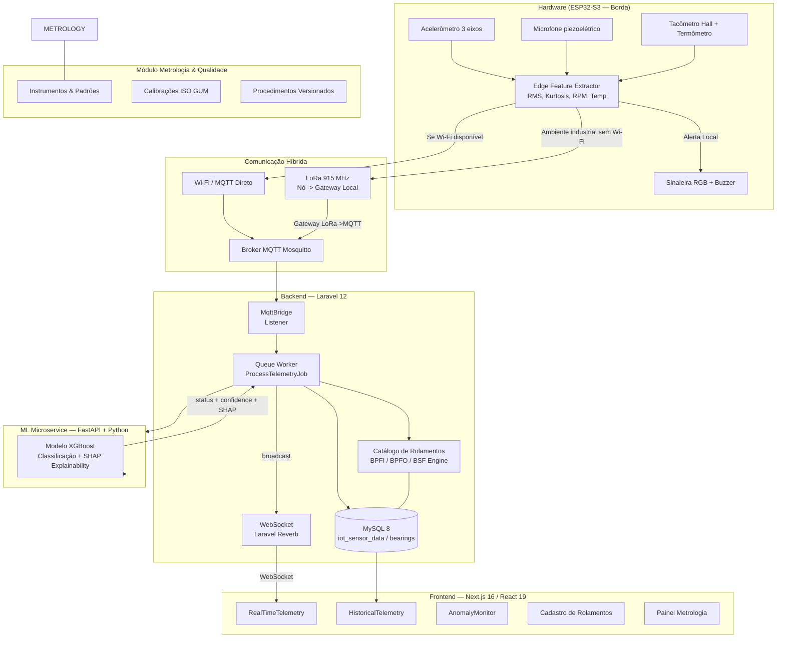
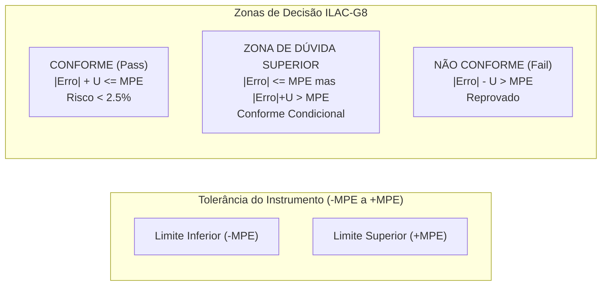
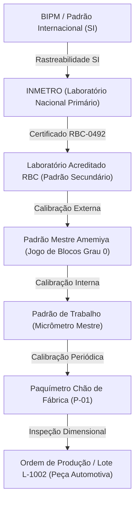
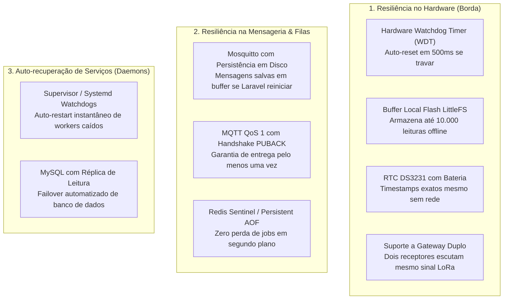
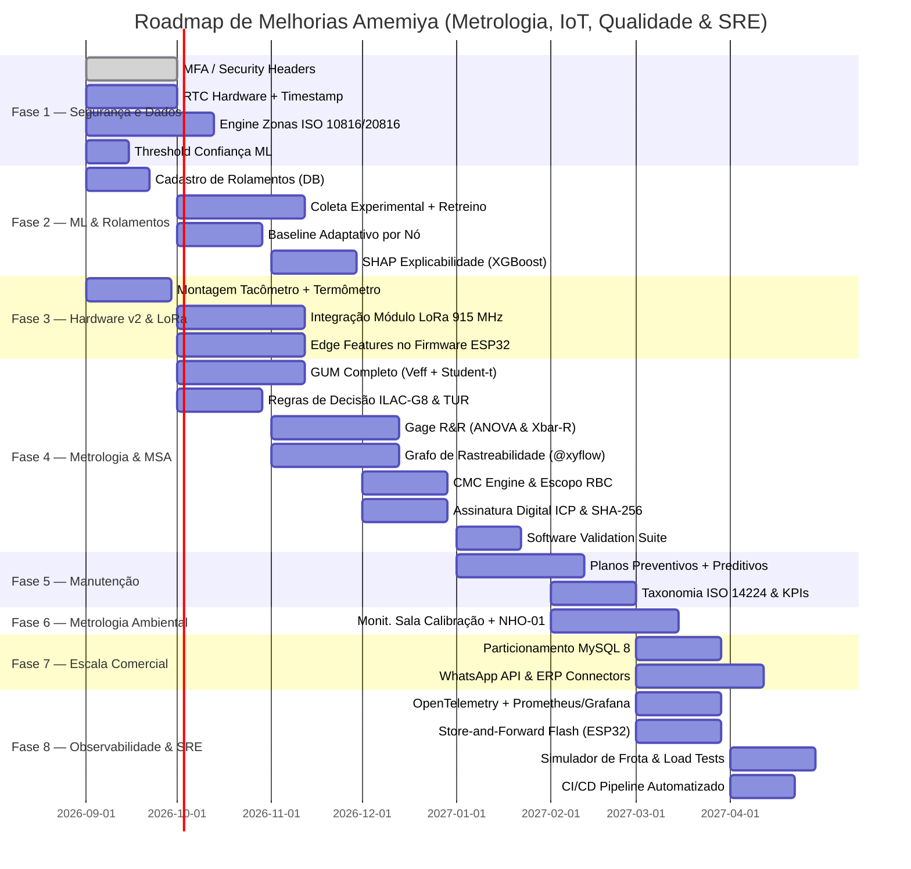

# Amemiya — Plano de Melhoria para Versão Comercial

> Análise técnica conduzida sob perspectiva de Engenheiro de Software, Cientista de Dados e Especialista em Manutenção Industrial.

---

> [!NOTE]
> **Contexto do Semestre Atual:**
> - **Modelo ML:** XGBoost em produção (sincronizar `main.py` local).
> - **Hardware Base:** ESP32-S3, acelerômetro 3 eixos, microfones, sinaleira RGB, buzzer.
> - **Adições de Hardware (Budget ~R$ 200):** Tacômetro (Hall Effect KY-003 + ímã), termômetro (DS18B20) e comunicação **LoRa** para chão de fábrica sem Wi-Fi.
> - **Estratégia de Dados:** Transmissão apenas de **parâmetros/features de IA** (não transmitimos sinal bruto contínuo), dispensando TimeSeries DB complexo e mantendo MySQL 8 indexado/particionado.
> - **Novo Cadastro:** Catálogo de Rolamentos (geometria: BPFO, BPFI, BSF calculados com RPM dinâmico).

---

## Visão Geral do Sistema Atual e Comunicação



---

## Mapeamento de Normas Regulatórias — O Que Temos e O Que Falta

### Normas de Metrologia, Qualidade e Gestão (ISO, AIAG, VDA, ILAC, INMETRO)

| Norma / Referência | Escopo Técnico | Status no Amemiya | Plano de Implementação / Ações |
|--------------------|----------------|-------------------|--------------------------------|
| **ISO/IEC 17025:2017** | Requisitos para competência de laboratórios de ensaio e calibração | ⚠️ Parcial (GUM básico, procedimentos versionados, assinaturas) | • Hash SHA-256 e assinatura digital ICP-Brasil (PAdES/TSA)<br>• CMC Engine (bloqueio de incerteza abaixo do escopo)<br>• Grafo de rastreabilidade metrológica ininterrupta<br>• Justificativa obrigatória (*Reason for Change*) em retificações<br>• Suite de validação de software metrológico (GAMP 5) |
| **ISO 10012:2003** | Sistemas de gestão de medição — Confirmação metrológica e processos de medição | ⚠️ Parcial (Controle de vencimento e ILAC-G24) | • Confirmação Metrológica formal (adequação ao uso pretendido)<br>• Ajuste dinâmico de intervalos (OIML D10 / ILAC-G24 avançado)<br>• Gestão e qualificação de fornecedores e laboratórios RBC |
| **ISO 14253-1 / ILAC-G8:09:2019** | Regras de decisão e declaração de conformidade com especificações | ⚠️ Parcial (Simple Acceptance e GuardBand preliminar) | • Guard Bands normalizadas ($w = U$ e $w = U \cdot r$)<br>• Declarações formais em 4 estados (Conforme, Conforme Condicional, Não Conforme Condicional, Não Conforme)<br>• Cálculo de Risco Específico/Global do Consumidor e Fornecedor ($P_{FA} \le 2.5\%$)<br>• Validação de TUR (*Test Uncertainty Ratio* $\ge 4:1$) |
| **JCGM 100:2008 (ISO GUM)** | Guia para a Expressão da Incerteza de Medição | ⚠️ Parcial (Cálculo básico Tipo A + Tipo B) | • Graus de liberdade efetivos ($\nu_{eff}$) via Welch-Satterthwaite<br>• Fator de abrangência $k$ dinâmico por distribuição $t$ de Student<br>• Coeficientes de sensibilidade parciais ($c_i = \partial f/\partial x_i$)<br>• Orçamento de incerteza multiponto detalhado |
| **JCGM 101:2008 (GUM Supl. 1)** | Propagação de incerteza via Simulação de Monte Carlo | ❌ Ausente | • Motor Monte Carlo (100.000 iterações) para modelos não-lineares |
| **AIAG MSA (4ª Edição) / VDA 5** | Análise dos Sistemas de Medição (Indústria Automotiva / Aeroespacial) | ❌ Ausente | • **Gage R&R** por ANOVA e por Médias/Amplitudes ($\bar{X}-R$)<br>• Cálculo de $\%GRR$, $\%EV$, $\%AV$, $\%PV$ e $ndc \ge 5$<br>• Estudo de Tendência e Linearidade (*Bias & Linearity*)<br>• Cartas de Estabilidade ($\bar{X}-S$)<br>• Análise de Concordância por Atributos (Kappa de Cohen/Fleiss) |
| **ISO 9001:2015 (Item 7.1.5)** | Recursos de monitoramento e medição — Rastreabilidade e Não Conformidades | ⚠️ Parcial (Instrumentos e RNCs básicas) | • Rastreabilidade Reversa (*Recall Automático* de lotes produzidos com instrumentos reprovados)<br>• Quarentena automática de instrumentos e lotes |
| **ISO 10816 / ISO 20816** | Severidade de vibração em máquinas rotativas | ⚠️ Parcial | • Classificação em Zonas A/B/C/D no backend |
| **ISO 13373-1/-2** | Monitoramento de condição e diagnóstico de máquinas | ⚠️ Parcial | • Laudos automáticos de condição assinados com features SHAP |
| **ISO 14224** | Coleta de dados de confiabilidade e modos de falha | ❌ Ausente | • Taxonomia padronizada de falhas (*Failure Modes*) |
| **ISO 27001** | Segurança da Informação e Auditoria Imutável | ⚠️ Parcial | • MFA (TOTP), Rate Limit, Encadeamento de Hash nos logs |

### NRs Brasileiras Relevantes

| NR | Escopo | Status Atual | Gap / Ação |
|----|--------|-------------|------------|
| **NR-12** | Segurança em máquinas e equipamentos | ⚠️ Parcial — sistema gera alertas de vibração anormal | Hardware: adicionar saída de parada de emergência; software: log de paradas por falha com timestamp |
| **NR-17** | Ergonomia | ❌ Ausente | Considerar monitoramento de ruído (dB) para EHS — sensor de ambiente |
| **NR-18** | Segurança na construção civil | Fora do escopo |  |
| **NR-04** | SESMT | ⚠️ Indireto — sistema pode alimentar dados de saúde das máquinas para SESMT | Exportar relatórios de ocorrências em formato compatível com eSocial |
| **NR-07** | PCMSO (Programas de Controle Médico) | ⚠️ Indireto — dados de ruído e vibração servem de evidência | Adicionar medição de ruído ambiental (dB SPL) com alertas de NHO-01 |
| **NR-33** | Espaços confinados | ❌ Fora de escopo imediato |  |
| **NHO-01 FUNDACENTRO** | Avaliação da exposição ocupacional ao ruído | ❌ Ausente | Sensor de dB ambiental + cálculo de dose diária de ruído (LEq, LCpeak) |
| **NR-10** | Segurança em instalações elétricas | ⚠️ Indireto — dados de corrente elétrica do motor monitorados | Adicionar sensor de corrente (CT) e alertas de sobrecarga |

---

## Análise Crítica — Gaps Técnicos Identificados

### 1. Machine Learning — Limitações Críticas

**Situação atual:** Modelo XGBoost (10 classes de falha) com extração de features estatísticas e espectrais. O código local no repositório ainda está desatualizado (usando Keras).

**Gaps:**
- **Sem normalização por RPM (Frequências de Defeito):** Sem tacômetro e sem cálculo de BPFI/BPFO/BSF, o modelo depende de frequências absolutas que variam quando a máquina altera de rotação.
- **Ausência de Cadastro de Rolamentos:** O sistema não conhece a geometria do rolamento monitorado (quantidade de esferas, diâmetro da pista/esferas), impedindo o cálculo exato das frequências de defeito mecânico.
- **Ausência de baseline adaptativo:** Cada máquina tem sua "assinatura" vibratória normal. Sem um mecanismo de baseline por nó (Z-Score), a taxa de falsos positivos em campo é alta.
- **Modelo estático (sem pipeline de retreino estruturado):** Quando um técnico confirma ou rejeita um diagnóstico no chão de fábrica, esse dado é perdido.
- **Sem explicabilidade (XAI):** O sistema retorna `"Desalinh. H"` com 87% de confiança sem justificar as features de maior peso (SHAP).
- **Sem threshold de confiança configurável:** Diagnósticos com confiança baixa (ex: 52%) são tratados iguais a diagnósticos com 97%.

### 2. Hardware & Comunicação — Limitações Críticas

**Situação atual:** ESP32-S3 com acelerômetro 3 eixos, microfone piezoelétrico, sinaleira RGB e buzzer. Comunicação via Wi-Fi/MQTT.

**Gaps:**
- **Dependência exclusiva de Wi-Fi:** Em galpões industriais, o sinal Wi-Fi é altamente atenuado por estruturas metálicas. A inclusão de **LoRa (915 MHz)** como canal de comunicação de longa distância/baixo consumo é indispensável para um produto comercial.
- **Sem sensor de temperatura:** A maioria das falhas de lubrificação e rolamento produz elevação térmica antes de vibração crítica (ISO 13373).
- **Sem tacômetro:** Impossibilidade de medir rotação (RPM) em tempo real em motores com inversor de frequência (VFD) ou cargas variáveis.
- **Sem RTC com bateria:** Se o nó perder energia e comunicação simultaneamente, timestamps ficam dessincronizados.

### 3. Software Backend — Gaps

- **Ausência de Catálogo de Rolamentos no Banco:** Falta modelagem de dados para especificar rolamentos padrão (ex: SKF 6205, NSK 6308) e calcular coeficientes de falha.
- **Sem engine de limites normativos (ISO 10816/20816):** O sistema classifica anomalias pelo ML mas não compara o RMS de vibração com as zonas A/B/C/D da norma para o porte da máquina.
- **Sem Manutenção Preventiva baseada em tempo/condição:** O módulo IoT detecta alertas, mas não está integrado a planos de manutenção periódica (horímetro/calendário).
- **Estratégia de Armazenamento:** Como o hardware transmite **apenas parâmetros de borda** (Features, RMS, Kurtosis, RPM, Temp — não enviando a onda bruta contínua), uma base relacional MySQL 8 com particionamento por data atende com excelência e menor custo operacional do que bancos de séries temporais dedicados.

### 4. Frontend — Gaps

- **Sem visualização de zonas normativas:** O dashboard de IoT mostra valores mas não contextualizados nas zonas A/B/C/D da ISO 20816.
- **Sem gráfico de tendência temporal de RMS:** A análise histórica não mostra a trajetória de degradação. É fundamental para decisão de manutenção.
- **Sem painel de MTBF/MTTR:** Métricas essenciais de confiabilidade não são calculadas.
- **Sem integração de alertas com canais externos:** Não há integração com WhatsApp Business API, e-mail de urgência, ou integrações com TOTVS/SAP para abertura automática de OS.

---

## Plano de Melhorias por Prioridade

---

### FASE 1 — Correções Críticas de Segurança e Qualidade de Dado (1–2 meses)

> *"Dados ruins treinam modelos ruins. Corrigir a base de dados antes de qualquer melhoria de ML."*

#### 1.1 Completar prioridade 7 do TODO (Security Hardening)

- **MFA/2FA** (TOTP) para roles Admin e Quality Manager — `filament-two-factor-authentication`
- **Rate limiting** progressivo em `/login` e endpoints sensíveis
- **Security headers** — HSTS, CSP, X-Frame-Options via middleware Laravel
- **Session timeout** configurável por tenant

**Impacto regulatório:** ISO 27001 (A.9), LGPD

#### 1.2 Timestamp Confiável no Hardware

Adicionar módulo **DS3231 RTC** (Real-Time Clock com bateria) ao hardware ESP32. O firmware deve:
1. Sincronizar o RTC via NTP ao conectar ao Wi-Fi
2. Usar o RTC como fonte de timestamp quando offline
3. Incluir flag `timestamp_source: "rtc" | "ntp"` no payload MQTT

**Impacto:** Rastreabilidade temporal exigida pela ISO 13373 e ISO 17025 (para dados de temperatura de calibração).

#### 1.3 Engine de Limites Normativos ISO 10816/20816

Criar `Modules/IoT/app/Services/VibrationNormativeEngine.php`:

```php
class VibrationNormativeEngine
{
    // ISO 20816-3: Máquinas de médio porte (15–300 kW)
    const ZONES = [
        'A' => ['max_rms_mm_s' => 2.3,  'label' => 'Novo / Comissionado'],
        'B' => ['max_rms_mm_s' => 4.5,  'label' => 'Operação Aceitável'],
        'C' => ['max_rms_mm_s' => 7.1,  'label' => 'Alerta — Agendar Manutenção'],
        'D' => ['max_rms_mm_s' => 99.0, 'label' => 'Perigo — Parar Máquina'],
    ];

    public function classify(float $rmsGlobal, string $machineClass = 'medium'): array
    {
        // retorna zona, label, cor, e ação recomendada
    }
}
```

Integrar no `ProcessTelemetryJob` e persistir `normative_zone` na `iot_sensor_data`.

#### 1.4 Threshold de Confiança Configurável

Adicionar campo `ml_confidence_threshold` na tabela `iot_nodes` (padrão: 0.70). No `ProcessTelemetryJob`:

```php
if ($mlResult['confidence'] < $node->ml_confidence_threshold) {
    $mlResult['status'] = 'indeterminado'; // não alertar se confiança baixa
}
```

---

### FASE 2 — Melhoria do Pipeline de ML (Este Semestre)

#### 2.0 Sincronizar Código com Produção

> [!CAUTION]
> O `main.py` local ainda carrega o modelo Keras/TensorFlow (`modelo_multimodal_incremental_mod3.keras`). O modelo em produção já é XGBoost. **Isso precisa ser corrigido primeiro — o Docker local está rodando um modelo diferente do de produção.**

**Ação imediata:**
1. Exportar o modelo XGBoost atual de produção: `xgb_model.json` + scaler `.pkl`
2. Substituir o `main.py` por uma versão XGBoost (FastAPI + `xgboost` + `scikit-learn`)
3. Remover dependências pesadas: `tensorflow`, `keras`, `librosa`, `matplotlib` do `requirements.txt`
4. Testar localmente antes de subir

**Benefício colateral:** Imagem Docker do `ml-service` vai de ~4 GB para ~500 MB.

**Novo `requirements.txt` estimado:**
```
fastapi==0.111.0
uvicorn==0.30.1
xgboost>=2.0.0
scikit-learn>=1.5.0
pandas==2.2.2
numpy==1.26.4
scipy==1.13.1
joblib==1.4.2
python-multipart==0.0.9
shap>=0.45.0
```

#### 2.1 Cadastro de Rolamentos (Bearing Database) & Cálculo Dinâmico de Defeitos

Para que o cálculo das frequências de defeito (BPFO, BPFI, BSF) seja exato e flexível, adicionaremos um **Catálogo de Rolamentos** no sistema.

**Nova Tabela:** `bearings` (e relacionamento com `IoTNode` ou `Machine`)
```sql
CREATE TABLE bearings (
    id CHAR(26) PRIMARY KEY, -- ULID
    tenant_id CHAR(26) NOT NULL,
    manufacturer VARCHAR(100) NOT NULL, -- ex: SKF, NSK, FAG
    model VARCHAR(100) NOT NULL,        -- ex: 6205-2RS, 6308
    balls_count INT NOT NULL,           -- n (número de corpos rolantes)
    ball_diameter_mm DECIMAL(8,3) NOT NULL,  -- d
    pitch_diameter_mm DECIMAL(8,3) NOT NULL, -- D
    contact_angle_deg DECIMAL(5,2) DEFAULT 0.0, -- α
    created_at TIMESTAMP,
    updated_at TIMESTAMP
);
```

**Cálculo Dinâmico das Frequências de Falha:**
```python
def calcular_frequencias_defeito(rpm: float, bearing: dict) -> dict:
    """
    Calcula as frequências características de defeito a partir do RPM medido e geometria do rolamento.
    """
    freq_rot = rpm / 60.0 # 1X (velocidade síncrona em Hz)
    n = bearing['balls_count']
    d = bearing['ball_diameter_mm']
    D = bearing['pitch_diameter_mm']
    alpha_rad = np.radians(bearing.get('contact_angle_deg', 0.0))

    bpfo = (n / 2.0) * freq_rot * (1.0 - (d / D) * np.cos(alpha_rad)) # Pista externa
    bpfi = (n / 2.0) * freq_rot * (1.0 + (d / D) * np.cos(alpha_rad)) # Pista interna
    bsf  = (D / (2.0 * d)) * freq_rot * (1.0 - ((d / D) * np.cos(alpha_rad))**2) # Esfera/corpo rolante
    ftf  = (1.0 / 2.0) * freq_rot * (1.0 - (d / D) * np.cos(alpha_rad)) # Gaiola

    return {
        'freq_rot_hz': freq_rot,
        'bpfo_hz': bpfo,
        'bpfi_hz': bpfi,
        'bsf_hz': bsf,
        'ftf_hz': ftf
    }
```

#### 2.2 Coleta Experimental & Retreinamento do Modelo XGBoost

Como o modelo atual foi treinado sem RPM e sem temperatura, faremos a coleta do novo dataset na bancada experimental e o retreinamento do XGBoost:

1. **Protocolo Experimental de Coleta:**
   - Montar bancada com motor + inversor de frequência (varredura de RPM: 600 a 1800 RPM).
   - Inserir falhas controladas em rolamentos catalogados (rolamento saudável, desbalanceamento de massa, desalinhamento paralelo/angular, defeito em pista externa, pista interna e esfera).
   - Coletar telemetria contendo: Vibração 3D + Microfone + Tacômetro (RPM) + Termômetro (DS18B20).
2. **Engenharia de Features Normalizadas:**
   - Extrair RMS, Kurtosis, Skewness, Fator de Crista.
   - Extrair energia nas bandas normalizadas em função do RPM (ex: 1X, 2X, 3X, BPFO ± 5Hz, BPFI ± 5Hz, BSF ± 5Hz).
   - Adicionar temperatura do mancal e delta térmico em relação ao baseline.
3. **Treinamento e Validação XGBoost:**
   - Algoritmo: `XGBClassifier(n_estimators=300, max_depth=6, learning_rate=0.05)`.
   - Validação cruzada estratificada (Stratified K-Fold 5-folds).
   - Exportação para formato universal e leve: `xgb_model.json` + `scaler.pkl`.

**Features do Vetor de Entrada do XGBoost v2:**
| Feature | Tipo | Descrição |
|---------|------|-----------|
| `rpm` | Numérica | Rotação medida em tempo real pelo tacômetro |
| `freq_rot_hz` | Numérica | Frequência fundamental (1X) |
| `bpfo_energia` | Numérica | Energia espectral na frequência BPFO |
| `bpfi_energia` | Numérica | Energia espectral na frequência BPFI |
| `bsf_energia` | Numérica | Energia espectral na frequência BSF |
| `rms_global`, `rms_x/y/z` | Numérica | RMS de vibração em velocidade/aceleração |
| `kurt_x/y/z` | Numérica | Kurtose estatística por eixo |
| `piezo_fator_crista` | Numérica | Fator de crista de alta frequência (acústica) |
| `temperature_motor_c` | Numérica | Temperatura do mancal |
| `temp_delta_baseline` | Numérica | Variação térmica relativa |

#### 2.3 Baseline Adaptativo por Nó

Implementar **Z-Score adaptativo** por nó para normalizar RMS e temperatura:

```python
# Ao receber dado novo:
historico = consultar_ultimos_n_registros(node_id=X, n=500)
media_baseline = historico['rms_global'].mean()
std_baseline   = historico['rms_global'].std()
z_score_rms    = (rms_atual - media_baseline) / std_baseline

# Feature adicionada ao vetor do XGBoost: z_score_rms
# Isso resolve o problema de máquinas com assinatura vibratória naturalmente mais alta
```

#### 2.4 Retreinamento com Feedback de Técnicos

Criar fluxo de feedback no frontend:

1. Sistema exibe: `"Desbalanceamento — 87% confiança"`
2. Técnico confirma ou corrige: `"Era soltura mecânica"`
3. Backend salva em `iot_ml_feedback` (`label_predicted`, `label_confirmed`, `sensor_data_id`)
4. Notebook de retreinamento quinzenal usa esses dados + dados históricos para retreinar o XGBoost

**Backend:** Nova migration `iot_ml_feedback` + endpoint `POST /api/iot/telemetry/{id}/feedback`.

O XGBoost permite retreinamento incremental com `xgb.train(..., xgb_model=model_atual)` — sem precisar retreinar do zero.

#### 2.5 Análise de Tendência (Trend Analysis)

Novo endpoint: `GET /api/iot/nodes/{id}/trend?window=30d`

```php
// TrendAnalysisService.php
public function calculateHealthScore(string $nodeId, int $days = 30): array
{
    $data = IoTSensorData::where('node_id', $nodeId)
        ->where('measured_at', '>=', now()->subDays($days))
        ->orderBy('measured_at')
        ->get(['rms_global', 'measured_at']);

    // Regressão linear simples sobre rms_global vs. tempo
    // Retorna: slope (taxa de degradação), projected_zone_c_date, health_score (0-100)
}
```

Exibir no frontend como "Health Score" decrescente com data estimada de próxima manutenção.

#### 2.6 Explicabilidade com SHAP (XGBoost nativo)

O XGBoost tem suporte nativo a SHAP — uma das maiores vantagens sobre o Keras:

```python
import shap

# XGBoost tem TreeExplainer altamente otimizado
explainer = shap.TreeExplainer(model)
shap_values = explainer.shap_values(features_df)

# Top 3 features que mais contribuíram para o diagnóstico
feature_importance = sorted(
    zip(feature_names, shap_values[0]),
    key=lambda x: abs(x[1]),
    reverse=True
)[:3]

# Retornar: [{"feature": "bpfo_energia", "contribution": 0.34, "direction": "positive"}, ...]
```

Exibir no frontend como card: *"Diagnóstico baseado em: energia na frequência BPFO (+34%), kurtosis eixo Z (+21%), temperatura acima do baseline (+15%)"*.

#### 2.7 Threshold de Confiança Configurável

Adicionar campo `ml_confidence_threshold` na tabela `iot_nodes` (padrão: `0.70`):

```php
// ProcessTelemetryJob.php
if ($mlResult['confidence'] < $node->ml_confidence_threshold) {
    $mlResult['status'] = 'indeterminado'; // não gerar alerta se confiança baixa
    $mlResult['alert_level'] = 'none';
}
```

---


### FASE 3 — Hardware Melhorado & Comunicação LoRa (Este Semestre)

#### 3.1 Configuração de Hardware para Este Semestre

> Budget: ~R$ 200 para componentes adicionais (ESP32-S3, acelerômetro, microfones, sinaleira e buzzer já existem).

```
┌──────────────────────────────────────────────────────────┐
│                   Nó de Borda IoT v2                     │
│                                                          │
│  ✅ ESP32-S3 (já disponível)                              │
│                                                          │
│  Sensores — JÁ DISPONÍVEIS:                             │
│  ├── ✅ Acelerômetro 3 eixos (radial, tang., axial)       │
│  ├── ✅ Microfone piezoelétrico (acústica)                │
│  ├── ✅ Sinaleira RGB (alerta visual local)               │
│  └── ✅ Buzzer (alerta sonoro local)                      │
│                                                          │
│  Sensores — ADICIONANDO (este semestre):                │
│  ├── 🆕 Sensor de temperatura DS18B20 (~R$ 15–25)        │
│  │   → Temperatura de superfície do motor/mancal        │
│  │   → Sensor 1-Wire, impermeável, faixa -55 a +125°C  │
│  ├── 🆕 Tacômetro Hall Effect (KY-003 + ímã) (~R$ 10)   │
│  │   → Pulso por rotação → calcula RPM em tempo real    │
│  └── 🆕 Módulo LoRa 915 MHz (SX1262 / Ra-02 / E220) (~R$ 20) │
│       → Alcance de até 2-5 km em ambiente fabril        │
│       → Imunidade a ruídos eletromagnéticos e obstáculos│
│                                                          │
│  Comunicação Híbrida:                                    │
│  ├── Primário: LoRa 915 MHz (Nó Sensor → Gateway LoRa)   │
│  └── Fallback/Direto: Wi-Fi MQTT (quando houver sinal)   │
│                                                          │
│  Proteção: Caixa plástica com vedação (IP54 recomendado) │
│  Custo adicional total por nó: ~R$ 45–55                 │
└──────────────────────────────────────────────────────────┘
```

**Arquitetura de Comunicação LoRa:**
- **Nós Sensores (Borda):** Fazem a amostragem de alta frequência, calculam as features (RMS, Kurtosis, RPM, Temp, Fator de Crista) e transmitem um pacote compacto via LoRa (Payload de apenas ~30–60 bytes).
- **Gateway Concentrador (Bancada/Planta):** Um ESP32-S3 com receptor LoRa que recebe os pacotes dos nós locais e publica no Broker MQTT (Mosquitto) conectado à rede corporativa/Internet.

#### 3.2 Payload Compacto (LoRa & MQTT)

Como transmitimos **apenas as features de IA** (parâmetros extraídos) e não a onda bruta contínua, o payload é ultraleve:

```json
{
  "device_id": "GW-001",
  "node_id": 1,
  "msg_id": 1042,
  "rpm": 1487.5,
  "temperature_motor_c": 72.3,
  "rms_global": 3.21,
  "time_domain": {
    "rms_x": 1.2, "rms_y": 0.9, "rms_z": 2.1,
    "kurt_x": 3.1, "kurt_y": 2.8, "kurt_z": 4.2
  },
  "piezo": { "rms": 0.42, "pico_max": 1.8, "fator_crista": 4.3 },
  "fft_peaks": [ {"freq": 24.8, "amp": 1.2}, {"freq": 142.3, "amp": 0.8} ],
  "timestamp": 1724673600,
  "comm_type": "lora"
}
```

A sinaleira e o buzzer já existem mas precisam ser programados com a lógica de zonas:

```cpp
// Firmware ESP32-S3 — lógica de alerta local
void updateSignalTower(float rms_global, float confidence, String ml_status) {
    if (rms_global < ZONE_B_LIMIT) {
        setLED(GREEN);  // Normal
    } else if (rms_global < ZONE_C_LIMIT || confidence < 0.70) {
        setLED(YELLOW); // Alerta
        buzzShort();
    } else {
        setLED(RED);    // Crítico
        buzzLong();     // Buzzer contínuo
    }
}
```

Os limites de zona ficam configuráveis via MQTT (o backend publica num tópico `config/{device_id}` quando o técnico altera).

#### 3.4 Pré-processamento no Hardware (Edge Computing)

Com o ESP32-S3, calcular **no próprio hardware** antes de enviar:
- RMS global, RMS por eixo
- Kurtosis (via algoritmo de Welford — eficiente para microcontrolador)
- RPM via contagem de pulsos do tacômetro (janela de 1 segundo)
- Temperatura do motor (polling DS18B20 a cada 5s)
- Fator de crista e pico

Isso reduz o payload MQTT de ~65 KB (sinal bruto) para ~200 bytes (features), permitindo redes mais lentas. Enviar sinal bruto apenas quando anomalia for detectada localmente (threshold de RMS > Zona B).

#### 3.5 Protocolo de Montagem Normalizado

Criar documento técnico de instalação (necessário para ISO 13373):
- Torque do parafuso de fixação do sensor no ponto de medição
- Localização normalizada dos pontos de medição (conforme ISO 13373-1, fig. 1)
- Fotografia da instalação registrada no sistema, vinculada ao `IoTNode`
- Direção dos eixos documentada (radial = perpendicular ao eixo, axial = paralelo)
- Posição do ímã do tacômetro e gap de medição

---

### FASE 4 — Módulo de Metrologia & Qualidade Industrial Avançado (ISO/IEC 17025, ISO 10012, AIAG MSA & ILAC-G8)

> Esta fase eleva o módulo de metrologia para nível comercial industrial e apto à acreditação **Cgcre/INMETRO (RBC - Rede Brasileira de Calibração)** e auditorias automotivas (IATF 16949 / VDA 6.1).

---

#### 4.1 Motor Matemático ISO GUM Completo (JCGM 100 & JCGM 101)

O atual `UncertaintyCalculator.php` implementa um GUM simplificado. Vamos evoluí-lo para um motor metrológico completo com rigor matemático estrito:

```
┌───────────────────────────────────────────────────────────────────────────────────────┐
│                      Motor de Incerteza GUM Completo (Amemiya Engine)                 │
│                                                                                       │
│  1. Incerteza Tipo A: uA = s / sqrt(n)                                                │
│  2. Incerteza Tipo B (Multicomponente):                                               │
│     ├── Resolução: u_res = Resolução / (2 * sqrt(3)) [Retangular]                    │
│     ├── Incerteza do Padrão: u_std = U_pad / k_pad [Normal]                           │
│     ├── Deriva do Padrão: u_drift = Delta_drift / sqrt(3) [Retangular]                │
│     ├── Correção Térmica Diferencial: u_temp = f(L, Delta_T, Delta_alpha)             │
│     └── Histerese / Efeito do Operador: u_op = Max_diff / (2 * sqrt(3))               │
│                                                                                       │
│  3. Coeficientes de Sensibilidade: c_i = dY / dX_i                                    │
│  4. Incerteza Combinada: u_c = sqrt( sum( (c_i * u_i)^2 ) )                           │
│  5. Graus de Liberdade Efetivos (Welch-Satterthwaite):                                │
│     v_eff = u_c^4 / sum( (c_i * u_i)^4 / v_i )                                        │
│  6. Fator de Abrangência Dinâmico: k = t_Student(p=95.45%, v=v_eff)                   │
│  7. Incerteza Expandida: U = k * u_c                                                  │
└───────────────────────────────────────────────────────────────────────────────────────┘
```

**Implementação em PHP (`UncertaintyEngine.php`):**
```php
namespace Modules\Metrology\Services;

class UncertaintyEngine
{
    /**
     * Calcula graus de liberdade efetivos pela fórmula de Welch-Satterthwaite.
     */
    public function calculateEffectiveDegreesOfFreedom(float $combinedUncertainty, array $budget): float
    {
        $denominator = 0.0;
        foreach ($budget as $component) {
            $ui = (float) $component['standard_uncertainty'];
            $vi = (float) ($component['degrees_of_freedom'] ?? 1000000); // Infinito para Tipo B se confiável
            if ($vi > 0 && $ui > 0) {
                $denominator += pow($ui, 4) / $vi;
            }
        }

        if ($denominator <= 0) {
            return 1000000.0; // Praticamente infinito
        }

        return pow($combinedUncertainty, 4) / $denominator;
    }

    /**
     * Calcula o fator k exato pela distribuição t de Student (95.45% de confiança).
     * Se v_eff >= 30, k = 2.00. Se v_eff < 30, interpola valor exato da tabela Student-t.
     */
    public function calculateCoverageFactor(float $vEff): float
    {
        if ($vEff >= 30) {
            return 2.00;
        }

        // Tabela t de Student para 95.45% (2 caudas)
        $tTable = [
            1 => 13.97, 2 => 4.53, 3 => 3.31, 4 => 2.87, 5 => 2.65,
            6 => 2.52, 7 => 2.43, 8 => 2.37, 9 => 2.32, 10 => 2.28,
            15 => 2.20, 20 => 2.13, 25 => 2.09, 30 => 2.00
        ];

        $vFloor = (int) floor($vEff);
        if ($vFloor < 1) $vFloor = 1;
        
        return $tTable[$vFloor] ?? 2.00;
    }
}
```

**Suporte a Simulação de Monte Carlo (GUM Suplemento 1 / JCGM 101:2008):**
- Para medições não lineares (ex: torque angular, medição 3D de engrenagens), o sistema roda um job assíncrono com **100.000 iterações de Monte Carlo**, gerando a Função de Densidade de Probabilidade (PDF) e o intervalo de confiança de menor comprimento (*shortest 95% coverage interval*).

---

#### 4.2 Regras de Decisão Formais & Bandas de Guarda (ILAC-G8:09/2019 & ISO 14253-1)

A ISO/IEC 17025:2017 exige que toda declaração de conformidade declare explicitamente a regra de decisão empregada e o risco associado.



**Novos Estados de Declaração de Conformidade:**
1. **Conforme (Pass):** O erro medido somado à incerteza expandida está totalmente dentro dos limites de tolerância ($|E| + U \le MPE$). Risco de falsa aceitação $P_{FA} \le 2.5\%$.
2. **Conforme Condicional (Conditional Pass):** O erro medido está dentro da tolerância ($|E| \le MPE$), porém a incerteza invade a banda de guarda ($|E| + U > MPE$). Aprovado com restrição.
3. **Não Conforme Condicional (Conditional Fail):** O erro medido ultrapassa a tolerância ($|E| > MPE$), mas a incerteza ainda intercepta o limite ($|E| - U \le MPE$).
4. **Não Conforme (Fail):** O erro medido menos a incerteza excede a tolerância ($|E| - U > MPE$). Reprovação definitiva com abertura automática de RNC.

**Validação Automática de TUR (*Test Uncertainty Ratio*):**
$$TUR = \frac{MPE}{U}$$
- Se $TUR \ge 4:1$: Incerteza ideal para laboratório acreditado.
- Se $3:1 \le TUR < 4:1$: Aceitável com aviso de risco.
- Se $TUR < 3:1$: Alerta impeditivo — o padrão de referência selecionado não possui exatidão suficiente para calibrar o instrumento.

---

#### 4.3 CMC Engine (Capacidade de Medição e Calibração - Escopo Acreditado)

Para laboratórios comerciais que prestam serviços ou empresas com laboratório central de calibração, implementaremos o **CMC Engine**:

**Tabela de Escopo do Laboratório (`accredited_scopes`):**
```sql
CREATE TABLE accredited_scopes (
    id CHAR(26) PRIMARY KEY,
    tenant_id CHAR(26) NOT NULL,
    measurand VARCHAR(100) NOT NULL, -- ex: Comprimento, Massa, Pressão
    instrument_type_id CHAR(26) NOT NULL,
    min_range DECIMAL(12,4) NOT NULL,
    max_range DECIMAL(12,4) NOT NULL,
    cmc_expression VARCHAR(255) NOT NULL, -- ex: "0.0025 + 0.000012 * L" (em mm)
    unit VARCHAR(20) NOT NULL,
    accreditation_body VARCHAR(50) DEFAULT 'Cgcre/Inmetro',
    is_active BOOLEAN DEFAULT TRUE,
    created_at TIMESTAMP,
    updated_at TIMESTAMP
);
```

**Regra de Bloqueio:**
Ao emitir um certificado oficial de calibração, se a incerteza expandida calculada ($U_{calc}$) for matematicamente menor que o CMC aprovado no escopo para aquela faixa de medição, o sistema **bloqueia a emissão com selo RBC** e força o ajuste para $U = \max(U_{calc}, CMC)$, prevenindo infração regulatória contra a Cgcre/Inmetro.

---

#### 4.4 Módulo MSA Completo (Measurement Systems Analysis - AIAG 4ª Edição / VDA 5)

Adicionaremos ao sistema um submódulo dedicado à indústria automotiva e de manufatura de precisão:

```
┌───────────────────────────────────────────────────────────────────────────────────────┐
│                           Módulo MSA (Amemiya Quality Core)                           │
│                                                                                       │
│  1. Gage R&R por ANOVA (2 fatores com interação Operador x Peça):                     │
│     ├── EV (Equip. Variation / Repetibilidade) = sqrt(MS_error)                       │
│     ├── AV (Appraiser Variation / Reprodutibilidade) = sqrt((MS_app - MS_int)/(r*p)) │
│     ├── INT (Interação Operador x Peça) = sqrt((MS_int - MS_error)/r)                 │
│     ├── PV (Part Variation / Variação das Peças) = sqrt((MS_part - MS_int)/(r*a))     │
│     ├── Total Variation: TV = sqrt(GRR^2 + PV^2)                                      │
│     └── %GRR = (GRR / TV) * 100                                                       │
│                                                                                       │
│  2. Métricas de Aceitação AIAG:                                                       │
│     ├── %GRR < 10%: Sistema de Medição EXCELENTE                                     │
│     ├── 10% <= %GRR <= 30%: ACEITÁVEL CONDICIONAL (requer justificativa)              │
│     ├── %GRR > 30%: INACEITÁVEL (sistema de medição rejeitado)                       │
│     └── ndc (Number of Distinct Categories) = 1.41 * (PV / GRR) >= 5                  │
│                                                                                       │
│  3. Estudo de Tendência e Linearidade (Bias & Linearity):                             │
│     ├── Regressão linear do viés ao longo da faixa: Bias = a * Referência + b         │
│     └── Teste t de Student para significância estatística da inclinação               │
│                                                                                       │
│  4. Estabilidade Metrológica (Cartas de Controle Shewhart Xbar-R / Xbar-S):          │
│     └── Monitoramento contínuo com detecção de padrões Western Electric               │
│                                                                                       │
│  5. Análise de Concordância por Atributos (Gages Passa/Não-Passa):                    │
│     ├── Coeficiente Kappa de Cohen (Concordância intra e inter-avaliador)             │
│     └── Eficácia do Sistema de Inspeção Visual (% de Acertos vs. Padrão Ouro)         │
└───────────────────────────────────────────────────────────────────────────────────────┘
```

**Novas Telas no Frontend:**
- Wizard de criação de estudo Gage R&R (seleção de instrumento, 3 operadores, 10 peças, 3 réplicas).
- Coleta de dados com formulário de digitação rápida e suporte a leitor de paquímetro/micrômetro USB/Bluetooth (porta serial WebHID).
- Gráficos interativos gerados em tempo real (Gráfico de Médias por Operador, Gráfico de Amplitudes, Gráfico de Interação e Histograma de Resíduos).

---

#### 4.5 Grafo de Rastreabilidade Metrológica Interativo & Recall Reverso



**1. Grafo Visual na UI (utilizando `@xyflow/react` já instalado):**
- Ao visualizar qualquer instrumento, o usuário clica em "Árvore de Rastreabilidade". O sistema renderiza o grafo interativo completo, permitindo inspecionar cada certificado e padrão da cadeia com 1 clique.

**2. Alerta de Quebra de Rastreabilidade em Cascata:**
- Se o Padrão Mestre vence sua calibração, o sistema automaticamente sinaliza todos os padrões e instrumentos subordinados como `Rastreabilidade Comprometida`.

**3. Recall Reverso Automático (Qualidade Integrada):**
- Quando um instrumento `P-01` é reprovado na calibração periódica por desgaste excessivo:
  1. O sistema busca todas as medições e inspeções de qualidade realizadas com `P-01` entre a data da reprovação e a data da última calibração válida.
  2. Identifica os lotes e ordens de produção afetados (ex: Lote `L-1002`).
  3. Altera o status dos lotes afetados para `SUSPEITO / EM QUARENTENA`.
  4. Gera automaticamente uma Não Conformidade (RNC) com o histórico metrológico anexado e notifica a Garantia da Qualidade.

---

#### 4.6 Integridade, Assinatura Digital ICP-Brasil e Reason for Change

Para conformidade com o **Código Civil Brasileiro, Medida Provisória 2.200-2/2001 (ICP-Brasil), ISO/IEC 17025 e FDA 21 CFR Part 11**:

1. **Assinatura Digital ICP-Brasil (PAdES):**
   - Assinatura digital do Responsável Técnico pelo laboratório via certificado digital A1/A3 (ICP-Brasil) ou token em nuvem (BirdID/SafeID).
   - Carimbo de Tempo (*Timestamp Authority - TSA*) atestando o instante exato da emissão.
2. **Hash Criptográfico de Integridade (SHA-256):**
   - No momento da aprovação, o hash SHA-256 do arquivo PDF gerado é calculado e persistido no banco de dados e gravado nos metadados do documento.
   - O QR Code público de verificação permite que clientes e auditores subam o PDF para validar se o arquivo não sofreu qualquer adulteração bit a bit.
3. **Reason for Change Compulsório:**
   - Nenhum registro aprovado pode ser alterado diretamente.
   - Qualquer retificação exige: (1) Reautenticação do usuário (senha ou 2FA); (2) Justificativa textual obrigatória de no mínimo 30 caracteres; (3) Geração de um Certificado de Retificação que anula e substitui formalmente o anterior, mantendo histórico completo de versões.
4. **Encadeamento Criptográfico de Auditoria (Immutable Audit Chain):**
   - Cada registro na tabela de logs de auditoria (`audit_logs`) calcula:
     $$\text{HashAtual} = \text{SHA256}(\text{HashAnterior} + \text{Payload} + \text{Timestamp} + \text{UserId})$$
   - Isso impede que até mesmo um administrador com acesso direto ao banco de dados MySQL consiga forjar ou apagar registros sem quebrar a cadeia de integridade.

---

#### 4.7 Software Validation Suite (GAMP 5 & ISO 17025 Item 7.7.2)

Auditores da ISO 17025 frequentemente exigem comprovação de que o software utilizado para cálculo de calibração foi validado.

- **Comando de Validação Integrado:** `php artisan metrology:validate-software`
- O sistema executa uma bateria de testes contra **vetores de teste oficiais do NIST (National Institute of Standards and Technology) e INMETRO** para:
  - Média, Desvio Padrão e Incerteza Tipo A.
  - Correção Térmica e Incerteza de Temperatura.
  - Welch-Satterthwaite e interpolação da tabela $t$ de Student.
  - ANOVA Gage R&R.
- **Relatório Automático:** Gera um PDF oficial de **Certificado de Validação de Software Matemático** assinado pelo sistema com hash de integridade, pronto para ser apresentado aos auditores externos.

---

#### 4.8 Gestão e Qualificação de Fornecedores e Laboratórios RBC (ISO 17025 Item 6.6)

Cadastro e homologação de laboratórios externos de calibração:
- Cadastro do número de acreditação Cgcre (ex: `CAL 0123`, `CRL 0456`).
- Vínculo do PDF do escopo aprovado no INMETRO.
- Monitoramento da data de validade da acreditação do fornecedor.
- Avaliação de fornecedores: prazo de entrega do instrumento calibrado, conformidade do certificado recebido e índice de rejeições na conferência de recebimento metrológico.

---

### FASE 5 — Módulo de Manutenção Industrial Completo (ISO 14224 & RCM)

#### 5.1 Integração Preditiva + Preventiva
- Planos preventivos por tempo e por condição (vibração, temperatura, horímetro).
- Integração com `WorkOrder` existente do módulo Metrology.
- Abertura automática de OS quando o ML detectar Zona C ou D.

#### 5.2 Taxonomia de Falhas ISO 14224
- Estrutura hierárquica de modos de falha (`failure_modes`).
- Gráficos de Pareto de causas raiz e MTBF por modo de falha.

#### 5.3 KPIs de Confiabilidade
- **MTBF**, **MTTR**, **Disponibilidade Operacional** e **OEE**.

#### 5.4 Laudo de Diagnóstico Preditivo Assinado
- PDF automático com gráficos de tendência, zonas ISO 20816, features SHAP e hash SHA-256.

---

### FASE 6 — Módulo de Metrologia Ambiental & EHS (ISO 17025 6.4, NHO-01, NR-17)

#### 6.1 Monitoramento 24/7 da Sala de Calibração
- Temperatura e umidade contínuas. Invalidação automática de calibrações se $\Delta T > \pm 1^\circ C$.

#### 6.2 Monitoramento de Ruído Ocupacional (NHO-01 / NR-17)
- Cálculo da dose diária de ruído ($L_{Eq}$, $L_{Cpeak}$) para conformidade com SESMT / eSocial.

---

### FASE 7 — Escalabilidade, Integração ERP & Prontidão Comercial

#### 7.1 Otimização de Armazenamento Relacional (MySQL 8)
- Particionamento mensal por range de data na `iot_sensor_data` e criação de índices compostos `(tenant_id, node_id, measured_at DESC)`.
- Job diário de agregação de métricas para histórico de longo prazo (5+ anos).

#### 7.2 Alertas Multi-canal
- Integração com WhatsApp Business API (Twilio / Z-API) para operadores de chão de fábrica.
- E-mail transacional (Laravel Notifications) e Webhooks assinados (HMAC-SHA256) por tenant.

#### 7.3 API para Integração com ERP (SAP / TOTVS Protheus)
- Endpoints REST para abertura automática de Ordens de Serviço (OS) e sincronização de lotes de produção.

#### 7.4 Dashboard Executivo & Chão de Fábrica
- Floor Map interativo com semáforo de status em tempo real por máquina.
- Gráficos de disponibilidade global e ROI do sistema de manutenção preditiva.

---

### FASE 8 — Observabilidade Industrial, Resiliência, Failover & Ambientes de Teste

> Esta fase implementa a infraestrutura de missão crítica necessária para operar 24/7 em ambientes industriais com tolerância a falhas, rastreabilidade de rede e rigorosa esteira de testes automatizados.

---

#### 8.1 Observabilidade & Telemetria Industrial Ponta a Ponta

```
┌─────────────────────────────────────────────────────────────────────────────────────────────────┐
│                        Pipeline de Tracing Distribuído Ponta a Ponta (OpenTelemetry)            │
│                                                                                                 │
│  [ESP32 Nó Sensor] (Gera TraceID + Timestamp RTC)                                              │
│         │ (Pacote LoRa com Header de Telemetria: RSSI, SNR, BatVolts)                          │
│         ▼                                                                                       │
│  [Gateway Concentrador LoRa] (Mede latência LoRa e empacota JSON)                               │
│         │ (MQTT QoS 1 / TLS)                                                                    │
│         ▼                                                                                       │
│  [Mosquitto MQTT Broker] (Métricas: conexões ativas, taxa msgs/s, bytes in/out)                 │
│         │ (Laravel MqttBridge Daemon)                                                           │
│         ▼                                                                                       │
│  [Laravel Queue Worker - Redis] (Mede tempo de enfileiramento e consumo de memória)             │
│         │ (HTTP Post / Internal Fast Pipe)                                                      │
│         ▼                                                                                       │
│  [FastAPI ML Service] (Mede tempo de inferência XGBoost + extração SHAP em ms)                  │
│         │ (Bulk Insert MySQL + Reverb Broadcast)                                                │
│         ▼                                                                                       │
│  [Next.js Dashboard] (WebSocket Render Latency + UI FPS)                                        │
└─────────────────────────────────────────────────────────────────────────────────────────────────┘
```

**Métricas Coletadas e Exibidas no Painel de Observabilidade (Grafana / Filament Health Dashboard):**
1. **Saúde da Camada Física (Hardware & RF):**
   - Nível de Sinal RF: RSSI (dBm) e SNR (dB) do LoRa por nó.
   - Taxa de Perda de Pacotes (*Packet Loss Rate* - contagem de `msg_id` sequenciais perdidos).
   - Tensão de Alimentação / Bateria do nó (alerta preventivo de queda de energia).
   - Temperatura interna do chip ESP32-S3.
2. **Watchdog de Ingestão de Dados (*Dead Man's Snitch*):**
   - Se uma máquina cadastrada estiver em status `Operando`, mas seu nó sensor ficar **> 30 segundos sem emitir pulso de telemetria**, o sistema gera alerta imediato de `Perda de Comunicação com Nó`.
3. **Métricas de Performance Backend & ML:**
   - Latência média de inferência XGBoost (target: $< 25$ ms).
   - Tamanho das filas Redis (`queue:iot`, `queue:calibrations`, `queue:notifications`).
   - Throughput de ingestão MQTT (mensagens/segundo).
   - Consumo de CPU, Memória e I/O de disco de cada container Docker.

---

#### 8.2 Estratégia de Alta Disponibilidade (HA) e Failover

Em ambiente industrial, quedas de energia, surtos eletromagnéticos de inversores de frequência e instabilidade de rede são comuns. O sistema adota tolerância a falhas em 3 níveis:



**Mecanismo Store-and-Forward no Nó ESP32:**
- Se o nó sensor não receber confirmação de recepção ou detectar queda de sinal de rede:
  1. O nó entra em modo de contingência local.
  2. Grava os parâmetros extraídos na memória Flash SPIFFS/LittleFS interna do ESP32 com carimbo de tempo do RTC DS3231.
  3. Ao restabelecer a conexão, descarrega o histórico represado em pacotes de rajada (*burst mode*), marcados com flag `is_buffered: true`.
  4. O backend insere os dados no MySQL respeitando a ordem cronológica real (`measured_at`), sem distorcer gráficos históricos.

---

#### 8.3 Ambientes de Teste & Hardware-in-the-Loop (HIL)

Para garantir que novas versões de software não quebrem o chão de fábrica nem os cálculos metrológicos:

```
┌─────────────────────────────────────────────────────────────────────────────────────────────────┐
│                                 Estratégia de Ambientes Isolados                                │
│                                                                                                 │
│  1. LOCAL (Desenvolvimento):                                                                    │
│     • Docker Compose completo com Laravel 12, Next.js 16, MySQL 8, Redis, Reverb e Mosquitto.   │
│     • Emulador de Nós Virtuais em Python gerando telemetria sintética com 1 clique.             │
│                                                                                                 │
│  2. STAGING / TESTBED (Hardware-in-the-Loop - HIL):                                             │
│     • Bancada física com motor real + inversor de frequência + nós ESP32-S3 físicos.            │
│     • Injeção controlada de falhas (desbalanceamento, rolamento com defeito, corte de rede).     │
│     • Validação da precisão da inferência do XGBoost em condições reais de ruído industrial.    │
│                                                                                                 │
│  3. PRODUCTION (Ambiente Industrial / Nuvem):                                                   │
│     • Isolamento estrito por Tenant (Multi-tenancy por Coluna + ULID).                          │
│     • Backups automáticos horários (banco de dados) e diários (S3/MinIO) via spatie/laravel-backup.│
│     • Trilha de auditoria criptográfica imutável ativada.                                       │
└─────────────────────────────────────────────────────────────────────────────────────────────────┘
```

**Gerador de Parque Virtual de Sensores (`FleetSimulatorService`):**
- Script em Python/PHP capaz de instanciar de **10 a 1.000 nós virtuais simultâneos**.
- Gera padrões de sinal configuráveis: *Normal*, *Desbalanceamento*, *Falha de Rolamento*, *Degradação Térmica Gradual* e *Queda Repentina de Sinal*.
- Utilizado para testes de estresse de carga com **k6** e **Locust**, validando que a arquitetura suporta picos de até 1.000 mensagens/segundo sem represamento de fila.

**Pirâmide de Testes Automatizados:**
| Tipo de Teste | Ferramentas | Escopo Coberto |
|---------------|-------------|----------------|
| **Unitário & Matemático** | PestPHP / PHPUnit | 100% de cobertura nos motores matemáticos GUM, Welch-Satterthwaite, Student-t, Fórmulas de Rolamento (BPFO/BPFI/BSF), ILAC-G8 e ANOVA Gage R&R. |
| **Análise Estática Rigorosa** | Larastan (Nível 8/Max) + TypeScript Strict | Tipagem estrita, prevenção de null pointers e conformidade com DTOs. |
| **Componentes & UI** | Vitest + Storybook | Renderização de gráficos Recharts, modais de formulário e árvore de rastreabilidade `@xyflow/react`. |
| **End-to-End (E2E)** | Playwright | Fluxo completo do técnico: login $\rightarrow$ seleção de paquímetro $\rightarrow$ digitação de leituras $\rightarrow$ cálculo GUM $\rightarrow$ assinatura digital $\rightarrow$ emissão do PDF $\rightarrow$ verificação do QR Code. |
| **Carga e Estresse** | k6 / Locust | Sustentação de 500 requisições simultâneas de inferência de ML e 1.000 msgs/s no broker MQTT. |

**Pipeline de CI/CD Industrial (GitHub Actions):**
```yaml
# .github/workflows/industrial-ci.yml
name: Industrial CI/CD Pipeline
on: [push, pull_request]

jobs:
  quality-and-math-verification:
    runs-on: ubuntu-latest
    steps:
      - uses: actions/checkout@v4
      - name: Setup PHP & Tools
        uses: shivammathur/setup-php@v2
        with:
          php-version: '8.3'
          extensions: bcmath, pdo_mysql, redis
      - name: Static Analysis
        run: ./vendor/bin/phpstan analyse --level=8
      - name: Run GUM & Metrology Math Tests (Zero Tolerance for Rounding Drift)
        run: php artisan test --group=metrology-math
      - name: Run Full Pest Test Suite
        run: ./vendor/bin/pest --parallel
      - name: Run Frontend Vitest & Lint
        run: |
          cd ../metrology-sass-front
          npm run lint && npm run test
      - name: Docker Image Build & Security Vulnerability Scan (Trivy)
        uses: aquasecurity/trivy-action@master
        with:
          image-ref: 'amemiya-app:${{ github.sha }}'
```

---

## Resumo Visual das Prioridades



---

## Arquitetura-Alvo Completa (Metrologia, IoT, Qualidade & Observabilidade)

```mermaid
graph TD
    subgraph HWv2["Hardware Nó Sensor — ESP32-S3 (Borda Resiliente)"]
        ACCEL[Acelerômetro 3 eixos<br/>Radial, Tangencial, Axial]
        TACHO[Tacômetro Hall KY-003<br/>RPM em Tempo Real]
        TEMP[Termômetro DS18B20<br/>Temperatura Mancal]
        MIC[Microfone Piezoelétrico<br/>Acústica Alta Freq.]
        SIGNAL[Sinaleira RGB + Buzzer<br/>Alerta Local]
        EDGE[Firmware Edge<br/>RMS, Kurtosis, FFT Peaks, RPM]
        FLASH_BUF[Memória Flash LittleFS<br/>Store-and-Forward Offline Buffer]
        WDT_HW[Hardware Watchdog 500ms]
        LORA_TX[Módulo LoRa 915 MHz<br/>Transmissor]
    end

    subgraph GW["Gateway de Planta (Concentrador com Redundância)"]
        LORA_RX1[Módulo LoRa Receptor Principal]
        LORA_RX2[Módulo LoRa Receptor Backup]
        GW_ESP[ESP32-S3 Gateway]
        MQTT_CLIENT[Cliente MQTT com Reconnect]
    end

    subgraph Broker["Infraestrutura de Mensageria Resiliente"]
        MQTT[Mosquitto MQTT Broker<br/>QoS 1 + TLS + Disco Persistente]
    end

    subgraph Backend["Backend Laravel 12 (Core Metrológico & IoT)"]
        BRIDGE[MQTT Bridge Listener]
        QUEUE[Queue Worker Redis com Sentinel]
        
        subgraph MetrologyCore["Motor Metrológico (ISO 17025 / MSA)"]
            GUM[UncertaintyEngine<br/>Welch-Satterthwaite + Student-t]
            DECISION[DecisionRules<br/>ILAC-G8 & TUR >= 4:1]
            CMC[CMCEngine<br/>Validação de Escopo]
            MSA_ENG[MSA Engine<br/>Gage R&R ANOVA + Bias/Linearity]
            TRACE_ENG[TraceabilityEngine<br/>Grafo de Cadeia SI + Recall Reverso]
            SIGNER[PdfSignerService<br/>ICP-Brasil PAdES + TSA + SHA-256]
        end

        subgraph IoTCore["Motor IoT & Manutenção"]
            BEARING_ENG[Bearing Defect Engine<br/>BPFO, BPFI, BSF calc]
            NORM[Normative Engine<br/>ISO 10816/20816]
            MAINT_ENG[MaintenanceEngine<br/>Planos Preventivos + MTBF/MTTR]
        end

        NOTIF[Notification Service<br/>WhatsApp, Email, Webhooks]
        REVERB[Laravel Reverb WebSockets]
        API[REST API v1<br/>ERP Integration]
    end

    subgraph ML["ML Service (FastAPI)"]
        XGB[Modelo XGBoost v2<br/>Treinado com RPM & Temp]
        SHAP_EXP[SHAP TreeExplainer<br/>Explicabilidade do Diagnóstico]
    end

    subgraph DB["Armazenamento & Integridade"]
        MYSQL[(MySQL 8 Particionado<br/>Master com Réplica de Leitura)]
        S3[MinIO S3<br/>Certificados PDF Assinados & Modelos]
        AUDIT_CHAIN[(Trilha Imutável Merkle Tree)]
    end

    subgraph Obs["Observabilidade & SRE"]
        OTEL[OpenTelemetry Collector<br/>Distributed Tracing]
        PROM[Prometheus & VictoriaMetrics<br/>Métricas RF, Latência e Filas]
        GRAF[Grafana Dashboards<br/>Saúde dos Nós, Gateways e ML]
        WATCHDOG[Dead Man's Snitch<br/>Detecção de Nós Silenciosos]
    end

    subgraph Front["Frontend Next.js 16 / React 19"]
        DASH[Dashboard IoT Tempo Real]
        MSA_UI[Painel MSA & Gage R&R]
        TRACE_UI[Grafo Rastreabilidade (@xyflow)]
        CALIB_UI[Wizard Calibração & GUM]
        LAUDO[Certificados & Laudos PDF com QR Code]
        HEALTH_UI[Painel de Observabilidade do Chão de Fábrica]
    end

    ACCEL & TACHO & TEMP & MIC --> EDGE
    EDGE --> SIGNAL
    EDGE --> FLASH_BUF --> LORA_TX
    LORA_TX -.->|LoRa 915 MHz| LORA_RX1 & LORA_RX2
    LORA_RX1 & LORA_RX2 --> GW_ESP --> MQTT_CLIENT --> MQTT
    MQTT --> BRIDGE --> QUEUE
    QUEUE --> BEARING_ENG
    BEARING_ENG --> ML
    ML --> XGB --> SHAP_EXP
    SHAP_EXP --> QUEUE
    QUEUE --> NORM & MAINT_ENG
    NORM -->|Alerta Crítico| NOTIF
    QUEUE --> MYSQL & AUDIT_CHAIN
    QUEUE --> REVERB
    REVERB --> DASH

    BRIDGE & QUEUE & ML & MQTT --> OTEL --> PROM --> GRAF
    EDGE --> WATCHDOG --> NOTIF

    CALIB_UI --> GUM --> DECISION --> CMC --> SIGNER --> S3
    MSA_UI --> MSA_ENG --> MYSQL
    TRACE_UI --> TRACE_ENG --> MYSQL
    MYSQL --> DASH & MSA_UI & TRACE_UI & CALIB_UI
    GRAF --> HEALTH_UI
    S3 --> LAUDO
```

---

## Checklist de Conformidade Regulatória Completo

### ISO/IEC 17025:2017 (Metrologia & Calibração)

| Item da Norma | Requisito Técnico | Status no Amemiya | Ação no Plano |
|---------------|-------------------|-------------------|---------------|
| **6.4** | Padrões de referência e equipamentos calibrados | ✅ Implementado | Padrões cadastrados com vencimento e kits |
| **6.4.10** | Checagens intermediárias (*Intermediate Checks*) | ⚠️ Parcial | Cartas de controle $\bar{X}-S$ automatizadas |
| **6.5** | Rastreabilidade metrológica ao SI | ⚠️ Parcial | Grafo interativo de rastreabilidade na UI |
| **6.6** | Produtos e serviços fornecidos externamente | ⚠️ Parcial | Cadastro de laboratórios RBC e controle de escopo |
| **7.6** | Avaliação da incerteza de medição (ISO GUM) | ⚠️ Parcial | $\nu_{eff}$ exato, Student-$t$ dinâmico e Monte Carlo |
| **7.7** | Garantia da validade dos resultados | ❌ Pendente | Gage R&R (ANOVA), Bias & Linearity (AIAG MSA) |
| **7.7.2** | Validação de software metrológico | ❌ Pendente | Suite de validação NIST/INMETRO com laudo PDF |
| **7.8.6** | Declarações de conformidade e regras de decisão | ⚠️ Parcial | ILAC-G8 com Guard Bands e cálculo de TUR $\ge 4:1$ |
| **7.8.7** | Capacidade de Medição e Calibração (CMC) | ❌ Pendente | Bloqueio de emissão abaixo do CMC acreditado |
| **7.10** | Trabalho não conforme e recall reverso | ⚠️ Parcial | Quarentena automática de lotes de produção afetados |
| **8.4** | Integridade de registros e trilha de auditoria | ⚠️ Parcial | SHA-256, assinatura ICP-Brasil e *Reason for Change* |

### ISO 13373 & ISO 20816 (Monitoramento de Vibração & Preditiva)

| Requisito | Status | Ação no Plano |
|-----------|--------|---------------|
| Aquisição multicanal (3D + Acústica) | ✅ Implementado | Acelerômetro 3 eixos + piezo |
| Rotação em tempo real (RPM) | 🚧 Em implementação | Tacômetro Hall KY-003 integrado |
| Zonas de severidade ISO 20816 (A/B/C/D) | 🚧 Em implementação | Engine de limites normativos no backend |
| Explicabilidade do diagnóstico de falha | 🚧 Em implementação | SHAP TreeExplainer integrado ao XGBoost |
| Comunicação robusta em chão de fábrica | 🚧 Em implementação | Módulo LoRa 915 MHz com gateway concentrador |
| Alta Disponibilidade & Zero Data Loss | 🚧 Em implementação | Store-and-Forward em Flash (LittleFS) + Watchdogs |

---

## Questões e Decisões de Arquitetura

> [!NOTE]
> **Decisão 1 — Hardware e Budget (~R$ 200):**
> Hardware base existente (ESP32-S3, acelerômetro, microfones, sinaleira, buzzer).
> Componentes adicionados: Tacômetro Hall KY-003 (~R$ 10), Termômetro DS18B20 (~R$ 20) e Módulo LoRa 915 MHz (~R$ 20). Custo total adicional por nó: **~R$ 50**.

> [!NOTE]
> **Decisão 2 — Cadastro de Rolamentos (Bearing Database):**
> Modelada tabela `bearings` no banco. O sistema armazena a geometria dos rolamentos (número de esferas, diâmetro da pista e esferas) para que o backend/ML calcule automaticamente as frequências de defeito BPFO/BPFI/BSF de acordo com o RPM instantâneo.

> [!NOTE]
> **Decisão 3 — Coleta Experimental & Retreinamento:**
> Sem dependência de histórico anterior. Faremos coleta experimental na bancada com o novo hardware (variação de RPM + temperatura + falhas induzidas em rolamentos catalogados) e retreinamento supervisionado do XGBoost.

> [!NOTE]
> **Decisão 4 — Armazenamento Otimizado em MySQL 8:**
> Como o hardware envia apenas os parâmetros extraídos e métricas de IA (Edge Computing), dispensamos a complexidade de TimeSeries DBs externos. O MySQL 8 com particionamento mensal atende com alto desempenho e simplicidade operacional.

> [!NOTE]
> **Decisão 5 — Módulo de Metrologia & Qualidade Industrial:**
> O Amemiya passa a cobrir formalmente todo o ciclo de vida metrológico exigido pela **ISO/IEC 17025:2017**, **ISO 10012** e **AIAG MSA (4ª Edição)**, incluindo Gage R&R ANOVA, CMC Engine, Regras de Decisão ILAC-G8, Assinaturas ICP-Brasil PAdES com TSA e Grafo de Rastreabilidade interativo.

> [!NOTE]
> **Decisão 6 — Observabilidade, Failover & Ambientes de Teste (SRE Industrial):**
> Implementação de tracing distribuído via OpenTelemetry (TraceID desde o sensor até a tela), Store-and-Forward em memória Flash LittleFS no ESP32 para tolerância a quedas de rede (Zero Data Loss), gateway concentrador redundante, simulador de parque de sensores para testes de carga e esteira de CI/CD com validação matemática automatizada.

> [!WARNING]
> **Nota sobre ISO 13849 (Segurança Funcional):**
> Implementar saída digital de intertravamento (parar a máquina automaticamente quando detectar zona D) envolve risco elétrico e responsabilidade legal. Isso precisa ser feito por profissional habilitado e documentado conforme NR-12. Recomendo manter na fase atual os alertas locais (sinaleira + buzzer) e digitais (notificações), sem desligamento forçado direto.


