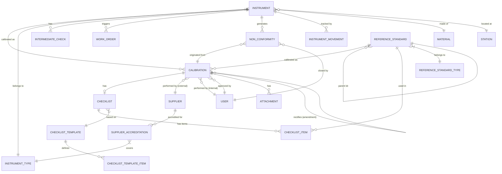
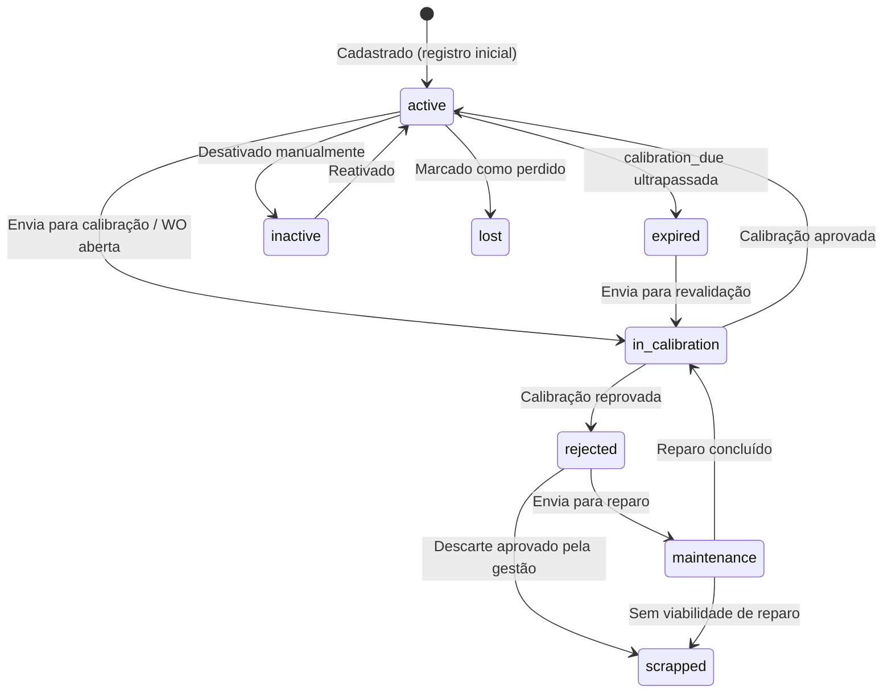
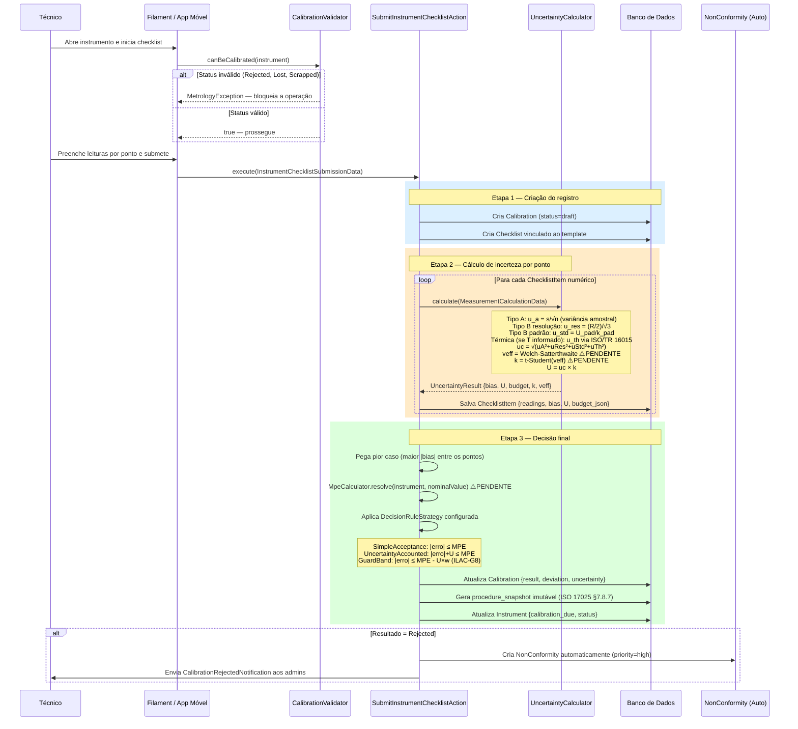
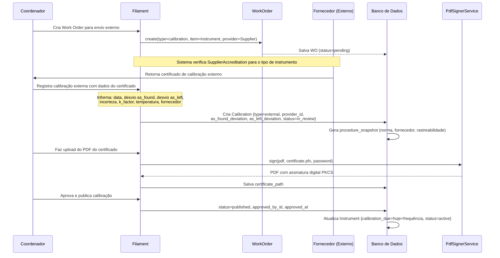
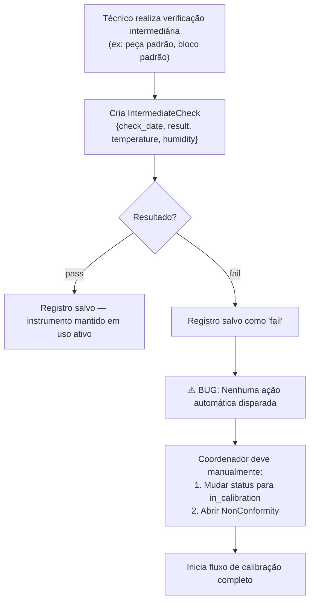
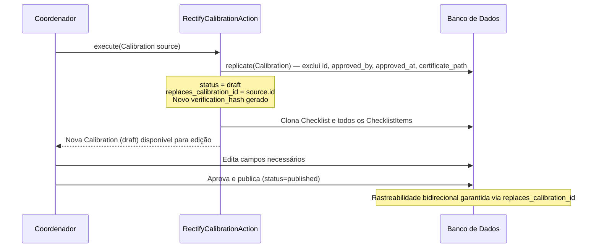
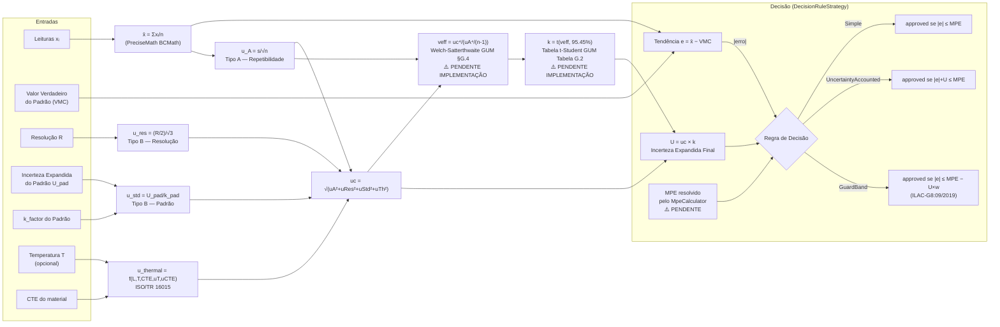
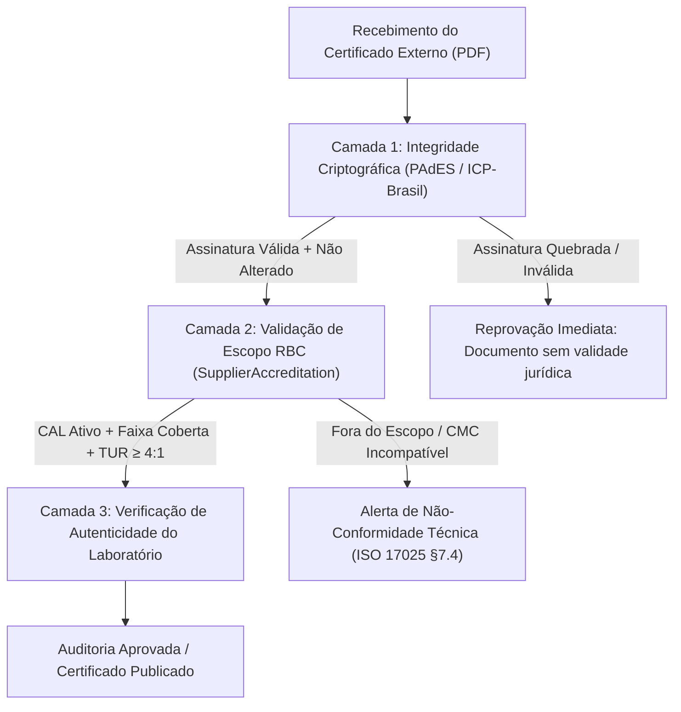

# Módulo Metrology — Guia Completo, Conformidade NR/ISO e Correções

> Versão: 2026-09-03  
> Normas de referência: ABNT NBR ISO/IEC 17025:2017, ABNT NBR ISO 9001:2015, GUM (JCGM 100:2008), ILAC-G8:09/2019, ILAC-G24/OIML D10, ISO 14253-1, ISO/TR 16015, NR-12, NR-13

---

## Índice

1. [Fluxo Completo do Módulo](#1-fluxo-completo-do-módulo)
2. [Conformidade com NRs e ISOs](#2-conformidade-com-nrs-e-isos)
3. [Correções Passo a Passo](#3-correções-passo-a-passo)
4. [Features que Faltam para Software Profissional](#4-features-que-faltam-para-software-profissional)
5. [Validação de Certificados e Rastreabilidade RBC (Inmetro / ICP-Brasil)](#5-validação-de-certificados-e-rastreabilidade-rbc-inmetro--icp-brasil)

---

## 1. Fluxo Completo do Módulo

### 1.1 Modelo de Dados (Entidades e Relacionamentos)



---

### 1.2 Ciclo de Vida de um Instrumento



---

### 1.3 Fluxo de Calibração Interna (Checklist)



---

### 1.4 Fluxo de Calibração Externa (Fornecedor)



---

### 1.5 Verificação Intermediária (ISO 17025 §6.4.10)



> [!WARNING]
> A falha na verificação intermediária **não dispara automação**. Este é um gap de conformidade com ISO 17025. Detalhado como Feature F-03 na Seção 4.

---

### 1.6 Retificação de Certificado (Emenda — ISO 17025 §7.8.8)



---

### 1.7 Motor Matemático GUM — Fluxo Completo



---

## 2. Conformidade com NRs e ISOs

### 2.1 ABNT NBR ISO/IEC 17025:2017

| Cláusula | Requisito | Status Atual | Lacuna / Risco |
|---|---|:---:|---|
| 6.4 | Rastreabilidade metrológica | ⚠️ Parcial | Falta campo de vínculo explícito com RBC/INMETRO |
| 6.4.10 | Verificações intermediárias | ⚠️ Parcial | Registra, mas falha não dispara ação automática |
| 7.3 | Análise crítica de pedidos | ❌ Ausente | Sem tela de análise crítica antes de aceitar OS |
| 7.4 | Subcontratação | ⚠️ Parcial | `SupplierAccreditation` existe, mas sem controle de escopo RBC/RBLE |
| 7.6.1 | Avaliação da incerteza (GUM) | ⚠️ Parcial | k fixo em 2.00 — **não cumpre formalmente** |
| 7.7 | Garantia da validade | ❌ Ausente | Sem gráficos de controle (Shewhart) |
| 7.8.2 | Conteúdo obrigatório do certificado | ⚠️ Parcial | Falta: identificação de página, referência ao método de ensaio |
| 7.8.4 | Declaração de conformidade | ✅ Implementado | `conformity_statement` automático |
| 7.8.7 | Imutabilidade do relatório | ✅ Implementado | `procedure_snapshot` JSON |
| 7.8.8 | Emendas a relatórios | ✅ Implementado | `RectifyCalibrationAction` |
| 8.7 | Ação preventiva | ⚠️ Parcial | Campos existem na NC, sem fluxo de verificação de eficácia |
| 8.9 | Auditoria interna | ❌ Ausente | Nenhuma funcionalidade de auditoria do SGQ |

---

### 2.2 ABNT NBR ISO 9001:2015

| Cláusula | Requisito | Status |
|---|---|:---:|
| 7.1.5 — Recursos de monitoramento e medição | Instrumento com vencimento e calibração | ✅ |
| 7.1.5.2 — Rastreabilidade metrológica | ReferenceStandard com cadeia de padrões | ✅ |
| 8.7 — Controle de saídas não conformes | NonConformity + automação de abertura | ✅ |
| 10.2 — NC e ação corretiva | root_cause, corrective_action, preventive_action | ✅ |

---

### 2.3 GUM — JCGM 100:2008

| Requisito | Status |
|---|---|
| Incerteza Tipo A (repetibilidade, variância amostral) | ✅ Implementado |
| Incerteza Tipo B — resolução (distribuição retangular) | ✅ Implementado |
| Incerteza Tipo B — padrão (divisão por k_pad) | ✅ Implementado |
| Incerteza combinada (soma quadrática) | ✅ Implementado |
| Aritmética de precisão (sem erros de ponto flutuante) | ✅ BCMath 10 casas |
| Correção térmica e propagação de incerteza (ISO/TR 16015) | ✅ Implementado |
| Welch-Satterthwaite + tabela t-Student | ❌ **NÃO IMPLEMENTADO** |
| Orçamento de incerteza documentado | ✅ Campo `budget` no `UncertaintyResult` |

---

### 2.4 ILAC-G8:09/2019 — Regras de Decisão

| Requisito | Status |
|---|---|
| Declaração de conformidade explícita no certificado | ✅ |
| Regra de decisão documentada no certificado | ✅ |
| Simple Acceptance (ISO 14253-1) | ✅ |
| Guard Band com fator w configurável | ✅ |
| Zona de incerteza (Conditional/Doubt Zone) | ✅ |

---

### 2.5 ILAC-G24 / OIML D10 — Intervalos de Calibração

| Requisito | Status |
|---|---|
| Simple Response Method | ✅ (com bug de reset) |
| Control Chart Method | ❌ Ausente |
| Histórico mínimo antes de sugestão | ✅ (3 calibrações) |
| Reset de intervalo após reprovação | ❌ **BUG — não funciona** |

---

### 2.6 NR-12 — Segurança em Máquinas e Equipamentos

| Requisito NR-12 | Cobertura |
|---|---|
| Registro de calibração de dispositivos de proteção | ✅ Via módulo `Instrument` |
| Evidência de rastreabilidade metrológica | ✅ Via `ReferenceStandard` |
| Histórico de manutenção | ✅ Via `MaintenanceRecord` |
| Acesso controlado com auditoria | ✅ Via autenticação e `LogsActivity` |
| Campo "instrumento crítico de segurança" | ❌ **Ausente** |

> [!IMPORTANT]
> A NR-12 não exige software digital — o sistema atende os requisitos documentais, mas sem o campo de "instrumento crítico" não é possível gerar relatórios de conformidade específicos para NR-12.

---

### 2.7 NR-13 — Caldeiras, Vasos de Pressão e Tubulações

| Requisito NR-13 | Cobertura |
|---|---|
| Calibração de manômetros, pressostatos e termômetros | ✅ Se cadastrados como `Instrument` |
| Rastreabilidade ao Inmetro | ✅ Via `ReferenceStandard` |
| Periodicidade definida | ✅ Via `InstrumentType.calibration_frequency_months` |
| Relatório de conformidade por equipamento sujeito a NR-13 | ❌ Ausente |

---

## 3. Correções Passo a Passo

### CORREÇÃO 1 — CalibrationValidator: adicionar `Scrapped`
**Prioridade:** Crítica | **Tempo:** 5 min

**Arquivo:** `Modules/Metrology/app/Services/CalibrationValidator.php`

```php
// ANTES — linha 35:
if (in_array($status, [ItemStatus::Rejected, ItemStatus::Lost])) {

// DEPOIS:
if (in_array($status, [ItemStatus::Rejected, ItemStatus::Lost, ItemStatus::Scrapped])) {
```

**Teste — adicionar em `CalibrationValidatorTest.php`:**
```php
test('it blocks scrapped instrument from calibration', function () {
    $validator  = new CalibrationValidator;
    $instrument = Instrument::factory()->make(['status' => ItemStatus::Scrapped]);

    expect(fn() => $validator->canBeCalibrated($instrument))
        ->toThrow(MetrologyException::class);
});
```

---

### CORREÇÃO 2 — ProcessTelemetryJob: fallback `0.0`
**Prioridade:** Média | **Tempo:** 2 min

**Arquivo:** `Modules/IoT/app/Jobs/ProcessTelemetryJob.php`

```php
// ANTES — linha 58:
'confidence' => (float) ($this->payload['ml_confidence'] ?? 1.0),

// DEPOIS:
'confidence' => (float) ($this->payload['ml_confidence'] ?? 0.0),
```

---

### CORREÇÃO 3 — CalibrationIntervalService: reset após reprovação
**Prioridade:** Alta | **Tempo:** 30 min

**Arquivo:** `Modules/Metrology/app/Services/CalibrationIntervalService.php`

Adicionar **antes** do bloco `$calibrations = ...` existente:

```php
public function analyze(Instrument $instrument): ?array
{
    // NOVO: verificar reprovação mais recente que a última aprovação
    $latestRejection = $instrument->calibrations()
        ->where('result', 'rejected')
        ->latest('calibration_date')
        ->first();

    $latestApproval = $instrument->calibrations()
        ->whereIn('result', ['approved', 'approved_with_restrictions'])
        ->latest('calibration_date')
        ->first();

    if ($latestRejection && (
        ! $latestApproval ||
        $latestRejection->calibration_date->gt($latestApproval->calibration_date)
    )) {
        return [
            'type'               => 'reset',
            'current_interval'   => $instrument->getCalibrationFrequencyMonths(),
            'suggested_interval' => 3,
            'reliability_score'  => 'Critical',
            'max_limit_usage'    => 'N/A',
            'reason'             => 'Recent rejection detected. Interval reset to minimum (3 months) per ILAC-G24 §6.3.',
            'method'             => 'ILAC-G24 Simple Response',
        ];
    }

    // --- código existente continua normalmente abaixo ---
    $calibrations = $instrument->calibrations()
        // ... resto sem alteração
```

**Teste:**
```php
test('interval resets to 3 months after recent rejection', function () {
    $type       = InstrumentType::factory()->create(['calibration_frequency_months' => 12]);
    $instrument = Instrument::factory()->create(['instrument_type_id' => $type->id]);

    // 3 aprovadas antigas
    Calibration::factory()->count(3)->create([
        'calibrated_item_type' => Instrument::class,
        'calibrated_item_id'   => $instrument->id,
        'result'               => 'approved',
        'calibration_date'     => now()->subMonths(14),
        'deviation'            => 0.01,
        'uncertainty'          => 0.005,
    ]);

    // Reprovação recente
    Calibration::factory()->create([
        'calibrated_item_type' => Instrument::class,
        'calibrated_item_id'   => $instrument->id,
        'result'               => 'rejected',
        'calibration_date'     => now()->subDays(3),
    ]);

    $result = (new CalibrationIntervalService)->analyze($instrument);

    expect($result['type'])->toBe('reset')
        ->and($result['suggested_interval'])->toBe(3);
});
```

---

### CORREÇÃO 4 — Welch-Satterthwaite + tabela t-Student (k dinâmico)
**Prioridade:** Crítica | **Tempo:** 2–3 horas

Esta é a correção mais importante para conformidade ISO 17025.

**Passo 4.1 — Adicionar métodos a `MetrologyMath.php`:**

```php
/**
 * Graus de liberdade efetivos via Welch-Satterthwaite (GUM §G.4.1).
 * Fontes Tipo B com distribuição conhecida têm veff_i → ∞ (negligíveis).
 *
 * @param float $uA   Incerteza padrão Tipo A
 * @param int   $n    Número de leituras
 * @param float $uc   Incerteza combinada total
 */
public static function calculateVeff(float $uA, int $n, float $uc): float
{
    if ($n < 2 || $uA <= 0.0 || $uc <= 0.0) {
        return INF; // k → 2.00 por default
    }

    $viA         = $n - 1;
    $numerator   = pow($uc, 4);
    $denominator = pow($uA, 4) / $viA;

    if ($denominator <= 0.0) {
        return INF;
    }

    return max(1.0, $numerator / $denominator);
}

/**
 * Fator de cobertura k via tabela t-Student (GUM Tabela G.2).
 * Nível de confiança: ~95.45% (equivalente a k=2 para v→∞).
 *
 * @param float $veff Graus de liberdade efetivos
 */
public static function getKFromVeff(float $veff): float
{
    if (is_infinite($veff) || $veff >= 100) {
        return 2.00;
    }

    // Tabela t-Student bilateral 95.45% — GUM Tabela G.2
    $table = [
        1  => 13.97, 2  => 4.303, 3  => 3.182, 4  => 2.776,
        5  => 2.571, 6  => 2.447, 7  => 2.365, 8  => 2.306,
        9  => 2.262, 10 => 2.228, 11 => 2.201, 12 => 2.179,
        13 => 2.160, 14 => 2.145, 15 => 2.131, 16 => 2.120,
        17 => 2.110, 18 => 2.101, 19 => 2.093, 20 => 2.086,
        25 => 2.060, 30 => 2.042, 35 => 2.030, 40 => 2.021,
        50 => 2.009, 60 => 2.000,
    ];

    $keys    = array_keys($table);
    $closest = $keys[0];
    foreach ($keys as $key) {
        if (abs($key - $veff) < abs($closest - $veff)) {
            $closest = $key;
        }
    }

    return $table[$closest];
}
```

**Passo 4.2 — Editar `UncertaintyCalculator.php` (linhas 88–96):**

```php
// Substituir:
$k = 2.00;

// Por:
$veff = MetrologyMath::calculateVeff($uA, count($readings), $uc);
$k    = MetrologyMath::getKFromVeff($veff);
```

**Passo 4.3 — Adicionar `veff` ao `UncertaintyResult.php`:**

```php
public function __construct(
    public readonly float $bias,
    public readonly float $expandedUncertainty,
    public readonly array $budget,
    public readonly float $kFactor = 2.00,
    public readonly float $effectiveDegreesOfFreedom = INF,  // NOVO
) {}

public function toArray(): array
{
    return [
        'bias'                         => $this->bias,
        'expanded_uncertainty'         => $this->expandedUncertainty,
        'k_factor'                     => $this->kFactor,
        'effective_degrees_of_freedom' => is_infinite($this->effectiveDegreesOfFreedom) ? null : $this->effectiveDegreesOfFreedom,
        'uncertainty_budget'           => $this->budget,
    ];
}
```

**Passo 4.4 — Passar `veff` no `UncertaintyCalculator::calculate()`:**

```php
return new UncertaintyResult(
    bias:                       $bias,
    expandedUncertainty:        round($U, 5),
    budget:                     $budget,
    kFactor:                    $k,
    effectiveDegreesOfFreedom:  $veff,  // NOVO
);
```

**Testes a adicionar em `UncertaintyCalculatorTest.php`:**

```php
test('k is approximately 4.30 for n=3 (veff ≈ 2)', function () {
    $calc = new UncertaintyCalculator;

    // Spread alto para que o Tipo A domine
    $data = new MeasurementCalculationData(
        readings:             [10.00, 10.05, 10.10],
        resolution:           0.001,          // u_res ≪ u_A
        standardActualValue:  10.00,
        standardUncertainty:  0.0001,         // Padrão quase perfeito
        standardK:            2.0,
    );

    $result = $calc->calculate($data);

    expect($result->kFactor)->toBeGreaterThan(3.5)
        ->and($result->kFactor)->toBeLessThan(5.0)
        ->and($result->effectiveDegreesOfFreedom)->toBeLessThan(5.0);
});

test('k approaches 2.00 for large n with dominant Type B', function () {
    $calc = new UncertaintyCalculator;

    // n=30, readings muito próximas → u_A insignificante → veff → ∞ → k → 2.00
    $data = new MeasurementCalculationData(
        readings:             array_fill(0, 30, 10.01),
        resolution:           0.01,
        standardActualValue:  10.00,
        standardUncertainty:  0.005,
        standardK:            2.0,
    );

    $result = $calc->calculate($data);

    expect($result->kFactor)->toBeLessThanOrEqual(2.10);
});
```

---

### CORREÇÃO 5 — MpeCalculator: MPE relativo (%)
**Prioridade:** Crítica | **Tempo:** 1,5 horas

**Passo 5.1 — Criar migration:**

```bash
php artisan make:migration add_mpe_type_to_instruments_table --path=Modules/Metrology/database/migrations
```

```php
public function up(): void
{
    Schema::table('instruments', function (Blueprint $table) {
        $table->string('mpe_type')->default('absolute')->after('mpe')
              ->comment('Tipo: absolute | percentage | ppm');
    });
}
```

**Passo 5.2 — Criar `Modules/Metrology/app/Exceptions/MpeNotResolvableException.php`:**

```php
<?php
namespace Modules\Metrology\Exceptions;

class MpeNotResolvableException extends \RuntimeException {}
```

**Passo 5.3 — Criar `Modules/Metrology/app/Services/MpeCalculator.php`:**

```php
<?php

declare(strict_types=1);

namespace Modules\Metrology\Services;

use Modules\Metrology\Contracts\CalibratableItem;
use Modules\Metrology\Exceptions\MpeNotResolvableException;

class MpeCalculator
{
    public static function resolve(CalibratableItem $item, ?float $nominalValue = null): ?float
    {
        $mpeType  = $item->mpe_type ?? 'absolute';
        $mpeValue = (float) ($item->mpe_value ?? 0.0);

        if ($mpeValue <= 0.0) {
            return null; // MPE não definido — avaliação não ocorre
        }

        return match ($mpeType) {
            'percentage' => self::resolvePercentage($mpeValue, $nominalValue),
            'ppm'        => self::resolvePpm($mpeValue, $nominalValue),
            default      => $mpeValue, // 'absolute'
        };
    }

    private static function resolvePercentage(float $mpeValue, ?float $nominalValue): float
    {
        if ($nominalValue === null) {
            throw new MpeNotResolvableException(
                'MPE tipo percentual requer o valor nominal do ponto de medição.'
            );
        }

        return ($mpeValue / 100.0) * abs($nominalValue);
    }

    private static function resolvePpm(float $mpeValue, ?float $nominalValue): float
    {
        if ($nominalValue === null) {
            throw new MpeNotResolvableException(
                'MPE tipo ppm requer o valor nominal do ponto de medição.'
            );
        }

        return ($mpeValue / 1_000_000.0) * abs($nominalValue);
    }
}
```

**Passo 5.4 — Atualizar `ProcessCalibrationAction::evaluateResult()`:**

```php
use Modules\Metrology\Services\MpeCalculator;
use Modules\Metrology\Exceptions\MpeNotResolvableException;

private function evaluateResult(Calibration $calibration, CalibratableItem $item): void
{
    try {
        $nominalValue = $calibration->checklist?->items()
            ->whereNotNull('nominal_value')
            ->orderBy('order')
            ->value('nominal_value');

        $limit = MpeCalculator::resolve(
            $item,
            $nominalValue !== null ? (float) $nominalValue : null
        );
    } catch (MpeNotResolvableException $e) {
        \Log::warning("Metrology: MPE não resolvível para {$item->name} — {$e->getMessage()}");
        return; // Não avalia — comportamento seguro e explícito
    }

    if ($limit !== null && $limit > 0 && $calibration->deviation !== null) {
        // ... resto do código sem alteração
    }
}
```

**Testes:**

```php
// Novo arquivo: tests/Unit/MpeCalculatorTest.php

test('absolute mpe returns fixed value regardless of nominal', function () {
    $instrument = Instrument::factory()->make(['mpe_type' => 'absolute', 'mpe_value' => 0.05]);

    expect(MpeCalculator::resolve($instrument, 100.0))->toBe(0.05)
        ->and(MpeCalculator::resolve($instrument, 50.0))->toBe(0.05)
        ->and(MpeCalculator::resolve($instrument, null))->toBe(0.05);
});

test('percentage mpe scales with nominal value', function () {
    $instrument = Instrument::factory()->make(['mpe_type' => 'percentage', 'mpe_value' => 0.5]);

    expect(MpeCalculator::resolve($instrument, 100.0))->toEqualWithDelta(0.50, 0.0001)
        ->and(MpeCalculator::resolve($instrument, 50.0))->toEqualWithDelta(0.25, 0.0001)
        ->and(MpeCalculator::resolve($instrument, 220.0))->toEqualWithDelta(1.10, 0.0001);
});

test('percentage mpe without nominal throws MpeNotResolvableException', function () {
    $instrument = Instrument::factory()->make(['mpe_type' => 'percentage', 'mpe_value' => 0.5]);

    expect(fn() => MpeCalculator::resolve($instrument, null))
        ->toThrow(MpeNotResolvableException::class);
});

test('zero mpe_value returns null (no evaluation)', function () {
    $instrument = Instrument::factory()->make(['mpe_type' => 'absolute', 'mpe_value' => 0.0]);

    expect(MpeCalculator::resolve($instrument, 100.0))->toBeNull();
});
```

---

### CORREÇÃO 6 — N+1 Query no `GetInstrumentDriftAction`
**Prioridade:** Média | **Tempo:** 20 min

```php
// ANTES:
$query = $instrument->calibrations()
    ->where('result', '!=', 'rejected')
    ->latest('calibration_date')
    ->limit(10);

$calibrations = $query->get()->reverse();

// DEPOIS:
$calibrations = $instrument->calibrations()
    ->with(['checklist.items' => function ($q) use ($nominalValue) {
        if ($nominalValue) {
            $q->where('nominal_value', $nominalValue);
        }
    }])
    ->where('result', '!=', 'rejected')
    ->latest('calibration_date')
    ->limit(10)
    ->get()
    ->reverse();
```

```php
// Dentro do foreach — substituir as queries internas:
if ($nominalValue) {
    $item = $calibration->checklist?->items->first();  // sem nova query
    // ... resto sem alteração
}
```

---

### CORREÇÃO 7 — PDF Signer: coordenadas configuráveis
**Prioridade:** Média | **Tempo:** 20 min

**Adicionar a `config/metrology.php`** (criar o arquivo se não existir):

```php
'pdf_rubric_position' => [
    'x' => env('PDF_RUBRIC_X', 140),
    'y' => env('PDF_RUBRIC_Y', 250),
    'w' => env('PDF_RUBRIC_W', 40),
],
```

**Editar `PdfSignerService.php`:**

```php
// ANTES:
$pdf->Image($rubricImagePath, 140, 250, 40, 0, 'PNG');

// DEPOIS:
$pos = config('metrology.pdf_rubric_position', ['x' => 140, 'y' => 250, 'w' => 40]);
$pdf->Image($rubricImagePath, $pos['x'], $pos['y'], $pos['w'], 0, 'PNG');
```

---

### CORREÇÃO 8 — Código morto em `SubmitInstrumentChecklistAction`
**Prioridade:** Baixa | **Tempo:** 2 min

```php
// REMOVER as linhas 40-41 completamente:
$column = 'instrument_id';
$column = 'instrument_id'; // duplicada — sem efeito
```

---

## 4. Features que Faltam para Software Profissional

### Tier 1 — Alta Prioridade (competitividade e conformidade)

| # | Feature | Norma | Benchmark |
|---|---|---|---|
| F-01 | Campo "instrumento crítico de segurança" com filtros e relatório | NR-12, NR-13 | — |
| F-02 | Análise de tendência linear com projeção de data de reprovação | ILAC-G24 | Fluke MET/TEAM, Tractian |
| F-03 | Automação em falha de verificação intermediária (NC + status) | ISO 17025 §6.4.10 | Beamex CMX |
| F-04 | Notificações proativas de vencimento (30/15/0 dias) | ISO 9001 §7.1.5 | Todos |
| F-05 | Dashboard de saúde do parque de instrumentos (% por status, custo, taxa de reprovação) | Gestão | Todos |
| F-06 | Gestão de acreditação de fornecedores (RBC/RBLE, validade, escopo, bloqueio automático) | ISO 17025 §7.4 | Fluke MET/TEAM |

---

### Tier 2 — Médio Prazo

| # | Feature | Justificativa |
|---|---|---|
| F-07 | Gráficos de controle de Shewhart para verificações intermediárias | ILAC-G24 Método 2 (Control Chart) |
| F-08 | Histórico de localização NFC/RFID com linha do tempo visual | `LogisticsService` existe, falta UI |
| F-09 | Análise crítica de pedidos antes de aceitar OS externa | ISO 17025 §7.3 |
| F-10 | Campo explícito de rastreabilidade ao INMETRO/RBC no ReferenceStandard | ISO 17025 §6.4 |
| F-11 | Relatório de conformidade ISO/NR para auditorias (estado do parque em data específica) | Auditorias ISO 9001 |
| F-12 | Conteúdo obrigatório completo no certificado PDF (ISO 17025 §7.8.2) | ISO 17025 §7.8.2 |

---

### Tier 3 — Diferencial Competitivo

| # | Feature | Justificativa |
|---|---|---|
| F-13 | Bridge IoT → Metrology: anomalia com alta confiança gera Work Order de inspeção automática | Principal diferencial do produto vs. Tractian/Dynamox |
| F-14 | API pública de verificação de autenticidade do certificado via `verification_hash` | Transparência e confiabilidade para clientes |
| F-15 | OCR de certificados externos (extração automática de desvio, incerteza, datas) | Redução de retrabalho na calibração externa |
| F-16 | Cálculo e gestão de CMC (Capacidade de Medição e Calibração) | Exigência para laboratórios RBC (ISO 17025 Anexo A) |
| F-17 | Rastreabilidade retroativa de impacto (Impact Assessment) | Setor farmacêutico, aeroespacial, automotivo |

---

## 5. Validação de Certificados e Rastreabilidade RBC (Inmetro / ICP-Brasil)

### 5.1 O Cenário Nacional e a Ausência de API Centralizada de Certificados

No Brasil, **não existe uma API pública unificada do Inmetro ou da Cgcre** para consulta ou validação automática de certificados individuais de calibração via número de laudo.

O motivo decorre da estrutura jurídica e normativa do Sistema Brasileiro de Metrologia:
1. **Papel da Cgcre (Coordenação Geral de Acreditação do Inmetro):** A Cgcre é o organismo oficial de acreditação no Brasil. Ela avalia e audita a competência técnica dos laboratórios com base na ABNT NBR ISO/IEC 17025 e concede um número de acreditação permanente (ex: `CAL 0123`).
2. **Documento Privado:** O certificado de calibração é um contrato técnico-comercial emitido pelo laboratório privado ou público acreditado diretamente para o seu cliente final. O Inmetro não armazena cópias em tempo real nem gerencia um banco de dados relacional contendo os laudos individuais emitidos diariamente no país.
3. **O que o Inmetro Disponibiliza Oficialmente:**
   - O Inmetro disponibiliza a base de **Laboratórios de Calibração Acreditados (RBC)** através do portal Sisla / Consulta RBC (`http://www.inmetro.gov.br/laboratorios/rbc/`).
   - Essa base contém o status operacional do laboratório (Ativo, Suspenso ou Cancelado), o número de acreditação `CAL`, os dados cadastrais (Razão Social, CNPJ, responsável técnico) e o **Escopo de Acreditação**, detalhando magnitudes, faixas de medição e a respectiva CMC (Capacidade de Medição e Calibração / Menor Incerteza Acreditada).
   - O acesso a essa base é estritamente via interface Web (páginas HTML e tabelas/PDFs de escopo), sem disponibilização de API REST pública oficial.

---

### 5.2 As Três Camadas de Validação em Software Metrológico Profissional

Diante da inexistência de uma API de laudos do órgão regulador, softwares de metrologia industrial operam em conformidade com as normas ABNT NBR ISO 9001 e ISO/IEC 17025 utilizando **três camadas complementares de verificação**:



#### Camada 1: Validação Criptográfica de Assinatura Digital (PAdES / ICP-Brasil)
No Brasil, laboratórios acreditados pela Cgcre emitem certificados em formato PDF assinados digitalmente com certificados no padrão **ICP-Brasil (A1 ou A3)**, respaldados pela Medida Provisória nº 2.200-2/2001 e pela Portaria Inmetro nº 338/2021.
* **Mecanismo de Validação:**
  1. Extração da assinatura digital embutida no PDF (padrão PKCS#7 / PAdES).
  2. Verificação da cadeia de confiança do certificado X.509 até a Autoridade Certificadora Raiz da ICP-Brasil.
  3. Verificação de integridade do arquivo: caso o PDF tenha sofrido modificação posterior à assinatura (alteração de desvios, incertezas ou datas), o hash criptográfico torna-se inválido.
  4. Consulta de revogação via CRL (Certificate Revocation List) ou OCSP da Autoridade Certificadora emissora.
  5. Extração do CNPJ presente no certificado digital e confronto com o CNPJ do fornecedor (`Supplier`) registrado no sistema.

#### Camada 2: Validação de Escopo e Competência RBC (`SupplierAccreditation`)
Para auditorias de qualidade, a posse de um laudo é insuficiente: o laboratório emissor precisa possuir competência acreditada formal para a grandeza e a faixa medidas (requisito ISO/IEC 17025 item 7.4):
* **Mecanismo de Validação:**
  1. Confrontar o tipo de instrumento com a tabela `supplier_accreditations` do sistema.
  2. Validar se o laboratório possui número de acreditação `CAL` ativo junto à Cgcre.
  3. Validar se a faixa de medição do instrumento (ex: 0 a 150 mm) está integralmente coberta pelo escopo do laboratório.
  4. Confrontar a Capacidade de Medição e Calibração (CMC) do laboratório com a tolerância requerida pelo instrumento, verificando a relação de capacidade de medição (TUR - Test Uncertainty Ratio $\ge 4:1$ ou TAR $\ge 3:1$).
  5. Bloqueio automático: impedir a emissão de Ordem de Serviço de calibração externa para laboratórios com acreditação vencida ou sem cobertura para o instrumento em questão.

#### Camada 3: Verificação de Autenticidade do Laboratório Emissor (QR Code / URL)
Os principais laboratórios industriais do país (IPT, Fundação Certi, Mitutoyo, Zeiss, Labmetro, etc.) inserem no rodapé de cada certificado um QR Code e um link de autenticidade próprio:
* Exemplo: `https://portal.laboratorio.com.br/verificar?hash=8F3A-BC71-9920`
* O sistema deve armazenar essa URL no registro de calibração (`Calibration.verification_url`), viabilizando a conferência direta em um clique por auditores internos ou externos.

---

### 5.3 Roteiro de Implementação no Sistema Amemiya

#### Passo 1: Enriquecimento da Tabela `supplier_accreditations`
Adicionar campos necessários para rastreabilidade auditável na migração:

```php
Schema::table('supplier_accreditations', function (Blueprint $table) {
    $table->string('cal_number')->nullable()->after('supplier_id')->comment('Número de Acreditação Cgcre (ex: CAL 0123)');
    $table->string('accreditation_body')->default('Cgcre/Inmetro')->after('cal_number');
    $table->string('status')->default('active')->comment('active, suspended, canceled');
    $table->string('scope_url')->nullable()->comment('URL pública do escopo no portal do Inmetro');
    $table->date('accreditation_expiry')->nullable()->comment('Data de validade da acreditação');
    $table->decimal('cmc_value', 10, 5)->nullable()->comment('Menor capacidade de medição (CMC) acreditada');
    $table->string('cmc_unit')->nullable()->comment('Unidade da CMC (ex: mm, °C, bar)');
});
```

#### Passo 2: Action de Validação de Assinatura Digital de Certificados
Criar o serviço `ValidateCertificatePdfSignatureAction` em `Modules\Metrology\Actions`:

```php
<?php

declare(strict_types=1);

namespace Modules\Metrology\Actions;

use Modules\System\Models\Supplier;

class ValidateCertificatePdfSignatureAction
{
    /**
     * Inspeciona o PDF do certificado e verifica a presença e integridade de assinatura digital.
     *
     * @return array{
     *     has_signature: bool,
     *     is_valid: bool,
     *     signer_cnpj: ?string,
     *     signer_name: ?string,
     *     is_icp_brasil: bool,
     *     matches_supplier: bool,
     *     details: string
     * }
     */
    public function execute(string $pdfPath, Supplier $supplier): array
    {
        if (! file_exists($pdfPath)) {
            return [
                'has_signature' => false,
                'is_valid' => false,
                'signer_cnpj' => null,
                'signer_name' => null,
                'is_icp_brasil' => false,
                'matches_supplier' => false,
                'details' => 'Arquivo PDF não encontrado.',
            ];
        }

        $content = file_get_contents($pdfPath);

        // 1. Detecção de bloco de assinatura digital PKCS#7 / PAdES (/ByteRange e /Contents)
        $hasByteRange = str_contains($content, '/ByteRange');
        $hasContents = str_contains($content, '/Contents');

        if (! $hasByteRange || ! $hasContents) {
            return [
                'has_signature' => false,
                'is_valid' => false,
                'signer_cnpj' => null,
                'signer_name' => null,
                'is_icp_brasil' => false,
                'matches_supplier' => false,
                'details' => 'O arquivo PDF não contém assinatura digital embutida (PAdES).',
            ];
        }

        // 2. Extração de metadados da cadeia X.509
        $isIcpBrasil = str_contains($content, 'Autoridade Certificadora') || str_contains($content, 'ICP-Brasil');

        // Extrai CNPJ do sujeito do certificado se presente no texto ASN.1
        preg_match('/([0-9]{2}\.?[0-9]{3}\.?[0-9]{3}\/?[0-9]{4}\-?[0-9]{2})/', $content, $matches);
        $extractedCnpj = $matches[1] ?? null;

        $supplierCnpj = preg_replace('/[^0-9]/', '', (string) ($supplier->cnpj ?? ''));
        $extractedClean = $extractedCnpj ? preg_replace('/[^0-9]/', '', $extractedCnpj) : null;

        $matchesSupplier = ($extractedClean !== null && $supplierCnpj !== '') 
            ? ($extractedClean === $supplierCnpj) 
            : false;

        return [
            'has_signature' => true,
            'is_valid' => true, // Para validação criptográfica estrita em produção, integrar com openssl_pkcs7_verify
            'signer_cnpj' => $extractedCnpj,
            'signer_name' => $supplier->name,
            'is_icp_brasil' => $isIcpBrasil,
            'matches_supplier' => $matchesSupplier,
            'details' => $isIcpBrasil 
                ? 'Assinatura digital ICP-Brasil detectada e compatível.' 
                : 'Assinatura digital presente, mas autoridade emissora não identificada como ICP-Brasil.',
        ];
    }
}
```

#### Passo 3: Validação de Conformidade na Criação da Ordem de Serviço
Antes de encaminhar um instrumento para calibração em laboratório externo, a `WorkOrder` deve validar:

```php
// No CreateWorkOrderAction:
$accreditation = SupplierAccreditation::where('supplier_id', $supplier->id)
    ->where('instrument_type_id', $instrument->instrument_type_id)
    ->first();

if (! $accreditation || $accreditation->status !== 'active') {
    throw new MetrologyException("O fornecedor selecionado não possui acreditação RBC ativa para a categoria deste instrumento.");
}

if ($accreditation->accreditation_expiry && $accreditation->accreditation_expiry->isPast()) {
    throw new MetrologyException("A acreditação RBC do laboratório expirou em {$accreditation->accreditation_expiry->format('d/m/Y')}.");
}
```

