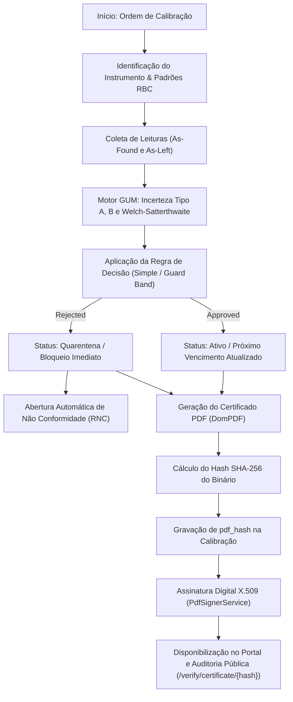
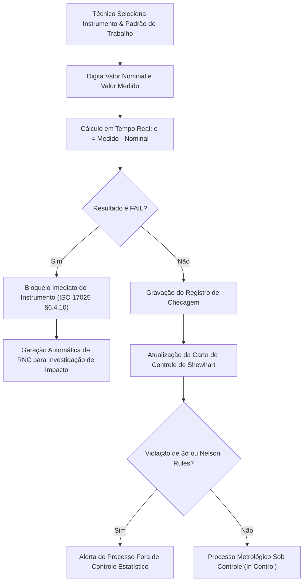
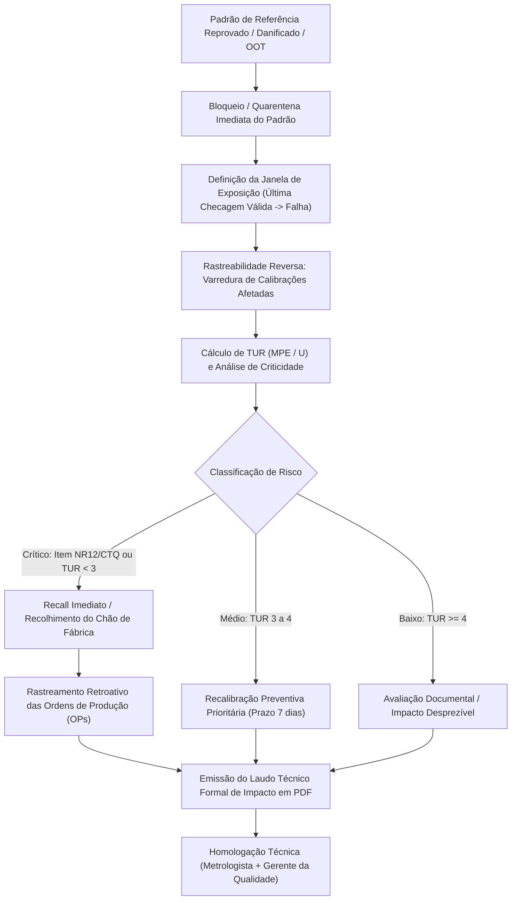
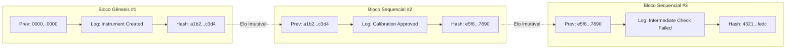

# Manual de Regras de Negócio e Arquitetura - Módulo Metrologia

> **Versão do Documento:** 5.0 (The Metrological Quality Atlas)  
> **Módulo:** Metrologia (`Modules/Metrology`) & Sistema (`Modules/System`)  
> **Normas de Referência:** ABNT NBR ISO/IEC 17025:2017, ILAC-G24 / OIML D10, ILAC-G8:09/2019, JCGM 100:2008 (GUM), FDA 21 CFR Part 11, ISO 9001 / IATF 16949  
> **Status:** Documentação Canônica Atualizada  

Este manual consolida todas as regras de negócio, arquitetura de software, modelos matemáticos, fluxos operacionais e o inventário completo do código implementado no módulo de metrologia.

---

## 1. Visão Geral e Filosofia Normativa

O Módulo de Metrologia gerencia integralmente o ciclo de vida dos ativos metrológicos (Instrumentos de Medição e Padrões de Referência). Ele visa assegurar:
1. **Conformidade Regulatória Estrita:** Aderência plena à ISO/IEC 17025 (requisitos para laboratórios de calibração) e FDA 21 CFR Part 11 (registros eletrônicos e assinaturas digitais).
2. **Rastreabilidade Metrológica Ininterrupta:** Toda calibração conecta-se a padrões RBC/Inmetro através de cadeia documentada, com número de certificado e laboratório acreditado Cgcre.
3. **Idempotência e Rigor Matemático:** Cálculos de incerteza de medição conforme GUM, cartas de controle estatístico (Shewhart) e regras de decisão sem desvios subjetivos.
4. **Imutabilidade e Segurança Forense:** Certificados assinados digitalmente com hash SHA-256 e trilha de auditoria encadeada criptograficamente em blockchain-style na base de dados.

---

## 2. Glossário e Linguagem Ubíqua

* **MPE (Maximum Permissible Error / Erro Máximo Permissível):** Limite de tolerância de erro tolerado no processo ou especificado pelo fabricante/norma para o instrumento.
* **Erro de Indicação ($e$) / Tendência (Bias):** Diferença entre o valor medido e o valor verdadeiro convencional (padrão):  
  $$e = \text{Valor Medido} - \text{Valor Nominal}$$
* **Incerteza Expandida ($U$):** Intervalo em torno do resultado de medição que se espera abranger uma grande fração da distribuição de valores ($U = k \cdot u_c$, onde tipicamente $k=2$ ou calculado dinamicamente).
* **TUR (Test Uncertainty Ratio / Razão de Incerteza do Teste):**  
  $$\text{TUR} = \frac{\text{MPE}}{U} \quad \text{ou} \quad \frac{\text{Tolerância do Processo}}{2 \cdot U}$$
  * $\text{TUR} \ge 4.0$: Risco insignificante para o consumidor.
  * $2.0 \le \text{TUR} < 4.0$: Risco moderado (requer monitoramento).
  * $\text{TUR} < 2.0$: Risco crítico (rejeição ou recall mandatório).
* **Faixa de Guarda (Guard Band):** Zona de redução do limite de tolerância baseada na incerteza $U$, reduzindo o risco de aceitação de peças ou calibrações não conformes.
* **Checagem Intermediária (Intermediate Check):** Verificação periódica realizada entre calibrações formais utilizando padrões de trabalho para garantir a manutenção da confiança metrológica (ISO 17025 §6.4.10 / ILAC-G24).
* **Rastreabilidade Reversa (Impact Analysis):** Mecanismo de investigação forense que, a partir de um padrão de referência que foi reprovado ou danificado, localiza todas as calibrações e instrumentos afetados durante a janela crítica de exposição.

---

## 3. Enums e Tipos Canônicos

### 3.1. `ItemStatus` (`Modules\Metrology\Enums\ItemStatus.php`)
* `Active`: Em operação normal no posto de trabalho.
* `Maintenance`: Em intervenção corretiva ou preventiva mecânica/eletrônica.
* `InCalibration`: Enviado ao laboratório metrológico ou RBC externa.
* `Quarantined`: Bloqueado por não conformidade, reprovação em checagem intermediária ou suspeição de impacto de padrão.
* `Scrapped`: Descartado/sucata formal (bloqueado para qualquer uso).
* `Lost`: Extraviado (gera investigação patrimonial e encerramento).

### 3.2. `CalibrationResult` (`Modules\Metrology\Enums\CalibrationResult.php`)
* `Approved`: Aprovado sem restrições.
* `ApprovedWithRestrictions`: Aprovado sob restrição (ex: zona de guarda ou faixa parcial).
* `Rejected`: Reprovado por exceder o MPE (dispara abertura imediata de RNC e bloqueio).

### 3.3. `InstrumentCriticality` (`Modules\Metrology\Enums\InstrumentCriticality.php`)
Classificação de risco para triagem de recall e frequências de calibração:
* `SafetyNr12` (`safety_nr12`): Segurança de Máquinas e Equipamentos (NR-12). Crítico.
* `SafetyNr13` (`safety_nr13`): Vasos de Pressão e Caldeiras (NR-13). Crítico.
* `ProductQualityCtq` (`product_quality_ctq`): Crítico para Qualidade (CTQ / IATF 16949). Crítico.
* `Environmental` (`environmental`): Monitoramento ambiental (ISO 14001).
* `OperationalReference` (`operational_reference`): Uso operacional geral de oficina/bancada.

---

## 4. Modelos Matemáticos e Motores de Cálculo

### 4.1. Cálculo de Incerteza Conforme GUM (JCGM 100:2008)
Implementado em [`UncertaintyCalculator`](file:///C:/Users/andrl/OneDrive/Documentos/Projetos%20Pessoal/amemiya/Modules/Metrology/app/Services/UncertaintyCalculator.php):

1. **Incerteza Tipo A ($u_A$ - Repetibilidade Amostral):**  
   $$s = \sqrt{\frac{1}{n-1} \sum_{i=1}^n (x_i - \bar{x})^2}, \quad u_A = \frac{s}{\sqrt{n}}$$
2. **Incertezas Tipo B ($u_B$):**
   * *Resolução do Instrumento ($u_{res}$ - Distribuição Retangular):*  
     $$u_{res} = \frac{\text{Resolução} / 2}{\sqrt{3}} = \frac{\text{Resolução}}{2\sqrt{3}}$$
   * *Incerteza do Padrão ($u_{std}$):*  
     $$u_{std} = \frac{U_{padrão}}{k_{padrão}}$$
   * *Efeitos Ambientais / Outras Fontes:* $\frac{\delta}{\sqrt{3}}$ ou $\frac{\delta}{\sqrt{6}}$ conforme distribuição retangular/triangular.
3. **Incerteza Combinada ($u_c$):**  
   $$u_c = \sqrt{u_A^2 + u_{res}^2 + u_{std}^2 + \sum u_{Bi}^2}$$
4. **Incerteza Expandida com Welch-Satterthwaite Dinâmico ($U$):**  
   Para pequenas amostras ($n < 10$), o fator $k=2.00$ subestima o intervalo de confiança de 95,45%. O sistema calcula os graus de liberdade efetivos $\nu_{eff}$:  
   $$\nu_{eff} = \frac{u_c^4}{\frac{u_A^4}{n-1} + \sum \frac{u_{Bi}^4}{\nu_{Bi}}}$$  
   E obtém o $k$ exato da distribuição $t$ de Student ($k = t_{0.9545}(\nu_{eff})$), aproximando-se de $2.00$ conforme $\nu_{eff} \to \infty$.

---

### 4.2. Regras de Decisão de Conformidade (ILAC-G8 / ISO 14253-1)
Localizadas em `Modules/Metrology/app/Services/DecisionRules/`:

* **Aceitação Simples (`SimpleAcceptance`):**  
  $$\text{Aprovado se: } |\text{Erro}| \le \text{MPE}$$
* **Incerteza Contabilizada (`UncertaintyAccounted`):**  
  $$\text{Aprovado se: } |\text{Erro}| + U \le \text{MPE}$$
* **Faixa de Guarda (`GuardBand` - ILAC-G8:09/2019):**  
  Reduz o limite de aceitação por um fator $w = \alpha \cdot U$ (onde $\alpha \ge 1$):  
  $$\text{Limite de Aceitação} = \text{MPE} - w$$
  * Se $|\text{Erro}| \le \text{MPE} - w \implies$ **Aprovado Pleno**.
  * Se $\text{MPE} - w < |\text{Erro}| \le \text{MPE} \implies$ **Aprovado com Restrições (Zona Condicional)**.
  * Se $|\text{Erro}| > \text{MPE} \implies$ **Reprovado**.

---

### 4.3. Carta de Controle de Shewhart para Checagens Intermediárias (ILAC-G24 / ISO 17025 §6.4.10)
Implementado em [`ShewhartControlChartService`](file:///C:/Users/andrl/OneDrive/Documentos/Projetos%20Pessoal/amemiya/Modules/Metrology/app/Services/ShewhartControlChartService.php):

Para uma série de checagens com desvios $e_i = x_{medido} - x_{nominal}$:
1. **Média Amostral ($\bar{X}$):** $\bar{X} = \frac{1}{n} \sum e_i$
2. **Desvio Padrão ($s$):** $s = \sqrt{\frac{1}{n-1} \sum (e_i - \bar{X})^2}$
3. **Limites de Controle Estatístico ($3\sigma$):**  
   $$\text{UCL} = \bar{X} + 3s, \quad \text{LCL} = \bar{X} - 3s$$
4. **Limites de Advertência ($2\sigma$):**  
   $$\text{UWL} = \bar{X} + 2s, \quad \text{LWL} = \bar{X} - 2s$$
5. **Limites de Tolerância do Instrumento ($\pm\text{MPE}$):**  
   $$\text{USL} = +\text{MPE}, \quad \text{LSL} = -\text{MPE}$$
6. **Regras de Nelson / Western Electric (Detecção de Anomalias):**
   * **Regra 1:** Ponto fora dos limites $\pm 3\sigma$ (UCL/LCL) ou fora da tolerância $\pm\text{MPE}$.
   * **Regra 2 (Tendência Sistemática):** 7 pontos consecutivos do mesmo lado da linha média $\bar{X}$.
   * **Ação Automática:** Ponto sinalizado como `is_out_of_control = true`, badge de processo fora de controle e disparo de alerta na interface.

---

## 5. Fluxos de Negócio Principais

### 5.1. Fluxo de Execução de Calibração e Certificação


---

### 5.2. Fluxo de Checagem Intermediária com Carta de Shewhart


---

### 5.3. Fluxo de Investigação de Padrão Comprometido e Recall (ISO 17025 §7.10)


---

### 5.4. Trilha de Auditoria Forense Criptográfica (Blockchain Audit Trail)


* **Detecção de Adulteração:** Se qualquer usuário executar um comando SQL direto na tabela `activity_log` alterando valores, o recálculo canônico do hash do registro falha (`DATA_TAMPERING_DETECTED`).
* **Detecção de Exclusão:** Se um registro intermediário for deletado para ocultar provas, a descontinuidade de sequência (`SEQUENCE_GAP`) e a quebra do elo (`BROKEN_CHAIN_LINK`) são imediatamente apontadas pelo comando `php artisan metrology:verify-audit-chain` e pela interface web.

---

## 6. Atlas do Código Implementado (File-by-File)

### 6.1. Backend (`amemiya`)

| Camada | Arquivo | Responsabilidade |
| :--- | :--- | :--- |
| **Model** | [`Instrument.php`](file:///C:/Users/andrl/OneDrive/Documentos/Projetos%20Pessoal/amemiya/Modules/Metrology/app/Models/Instrument.php) | Cadastro de instrumento, cálculo de MPE, criticidade (`isCritical()`), tag, relações com calibrações, checagens e manutenções. |
| **Model** | [`ReferenceStandard.php`](file:///C:/Users/andrl/OneDrive/Documentos/Projetos%20Pessoal/amemiya/Modules/Metrology/app/Models/ReferenceStandard.php) | Padrões RBC/Inmetro, incerteza declarada, certificados de origem, hierarquia de kits (pai/filho). |
| **Model** | [`Calibration.php`](file:///C:/Users/andrl/OneDrive/Documentos/Projetos%20Pessoal/amemiya/Modules/Metrology/app/Models/Calibration.php) | Registros de calibração, incerteza $U$, desvio, resultado, `pdf_hash` SHA-256 e checklists. |
| **Model** | [`IntermediateCheck.php`](file:///C:/Users/andrl/OneDrive/Documentos/Projetos%20Pessoal/amemiya/Modules/Metrology/app/Models/IntermediateCheck.php) | Checagens periódicas, auto-cálculo de $e = \text{medido} - \text{nominal}$, disparador de RNC em falha. |
| **Model** | [`NonConformity.php`](file:///C:/Users/andrl/OneDrive/Documentos/Projetos%20Pessoal/amemiya/Modules/Metrology/app/Models/NonConformity.php) | Gestão de RNCs com causa-raiz (Ishikawa/5W2H) e plano de ação corretiva. |
| **Model** | [`Activity.php`](file:///C:/Users/andrl/OneDrive/Documentos/Projetos%20Pessoal/amemiya/app/Models/Activity.php) | Modelo de log do sistema estendido com hook para encadeamento criptográfico automático. |
| **Service** | [`UncertaintyCalculator.php`](file:///C:/Users/andrl/OneDrive/Documentos/Projetos%20Pessoal/amemiya/Modules/Metrology/app/Services/UncertaintyCalculator.php) | Motor GUM de incerteza Tipo A/B e Welch-Satterthwaite dinâmico para amostras pequenas. |
| **Service** | [`ShewhartControlChartService.php`](file:///C:/Users/andrl/OneDrive/Documentos/Projetos%20Pessoal/amemiya/Modules/Metrology/app/Services/ShewhartControlChartService.php) | Estatística de Shewhart ($\bar{X} \pm 3\sigma$, $\pm 2\sigma$, MPE) e regras de Nelson para checagens. |
| **Service** | [`AuditChainService.php`](file:///C:/Users/andrl/OneDrive/Documentos/Projetos%20Pessoal/amemiya/Modules/System/app/Services/AuditChainService.php) | Encadeamento blockchain-style de logs de auditoria e verificação forense anti-adulteração. |
| **Service** | [`PdfSignerService.php`](file:///C:/Users/andrl/OneDrive/Documentos/Projetos%20Pessoal/amemiya/Modules/Metrology/app/Services/PdfSignerService.php) | Assinatura digital criptográfica X.509/ICP-Brasil em PDFs e posicionamento de rubrica técnica. |
| **Action** | [`GenerateCertificatePdfAction.php`](file:///C:/Users/andrl/OneDrive/Documentos/Projetos%20Pessoal/amemiya/Modules/Metrology/app/Actions/GenerateCertificatePdfAction.php) | Compilação do certificado em DomPDF, cálculo de SHA-256 e persistência em `pdf_hash`. |
| **Action** | [`GenerateStandardImpactReportAction.php`](file:///C:/Users/andrl/OneDrive/Documentos/Projetos%20Pessoal/amemiya/Modules/Metrology/app/Actions/GenerateStandardImpactReportAction.php) | Análise de impacto reversa de padrão comprometido, matriz de risco TUR e laudo formal em PDF. |
| **Action** | [`ProcessCalibrationAction.php`](file:///C:/Users/andrl/OneDrive/Documentos/Projetos%20Pessoal/amemiya/Modules/Metrology/app/Actions/ProcessCalibrationAction.php) | Aplica regras de decisão metrológica e dispara abertura de NC caso reprovado. |
| **Command** | [`VerifyAuditChainCommand.php`](file:///C:/Users/andrl/OneDrive/Documentos/Projetos%20Pessoal/amemiya/Modules/Metrology/app/Console/Commands/VerifyAuditChainCommand.php) | Comando Artisan `php artisan metrology:verify-audit-chain` para auditoria CLI da integridade. |
| **Controller**| [`PublicCalibrationController.php`](file:///C:/Users/andrl/OneDrive/Documentos/Projetos%20Pessoal/amemiya/Modules/Metrology/app/Http/Controllers/Api/V1/PublicCalibrationController.php) | Validação pública de certificados via hash e conferência bit-a-bit de arquivo PDF enviado por auditor. |
| **Controller**| [`StandardImpactApiController.php`](file:///C:/Users/andrl/OneDrive/Documentos/Projetos%20Pessoal/amemiya/Modules/Metrology/app/Http/Controllers/Api/V1/StandardImpactApiController.php) | Endpoints de consulta de impacto de padrão e exportação do laudo técnico de recall em PDF. |
| **Controller**| [`AuditLogApiController.php`](file:///C:/Users/andrl/OneDrive/Documentos/Projetos%20Pessoal/amemiya/Modules/System/app/Http/Controllers/Api/V1/AuditLogApiController.php) | Listagem com hashes criptográficos e endpoint `/api/v1/audit-logs/verify-chain`. |

---

### 6.2. Frontend (`metrology-sass-front`)

| Componente / Hook | Arquivo | Responsabilidade |
| :--- | :--- | :--- |
| **Página de Auditoria Pública** | [`verify/certificate/[hash]/page.tsx`](file:///C:/Users/andrl/OneDrive/Documentos/Projetos%20Pessoal/metrology-sass-front/app/[locale]/verify/certificate/[hash]/page.tsx) | Portal público acessível via QR Code do certificado com auditor bit-a-bit de integridade do arquivo PDF. |
| **Gráfico de Shewhart** | [`shewhart-control-chart.tsx`](file:///C:/Users/andrl/OneDrive/Documentos/Projetos%20Pessoal/metrology-sass-front/app/[locale]/(dashboard)/dashboard/metrology/instruments/[id]/components/shewhart-control-chart.tsx) | Renderização Recharts da Carta de Controle $\bar{X} \pm 3\sigma$, limites de advertência, MPE e pontos anômalos. |
| **Formulário de Checagem** | [`check-form-dialog.tsx`](file:///C:/Users/andrl/OneDrive/Documentos/Projetos%20Pessoal/metrology-sass-front/app/[locale]/(dashboard)/dashboard/metrology/instruments/intermediate-checks/components/check-form-dialog.tsx) | Modal de registro de checagens intermediárias com inputs de valor nominal, medido e cálculo de erro em tempo real. |
| **Tabela de Checagens** | [`check-list.tsx`](file:///C:/Users/andrl/OneDrive/Documentos/Projetos%20Pessoal/metrology-sass-front/app/[locale]/(dashboard)/dashboard/metrology/instruments/intermediate-checks/components/check-list.tsx) | Tabela detalhada de verificações intermediárias exibindo nominal, medido e desvio com formatação metrológica. |
| **Lista de Impacto de Padrão** | [`impact-analysis-list.tsx`](file:///C:/Users/andrl/OneDrive/Documentos/Projetos%20Pessoal/metrology-sass-front/app/[locale]/(dashboard)/dashboard/metrology/standards/[id]/components/impact-analysis-list.tsx) | Matriz de risco TUR, cards de severidade de recall e botão de download do Laudo de Impacto em PDF. |
| **Trilha de Auditoria Forense** | [`audit-logs/page.tsx`](file:///C:/Users/andrl/OneDrive/Documentos/Projetos%20Pessoal/metrology-sass-front/app/[locale]/(dashboard)/dashboard/metrology/audit-logs/page.tsx) | Listagem com bloco/hash criptográfico e modal interativo de validação da integridade da cadeia. |

---

## 7. Comandos de Manutenção e Auditoria

```bash
# Execução da suíte completa de testes de metrologia (98 testes)
php artisan test Modules/Metrology/tests

# Verificação forense da integridade da cadeia de auditoria
php artisan metrology:verify-audit-chain

# Verificação forense de tenant específico
php artisan metrology:verify-audit-chain --tenant="01JABC..."

# Varredura de instrumentos com calibração vencendo
php artisan metrology:check-calibration-due

# Geração automática de Ordens de Serviço preventivas
php artisan metrology:generate-auto-work-orders
```
