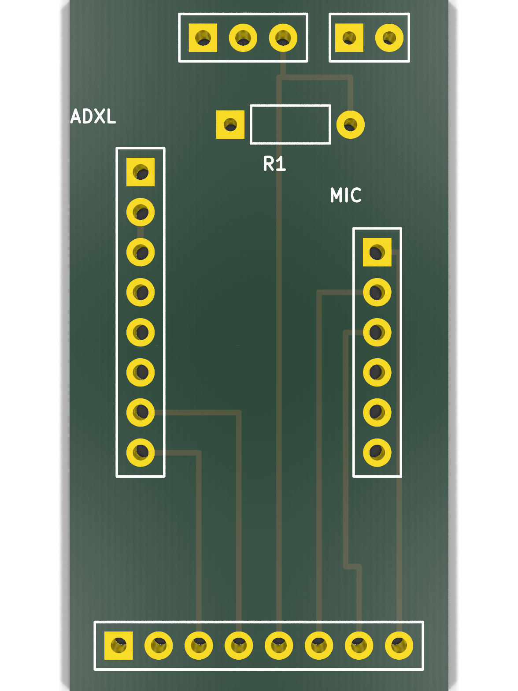
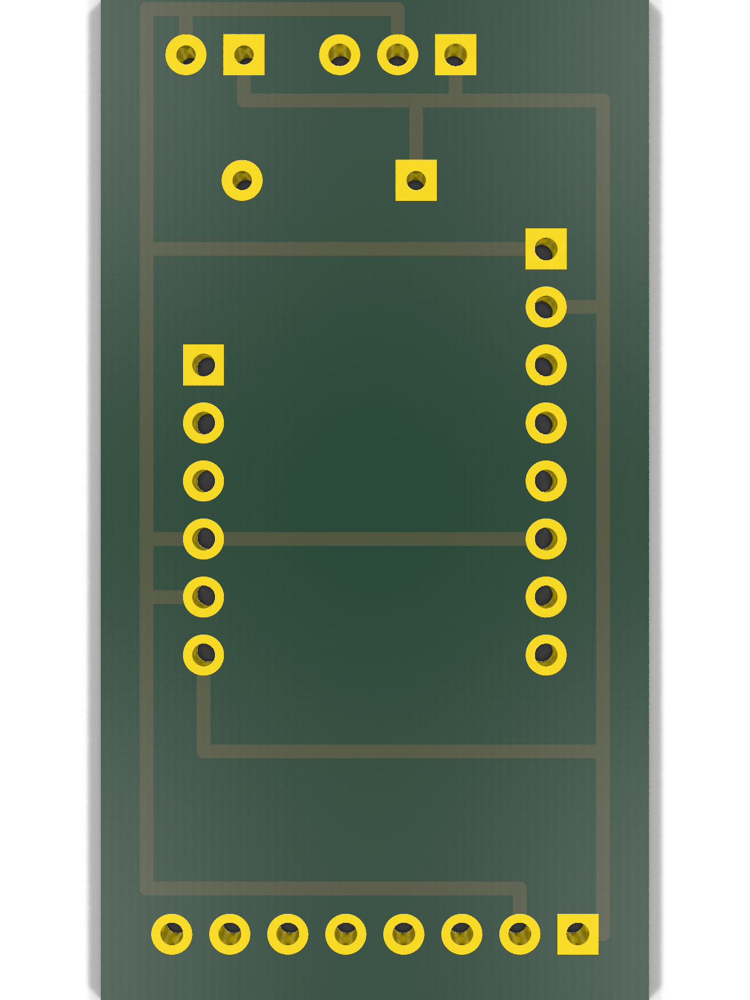
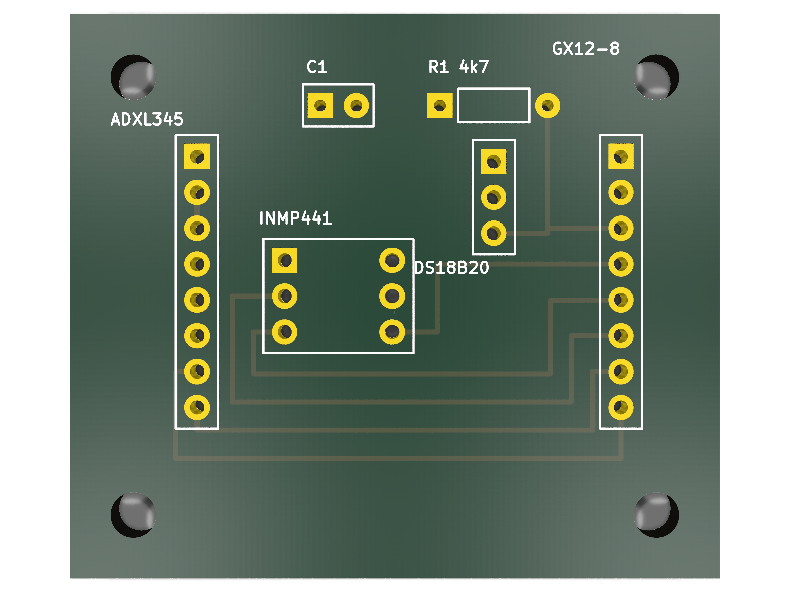
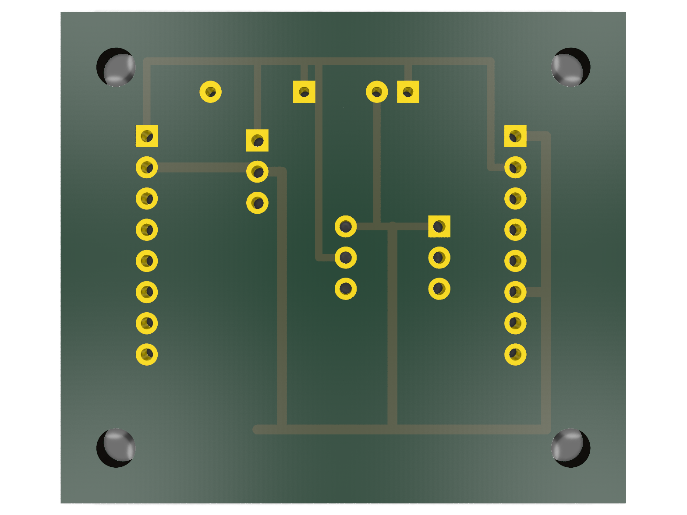
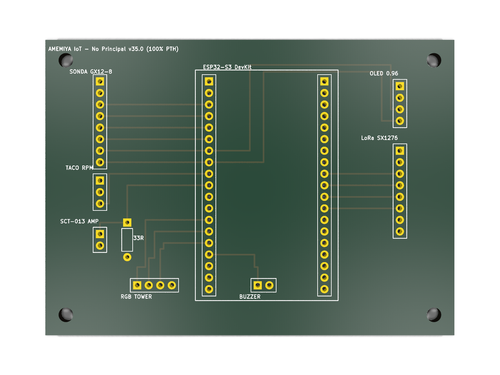
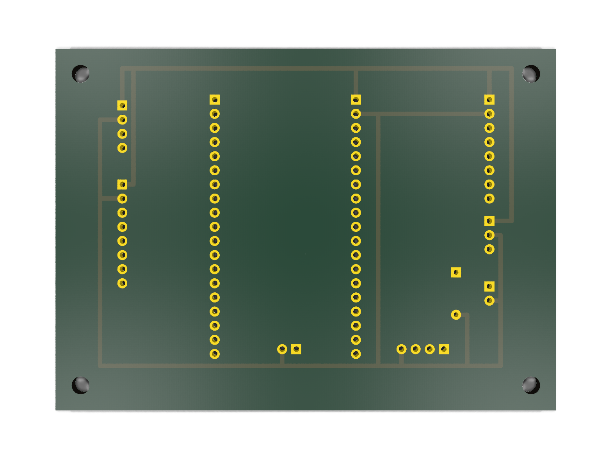

# Relatório Técnico de PCBs - Amemiya Industrial IoT

Este relatório reúne a documentação técnica, parâmetros de fabricação e inspeção visual fotorrealista das placas desenvolvidas para o sistema de manutenção preditiva Amemiya IoT:

1. **Sonda Cartucho Torre (`amemiya_probe_tower`)** — **24.0 mm × 48.0 mm** (Padrão vertical para Mancal UCP 204 estilo Tractian)
2. **Sonda Horizontal (`amemiya_probe_sensor`)** — **46.0 mm × 40.0 mm** (Padrão horizontal de bancada)
3. **Nó Principal de Aquisição (`amemiya_main_node`)** — **90.0 mm × 65.0 mm** (ESP32-S3 + LoRa Ra-02 + Display OLED + Entradas Analógicas e Tacômetro)

Todas as 3 placas foram projetadas em **100% Through-Hole (PTH)** (montagem manual fácil com ferros comuns de solda), em **2 camadas (Top / Bottom)** e aprovadas com **Zero Violações de DRC (KiCad 9.0 CLI)** e **Zero Itens Desconectados**.

---

## 1. Inspeção Visual 3D (Renders Oficiais KiCad 9)

### A. Sonda Cartucho Torre (24 × 48 mm — para Mancal UCP 204)

*Figura 1: Vista frontal da Sonda Torre com soquetes para ADXL345, jumpers do INMP441, conector GX12-8 no topo e DS18B20 na base.*

*Figura 2: Vista traseira da Sonda Torre com trilhas de alimentação isoladas (3.3V na esquerda e GND na direita).*

---

### B. Sonda Horizontal Clássica (46 × 40 mm)

*Figura 3: Vista superior da Sonda Horizontal com todos os sensores embarcados lado a lado.*

*Figura 4: Vista inferior da Sonda Horizontal com corredores de alimentação independentes.*

---

### C. Nó Principal ESP32-S3 (90 × 65 mm)

*Figura 5: Vista superior do Nó Principal com ESP32-S3, rádio LoRa, display OLED, SCT-013, tacômetro, barra RGB e buzzer.*

*Figura 6: Vista inferior do Nó Principal com plano de potência e barramentos de alimentação.*

---

## 2. Status de Validação Elétrica (DRC KiCad 9.0)

Relatório oficial de regras de design compilado via linha de comando:

| Placa | Dimensões | Violações de Regra | Itens Desconectados | Erros de Footprint | Status |
|---|:---:|:---:|:---:|:---:|:---:|
| **Sonda Torre (`amemiya_probe_tower`)** | **24.0 × 48.0 mm** | **0** | **0** | **0** | **APROVADO** |
| **Sonda Horizontal (`amemiya_probe_sensor`)** | **46.0 × 40.0 mm** | **0** | **0** | **0** | **APROVADO** |
| **Nó Principal (`amemiya_main_node`)** | **90.0 × 65.0 mm** | **0** | **0** | **0** | **APROVADO** |

---

## 3. Arquivos de Fabricação Gerados (Prontos para Envio)

Os pacotes Gerber RS-274X e arquivos de furação Excellon estão compactados na pasta `hardware/`:

* `hardware/amemiya_probe_tower_gerbers.zip` — **Sonda Cartucho Torre (24 × 48 mm)**
* `hardware/amemiya_probe_sensor_gerbers.zip` — **Sonda Horizontal (46 × 40 mm)**
* `hardware/amemiya_main_node_gerbers.zip` — **Nó Principal ESP32-S3 (90 × 65 mm)**

### Parâmetros para Pedido na PCBWay / JLCPCB:
* **Camadas:** 2 Layers
* **Material:** FR-4 Standard ($T_g \ge 130\text{--}140^\circ\text{C}$)
* **Espessura da Placa:** 1.6 mm
* **Espessura do Cobre:** 1 oz ($35\ \mu\text{m}$)
* **Acabamento da Superfície:** HASL com chumbo ou HASL Lead-Free (sem chumbo)
* **Cor da Máscara de Solda:** Verde (ou Preto/Azul conforme preferência)
* **Cor da Serigrafia (Silkscreen):** Branco
