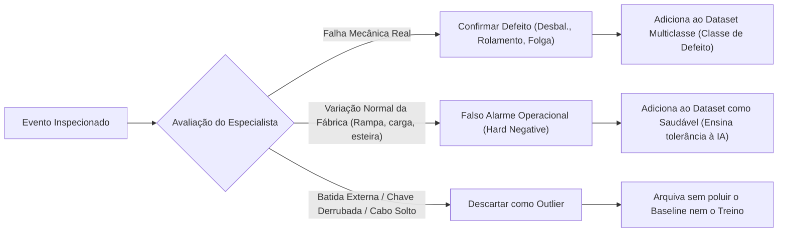

# Amemiya IoT: Regras de Negócio de Amostragem, Inferência e MLOps

Este documento formaliza as regras de negócio, grandezas físicas de amostragem, taxonomia de datasets e diretrizes do ciclo de vida de Machine Learning (*Edge-to-Cloud*) do ecossistema **Amemiya Industrial IoT**.

---

## 1. Princípio Fundamental: Inferência (Operação) vs. Treinamento (Jupyter)

A arquitetura do Amemiya separa estritamente o tempo de resposta e consumo de energia na fábrica da volumetria estatística exigida no treinamento matemático dos modelos.

```mermaid
flowchart TD
    subgraph INFERENCIA ["1. Inferência em Produção (Runtime - Segundos)"]
        S1["Sensor Acorda do Deep Sleep"] --> B1["Grava 1 Burst Curto (2 a 5 segundos)"]
        B1 --> W1["Extrai 6 a 15 Janelas (0,32s cada)"]
        W1 --> C1["Inferência Instantânea (< 1 ms por janela)"]
        C1 -- "Saudável (Votação OK)" --> SL1["Envia Heartbeat & Retorna ao Sleep"]
        C1 -- "Anomalia Confirmada" --> AL1["Acorda Rádio / Dispara Alarme no Painel"]
    end

    subgraph TREINAMENTO ["2. Treinamento / Retreino (MLOps - Milhares de Amostras)"]
        D1["Dataset Curado (3.000 a 5.000 Janelas de 36 features)"]
        D1 --> F1["Filtro Anti-Vazamento (GroupKFold por Sessão)"]
        F1 --> T1["Ajuste de Pesos XGBoost / Redes Neurais"]
        T1 --> V1["Auditoria de Risco (Matriz de Confusão / Curva ROC)"]
        V1 --> R1["Model Registry (Deploy / Shadow Mode)"]
    end
```

### Resumo Comparativo

| Dimensão | Inferência em Produção (Dia a Dia) | Treinamento de Modelo (Jupyter / MLOps) |
| :--- | :--- | :--- |
| **Objetivo** | Decidir se a máquina está quebrando agora com consumo mínimo de bateria. | Ajustar os hiperplanos matemáticos para a IA generalizar sem decorar ruído. |
| **Tempo de Coleta** | **2 a 5 segundos** (um único *burst*). | **10 a 15 minutos** de bancada ou dias de acumulação passiva. |
| **Volume de Amostras** | **6 a 15 janelas** de 36 features. | **2.000 a 5.000 janelas** de 36 features. |
| **Tempo de Execução** | $< 1\text{ ms}$ por janela no ESP32-S3 ou FastAPI. | Alguns minutos no notebook com validação cruzada. |
| **Frequência** | Periódica (a cada 30-60 min) ou por disparo de limiar. | Esporádica (mensal, pós-manutenção ou em novas bancadas). |

---

## 2. A Física e a Matemática da Amostragem

Os parâmetros físicos do hardware Amemiya (ESP32-S3 + ADXL345 + INMP441) determinam a taxa de geração de dados:

1. **Taxa de Amostragem do Acelerômetro ($f_s$):** $3.200\text{ Hz}$ ($3.200\text{ leituras/segundo}$).
2. **Tamanho da Janela de Análise ($N$):** $1.024\text{ pontos}$ de vibração.
3. **Resolução Espectral ($\Delta f$):** $\Delta f = \frac{f_s}{N} = \frac{3200}{1024} = 3,125\text{ Hz}$.
4. **Duração Temporal de 1 Amostra/Janela ($\Delta t$):**
   $$\Delta t = \frac{1024}{3200} = 0,32\text{ segundos (320 ms)}$$

### Taxa de Acumulação de Janelas
- **1 segundo** de máquina rodando = $\approx 3,1\text{ janelas}$.
- **1 minuto** de máquina rodando = $\approx 187\text{ janelas}$.
- **15 minutos** de bancada = $\approx \mathbf{2.812\text{ janelas}}$ (volume ideal para treino).

---

## 3. Taxonomia Neutra de Datasets

Os conjuntos de dados na tabela `iot_ml_datasets` são desacoplados de nomes de algoritmos específicos e categorizados pela sua **natureza mecânica e propósito MLOps**:

### 1. `diagnostic_multiclass` (Diagnóstico Multiclasse)
- **Conteúdo:** Contém janelas normais e classes de falhas conhecidas (`saudavel`, `desbalanceamento`, `folga_mecanica`, `falha_rolamento`).
- **Origem:** Ensaios guiados na bancada de testes ou falhas reais de campo confirmadas por Ordens de Serviço (OS).
- **Consumidores:** Classificadores supervisionados (XGBoost, Random Forest, Redes Neurais).

### 2. `baseline_normal` (Linha de Base Padrão-Ouro)
- **Conteúdo:** Amostras estritamente saudáveis coletadas durante o comissionamento ou logo após manutenção preventiva de um ativo.
- **Origem:** Corrida de aceitação de 15 minutos em vazio/carga nominal com a máquina aprovada pela equipe mecânica.
- **Consumidores:** Algoritmos de novidade não supervisionados (Isolation Forest, Autoencoders, Mahalanobis Distance) e calibradores de envelopes ISO 20816.

### 3. `benchmark_golden_set` (Conjunto de Teste / Auditoria Cega)
- **O que é na bancada física?** É uma corrida de bancada gravada exatamente como as outras (mesmo motor, mesmo nó ESP32-S3, mesmas 36 features), porém realizada em uma sessão separada e **congelada para sempre**.
- **A diferença prática entre o Treino e o Benchmark:**
  - *Arquivo de Treino:* É consumido no comando `fit()` do algoritmo para ajustar os pesos das árvores. É mutável (novos ensaios podem ser somados a ele ao longo dos meses).
  - *Arquivo de Benchmark:* É consumido **exclusivamente** no comando `predict()` para avaliar a nota da IA. **Nenhum algoritmo é autorizado a treinar com ele** (para não "decorar o gabarito").
- **Dois motivos críticos para existir:**
  1. **Eliminar a "Decoreba" (Vazamento Temporal / Autocorrelação):** Se sortearmos aleatoriamente 20% das janelas de uma mesma corrida contínua para testar (`train_test_split`), a janela de $1,0\text{ s}$ cai no treino e a de $1,3\text{ s}$ cai no teste. O modelo acerta 99% apenas porque decorou o milissegundo vizinho. O Benchmark em um ensaio isolado garante que o modelo aprendeu a física do defeito, e não o milissegundo daquele ensaio.
  2. **Prevenir o "Esquecimento Catastrófico":** Quando você treinar o modelo `v2.0` daqui a alguns meses para aprender uma falha nova (ex: folga mecânica), o Benchmark antigo garante que o modelo novo não desaprendeu a diagnosticar o desbalanceamento calibrado meses atrás. Se a acurácia no Benchmark cair, o deploy é bloqueado.
- **Regra Rígida:** **Nunca** entra no treinamento de nenhum modelo. Serve exclusivamente como a régua fixa de comparação (*Gatekeeper*).

### 4. `run_to_failure` (Histórico de Degradação / Vida Útil)
- **Conteúdo:** Séries temporais contínuas desde o início da operação normal até a quebra mecânica ou parada por alarme crítico (Curva P-F).
- **Consumidores:** Modelos de prognóstico e estimativa de vida útil restante (**RUL** - *Remaining Useful Life*).

---

## 4. Regras de Triagem e Rotulação Humana (*Human-in-the-Loop*)

No painel de controle, quando um evento anômalo é inspecionado no Drawer de Diagnóstico, o engenheiro metrologista/mecânico deve aplicar as seguintes regras de rotulação:

### Prevenção do Envenenamento de Baseline (*Baseline Poisoning*)
> [!CAUTION]
> **Nunca marque como "Saudável" ou "Baseline" um choque mecânico externo aberrante** (ex: batida de empilhadeira na carcaça). Se esse pico for incluído no baseline, o limiar de alarme da máquina subirá artificialmente e o sistema ficará "surdo" para falhas reais futuras.
> 
> * **Se o ruído é inerente ao processo fabril:** Marcar como *Falso Alarme Operacional*.
> * **Se foi um evento acidental externo:** Marcar como *Descarte / Outlier*.

---

## 5. Critérios de Qualidade para Retreinamento (*Dataset Quality Gates*)

Antes de exportar um dataset para retreino no Jupyter ou disparar um pipeline automatizado, o sistema valida três regras:

1. **Volume Mínimo:**
   - Para validação preliminar: mínimo de **1.000 amostras tabulares** por classe.
   - Para promoção definitiva em produção: **3.000 a 5.000 amostras tabulares**.
2. **Equilíbrio de Classes (*Class Balance Ratio*):**
   - A razão entre a classe com mais amostras e a classe com menos amostras não deve exceder **4:1**. Se exceder, o sistema exibe aviso de desbalanceamento e sugere balanceamento via pesos de classe (`scale_pos_weight`) ou SMOTE.
3. **Isolamento Físico de Sessão (*Group K-Fold* Anti-Vazamento):**
   - Todas as janelas de um mesmo `session_id` (a mesma corrida contínua do motor) devem ir **obrigatoriamente juntas** para o conjunto de treino ou para o conjunto de teste. É proibido aplicar `train_test_split` puramente aleatório em séries temporais de vibração.

---

## 6. Filtro de Persistência na Borda (ESP32-S3 Anti-Glitch)

Para evitar que o microcontrolador acorde o rádio e consuma bateria por ruídos passageiros de menos de 1 segundo:

1. **Janela de Confirmação:** O firmware mantém um buffer circular das últimas 3 janelas processadas ($3 \times 320\text{ ms} = 960\text{ ms}$).
2. **Regra de Disparo:** O rádio LoRa/Wi-Fi só entra em transmissão de rajada (*burst*) se a condição de anomalia for detectada em **pelo menos 3 janelas sucessivas**.
3. **Picos Isolados (< 500 ms):** São contabilizados apenas em um contador interno de ruído mecânico transiente, sem gerar pacotes na rede MQTT.

---

## 7. Avaliação Determinística Metrológica: Norma ISO 20816-3 (ABNT NBR ISO 20816-3)

Enquanto os modelos de Machine Learning (XGBoost / Random Forest) realizam a **discriminação qualitativa da causa raiz** (ex: pista externa, desbalanceamento ou falta de lubrificação), a norma técnica internacional **ISO 20816-3** rege a **severidade quantitativa da vibração** com força normativa para auditorias industriais e laudos metrológicos.

### 7.1. Formulação Física e Conversão de Grandezas
A norma ISO 20816-3 baseia-se na velocidade RMS ($v_{RMS}$ em $\text{mm/s}$) na faixa larga de $10\text{ Hz a }1.000\text{ Hz}$. A partir da aceleração RMS ($a_{RMS}$ medida em $g$) e da velocidade de rotação fundamental ($\text{RPM}$):

$$f_{rot} = \frac{\text{RPM}}{60}\quad [\text{Hz}]$$

$$v_{RMS} = \frac{a_{RMS} \times 9.80665 \times 1.000}{2\pi \times f_{rot}} = \frac{a_{RMS} \times 9806.65 \times 60}{2\pi \times \text{RPM}}\quad [\text{mm/s}]$$

### 7.2. Zonas de Severidade (Grupo 2: Motores de 15 kW a 300 kW, Base Rígida)

| Zona de Severidade | Faixa de Velocidade ($v_{RMS}$) | Significado Metrológico e Ação Operacional |
| :---: | :---: | :--- |
| **Zona A** | $\le 1,4\text{ mm/s}$ | **Excelente:** Vibração típica de máquinas recém-instaladas ou comissionadas. |
| **Zona B** | $1,4 < v \le 2,8\text{ mm/s}$ | **Aceitável / Boa:** Máquinas em operação irrestrita de longo prazo sem restrições. |
| **Zona C** | $2,8 < v \le 4,5\text{ mm/s}$ | **Alerta:** Operação restrita. Máquina aceitável apenas temporariamente; programar manutenção preventiva. |
| **Zona D** | $> 4,5\text{ mm/s}$ | **Perigo:** Vibração perigosa / inaceitável. Risco iminente de dano mecânico ou fadiga estrutural. Recomenda-se parada imediata. |

*(Nota: O sistema também suporta bases flexíveis — limites de $2,3$, $4,5$ e $7,1\text{ mm/s}$ — e máquinas de grande porte do Grupo 1).*

### 7.3. Integração Arquitetural no Pipeline de Telemetria
1. **Ingestão no Backend (`ProcessTelemetryJob.php`):** A cada burst recebido, o serviço `ISO20816SeverityService` calcula $v_{RMS}$ e determina a `iso_zone`.
2. **Disparo de Evento Crítico:** Amostras em **Zona C** ou **Zona D** disparam a flag de criticidade no banco de dados e no broadcast WebSockets.
3. **Visualização Front-end:** Exibição do `ISO20816SeverityGauge` no card de telemetria em tempo real e na inspeção detalhada de logs.
4. **Desempate com a IA:**
   - **IA acusa defeito + Zona A:** Alerta preventivo incipiente (estágio inicial de rolamento) ou potencial ruído transitório. Não requer parada de emergência.
   - **IA normal + Zona D:** Vibração estrutural grave (ex: ressonância externa ou soltura de fixação). Ação imediata exigida mesmo que os componentes internos estejam intactos.

