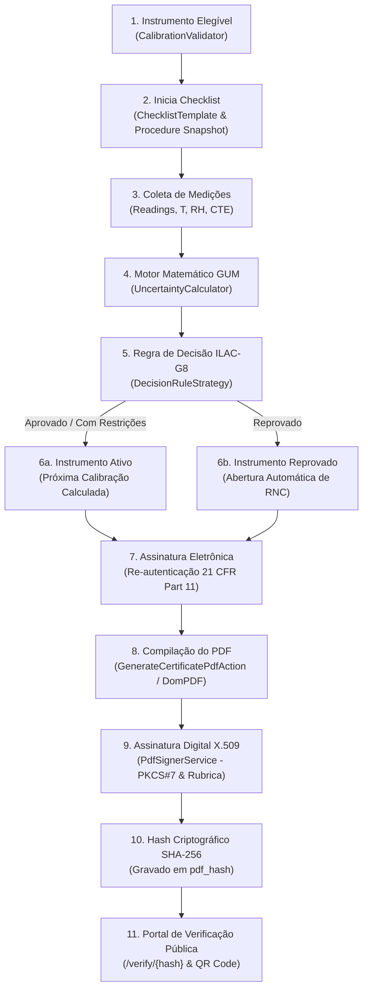

# Guia Técnico: Ciclo de Vida da Calibração e Emissão de Laudos

> **Normas de Referência:** ABNT NBR ISO/IEC 17025:2017, ILAC-G8:09/2019, ILAC-G24 / OIML D10, JCGM 100:2008 (GUM), FDA 21 CFR Part 11  
> **Módulo:** `Modules/Metrology`  
> **Status:** Documentação Canônica de Engenharia  

---

## 1. Visão Geral e Arquitetura Operacional

A esteira metrológica do Lean Tech Metrologia foi concebida para garantir **rastreabilidade metrológica ininterrupta**, **rigor matemático conforme o GUM** e **integridade probatória** em conformidade com os requisitos de acreditação ISO/IEC 17025 e de auditoria FDA 21 CFR Part 11.

---

## 2. Detalhamento Passo a Passo da Esteira

### Etapa 1: Validação Prévia de Elegibilidade (`CalibrationValidator`)
Antes do início de qualquer calibração, o sistema avalia se o instrumento está em condições operacionais:
* Instrumentos nos estados `Scrapped` (Sucata), `Lost` (Extraviado) ou `Rejected` (Reprovado/Quarentena) são bloqueados por exceção metrológica formal (`MetrologyException`).
* Apenas itens nos estados `Active`, `InCalibration` ou `Maintenance` (com liberação técnica) podem ser submetidos à calibração.

### Etapa 2: Vínculo ao Procedimento e Template (`ChecklistTemplate`)
* A calibração é vinculada ao procedimento metrológico padronizado do tipo de instrumento.
* No momento da inicialização, o sistema grava um `procedure_snapshot` imutável no registro de calibração contendo a norma de ensaio, os critérios de aceitação e a versão do procedimento em vigor na data da execução (atendendo à ISO/IEC 17025 §7.8.7 e §8.3).

### Etapa 3: Coleta de Dados e Condições Ambientais
* Para cada ponto nominal do instrumento (ex: $0, 5, 10, 15, 20, 25\text{ mm}$), são coletadas leituras repetidas ($n \ge 3$).
* São informadas as grandezas de influência: temperatura ambiente ($T$), umidade relativa do ar ($\text{RH}$) e, para medições dimensionais críticas, o coeficiente de dilatação térmica linear ($\alpha$) do material.

### Etapa 4: Motor de Cálculo de Incerteza (`UncertaintyCalculator`)
Para cada ponto de calibração, executa-se o pipeline canônico:
1. **Correção Térmica Diferencial (ISO/TR 16015):** Correção de cada leitura para $20^\circ\text{C}$ e cálculo de $u_{thermal}$.
2. **Incerteza Tipo A ($u_A$):** Repetibilidade amostral da média com variância amostral com $n-1$ graus de liberdade:  
   $$u_A = \frac{s}{\sqrt{n}}$$
3. **Incertezas Tipo B ($u_B$):**
   * Resolução do instrumento ($u_{res} = \frac{\delta}{2\sqrt{3}}$).
   * Incerteza do padrão de referência RBC ($u_{std} = \frac{U_{std}}{k_{std}}$).
4. **Incerteza Combinada ($u_c$):**  
   $$u_c = \sqrt{u_A^2 + u_{res}^2 + u_{std}^2 + u_{thermal}^2}$$
5. **Graus de Liberdade Efetivos ($\nu_{eff}$):** Equação de Welch-Satterthwaite:  
   $$\nu_{eff} = \frac{u_c^4}{\frac{u_A^4}{n-1}}$$
6. **Fator $k$ e Incerteza Expandida ($U$):** Interpolação na distribuição $t$ de Student para $95,45\%$ bilateral e cálculo de $U = k \cdot u_c$.

### Etapa 5: Avaliação da Regra de Decisão (ILAC-G8:09/2019)
O desvio (tendência / *bias*) é extraído para cada ponto:
$$e = \bar{x}_{corr} - x_{padrão}$$
A conformidade metrológica é determinada pela estratégia configurada no tipo de instrumento:
* **Aceitação Simples (`SimpleAcceptance`):** Conforme se $|e| \le \text{MPE}$.
* **Incerteza Contabilizada (`UncertaintyAccounted`):** Conforme se $|e| + U \le \text{MPE}$.
* **Banda de Guarda (`GuardBand`):** Conforme se $|e| \le \text{MPE} - w$, onde $w = r \times U$.
  * Se $|e| \le \text{MPE} - w \implies$ **Aprovado** (`Approved`).
  * Se $\text{MPE} - w < |e| \le \text{MPE} \implies$ **Aprovado com Restrições** (`ApprovedWithRestrictions`).
  * Se $|e| > \text{MPE} \implies$ **Reprovado** (`Rejected`).

### Etapa 6: Efeitos no Ciclo de Vida do Ativo Metrológico
* **Se Aprovado:**
  * O vencimento (`calibration_due`) é calculado somando a frequência de calibração definida no cadastro ou otimizada pelo `CalibrationIntervalService`.
  * O instrumento transiciona automaticamente para `ItemStatus::Active`.
* **Se Reprovado:**
  * O instrumento transiciona imediatamente para `ItemStatus::Rejected` (bloqueado para uso em produção).
  * O sistema dispara automaticamente a abertura de uma Não Conformidade formal (`NonConformity`) com severidade crítica e notificação aos administradores da qualidade.

### Etapa 7: Assinatura Eletrônica e Re-autenticação (FDA 21 CFR Part 11)
* A aprovação formal exige que o metrologista ou responsável técnico redigite sua credencial/senha no sistema (*re-authentication*).
* O log de auditoria registra carimbo de tempo, IP, ID do aprovador e hash do evento, inserido na trilha encadeada criptograficamente (*blockchain-style audit log*).

### Etapa 8: Compilação do Laudo PDF (`GenerateCertificatePdfAction`)
* Os dados estruturados (identificação do instrumento, dados ambientais, tabela de padrões rastreados RBC, tabela de pontos de medição com $U$ e $k$, declaração de conformidade e assinaturas) são compilados em PDF de alta precisão através do DomPDF.

### Etapa 9: Assinatura Digital Criptográfica X.509 (`PdfSignerService`)
* O binário PDF gerado é processado pelo `PdfSignerService` via TCPDF/FPDI:
  * Inserção da rubrica/assinatura visual do responsável técnico.
  * Assinatura digital criptográfica X.509 / PKCS#7 utilizando certificado do laboratório (`.pfx`), garantindo não-repúdio e autenticidade forense.

### Etapa 10: Hash Criptográfico SHA-256 e Integridade de Arquivo
* O sistema calcula o hash SHA-256 canônico do PDF final assinado e o persiste na coluna `pdf_hash` do modelo `Calibration`.
* Caso qualquer usuário ou agente externo modifique um único caractere ou byte do PDF armazenado no disco, a validação de integridade falha imediatamente.

### Etapa 11: Portal de Validação Pública
* Cada certificado possui uma URL pública única e QR Code (`/verify/{verification_hash}` ou `/verify/certificate/{pdf_hash}`).
* Auditores da qualidade e clientes externos podem fazer upload do PDF para conferência bit-a-bit contra o hash SHA-256 persistido no banco de dados.

---

## 3. Otimização de Intervalos de Calibração (ILAC-G24 / OIML D10)

Implementado em [`CalibrationIntervalService`](file:///C:/Users/andrl/OneDrive/Documentos/Projetos%20Pessoal/amemiya/Modules/Metrology/app/Services/CalibrationIntervalService.php) segundo o *Simple Response Method*:

### 3.1. Penalidade Mandatória por Reprovação Recente (§6.3 da ILAC-G24)
Quando um instrumento apresenta calibração com resultado `Rejected` mais recente que qualquer calibração aprovada, o sistema aplica penalidade estrita:
* **Intervalo Sugerido:** Reset mandatória para **3 meses** (piso de segurança).
* **Justificativa Registrada:** *"Recent rejection detected. Interval reset to minimum (3 months) per ILAC-G24 Section 6.3."*

### 3.2. Análise de Confiabilidade Histórica ($n \ge 3$ Calibrações)
Com histórico de no mínimo 3 calibrações aprovadas, o serviço calcula a taxa máxima de consumo do limite de tolerância:
$$\text{Uso do Limite (\%)} = \max \left( \frac{|\text{Desvio}| + U}{\text{MPE}} \times 100 \right)$$

1. **Cenário de Alta Confiabilidade ($\text{Uso} \le 50\%$):**
   * O instrumento opera com ampla margem de segurança.
   * **Ação:** Aumento do intervalo em **50%** ($\text{Novo Intervalo} = \lfloor \text{Intervalo Atual} \times 1.5 \rfloor$), com teto de **24 meses**.
2. **Cenário de Risco Moderado a Alto ($\text{Uso} \ge 80\%$):**
   * O instrumento atua na iminência de violação de tolerância (*Out-of-Tolerance risk*).
   * **Ação:** Redução preventiva do intervalo em **20%** ($\text{Novo Intervalo} = \lfloor \text{Intervalo Atual} \times 0.8 \rfloor$), com piso de **3 meses**.
3. **Cenário Estável ($50\% < \text{Uso} < 80\%$):**
   * O desempenho instrumental é seguro, porém insuficiente para justificar extensão do período.
   * **Ação:** Manutenção do intervalo atual.

---

## 4. Cartas de Controle de Shewhart para Checagens Intermediárias

A ABNT NBR ISO/IEC 17025 (§6.4.10) e a ILAC-G24 (Método 2) exigem verificações intermediárias entre calibrações periódicas para manter a confiança no estado metrológico do equipamento.

Implementado em [`ShewhartControlChartService`](file:///C:/Users/andrl/OneDrive/Documentos/Projetos%20Pessoal/amemiya/Modules/Metrology/app/Services/ShewhartControlChartService.php):

### 4.1. Formulação dos Limites Estatísticos
Para uma série temporal de checagens intermediárias com desvios individuais $e_i = x_{medido} - x_{nominal}$:
* **Média Amostral (Linha Central - LC):**  
  $$\text{LC} = \bar{X} = \frac{1}{n} \sum_{i=1}^n e_i$$
* **Desvio Padrão Amostral ($s$):**  
  $$s = \sqrt{\frac{1}{n-1} \sum_{i=1}^n (e_i - \bar{X})^2}$$
* **Limites de Controle Estatístico ($3\sigma$):**  
  $$\text{LSC (UCL)} = \bar{X} + 3s, \quad \text{LIC (LCL)} = \bar{X} - 3s$$
* **Limites de Advertência ($2\sigma$):**  
  $$\text{LSA (UWL)} = \bar{X} + 2s, \quad \text{LIA (LWL)} = \bar{X} - 2s$$
* **Limites de Especificação Técnica do Instrumento ($\pm\text{MPE}$):**  
  $$\text{LSE (USL)} = +\text{MPE}, \quad \text{LIE (LSL)} = -\text{MPE}$$

### 4.2. Regras de Decisão de Controle (Nelson Rules / Western Electric)
* **Regra 1 (Ponto Fora de Controle):** Qualquer desvio fora dos limites $\pm 3\sigma$ ($\text{LSC}/\text{LIC}$) ou além da tolerância máxima $\pm\text{MPE}$ marca o ponto como `is_out_of_control = true` e altera `in_control = false`.
* **Regra 2 (Deriva Sistemática):** Uma sequência de 7 ou mais pontos consecutivos no mesmo lado da média ($\bar{X}$) sinaliza tendência estatística adversa (*drift* mecânico ou eletrônico), acionando alerta preventivo antes que o MPE seja ultrapassado.

---

## 5. Benchmark Comparativo: Certificado PDF vs ISO/IEC 17025 §7.8.2 e Fluke MET/TEAM

A análise de conformidade do certificado gerado em [`certificate.blade.php`](file:///C:/Users/andrl/OneDrive/Documentos/Projetos%20Pessoal/amemiya/Modules/Metrology/resources/views/pdf/certificate.blade.php) frente à cláusula §7.8.2.1 da ISO/IEC 17025:2017 e às ferramentas de mercado (Fluke MET/TEAM, Beamex CMX) revela os seguintes pontos:

| Requisito Normativo (ISO/IEC 17025 §7.8.2.1) | Implementação Lean Tech | Fluke MET/TEAM | Situação / Ação Recomendada |
| :--- | :---: | :---: | :--- |
| **a) Título do Laudo** | Presente ("Certificado de Calibração") | Presente | Conforme |
| **b) Nome e endereço do laboratório** | Presente (`lab_name`, `lab_address`, `lab_contact`) | Presente | Conforme |
| **c) Local de realização das atividades** | Presente no cabeçalho | Presente | Conforme |
| **d) Identificação unívoca e numeração de páginas** | Presente (`Nº CAL-YYYY-...`, `Página X de Y`) | Presente | Conforme |
| **e) Nome e dados de contato do cliente** | **Parcial** (vinculado a `lab_client_id` no banco, mas não renderizado explicitamente no PDF para clientes externos) | Presente | **Gap a evoluir** (adicionar seção "Dados do Solicitante / Cliente") |
| **f) Identificação do método utilizado** | Presente (GUM e procedimento interno) | Presente | Conforme |
| **g) Descrição, identificação e estado do item** | Presente identificação do item. **Ausente** estado no recebimento (limpo, oxidado, íntegro) | Presente | **Gap a evoluir** (adicionar campo `as_received_condition`) |
| **h) Data de recebimento do item** | **Ausente** no layout do certificado | Presente | **Gap a evoluir** (adicionar `received_date`) |
| **i) Data de execução da calibração** | Presente (`calibration_date`) | Presente | Conforme |
| **j) Data de emissão do laudo** | Presente (data de aprovação) | Presente | Conforme |
| **m) Resultados com unidades e incerteza** | Presente (tabela detalhada com $U$ e $k$) | Presente | Conforme |
| **o) Identificação de quem autoriza o laudo** | Presente (assinatura do executor e aprovador) | Presente | Conforme |
| **Cláusula §7.8.4.3: Recomendação de Vencimento** | **Alerta:** Exibe próxima calibração sugerida sem flag de autorização do cliente | Toggle configurável | **Ajuste:** Na ISO 17025, não se deve sugerir prazo sem acordo prévio formal do cliente |

---

## 6. Conclusão

O ecossistema de calibração do Lean Tech Metrologia apresenta consistência técnica superior na garantia de integridade documental, integração de incertezas do GUM e automação das ações em caso de reprovação (abertura de RNC e bloqueio). Os gaps identificados referem-se primordialmente a metadados secundários de layout para serviços prestados a terceiros, sem impacto na validade física e matemática dos ensaios.
