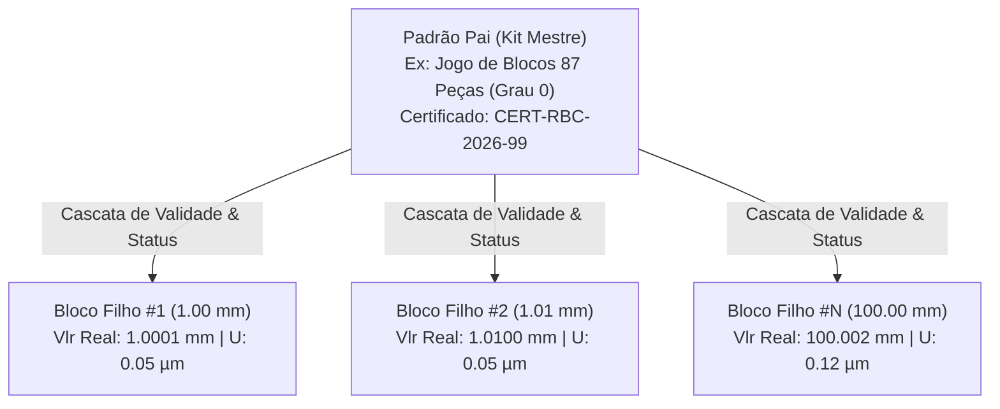
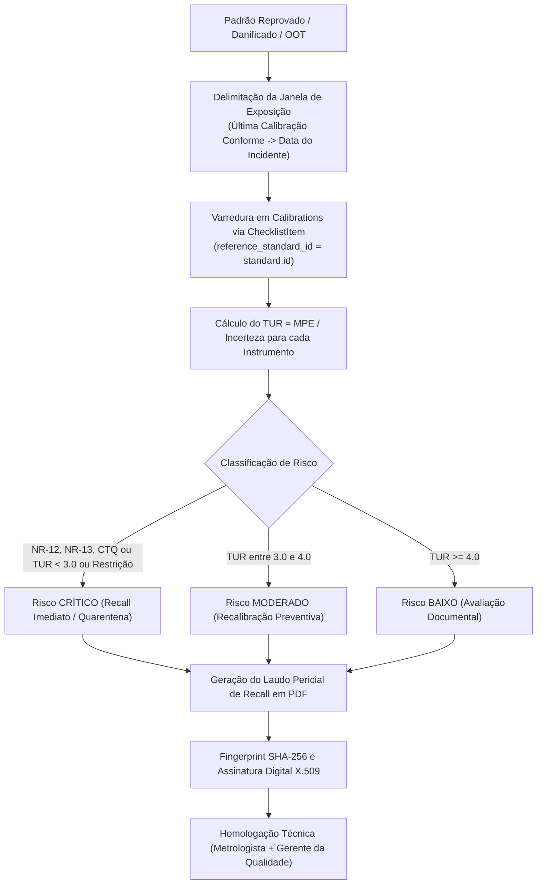

# Manual Técnico de Padrões de Referência, Kits Hierárquicos e Recall Metrológico Reverso

> **Código do Documento:** MAN-MET-004  
> **Versão:** 1.0  
> **Aprovação:** Auditoria Líder ISO 17025 & Engenharia de Software  
> **Normas de Referência:** ABNT NBR ISO/IEC 17025:2017 (§6.5, §7.10), ILAC-P10:07/2020, ILAC-G24, Portaria Inmetro / RBC  
> **Módulos:** `Modules/Metrology`  

---

## 1. Visão Geral e Princípios Normativos

A rastreabilidade metrológica é a propriedade de um resultado de medição pela qual ele pode ser relacionado a uma referência através de uma cadeia documentada e ininterrupta de calibrações, cada uma contribuindo para a incerteza de medição (VIM 2.41 / ISO/IEC 17025 §6.5).

No Lean Tech Metrologia, os Padrões de Referência ([`ReferenceStandard`](file:///C:/Users/andrl/OneDrive/Documentos/Projetos%20Pessoal/amemiya/Modules/Metrology/app/Models/ReferenceStandard.php)) são tratados sob rigor duplo:
1. **Cadeia Ascendente (Rastreabilidade RBC/SI):** Todo padrão possui número de certificado, laboratório acreditado Cgcre (ex: `CAL 0123`), data de validade e cadeia documental que o liga aos padrões nacionais/internacionais mantidos pelo Inmetro, NIST ou BIPM.
2. **Cadeia Descendente e Reversa (Análise de Impacto / Recall §7.10):** Se um padrão for reprovado em sua recalibração periódica, danificado, sofrer queda mecânica ou desvio (*drift* anômalo), o sistema opera em modo de investigação forense reversa, identificando todos os instrumentos, calibrações e ordens de produção afetados durante a janela de risco.

---

## 2. Arquitetura de Kits Hierárquicos (Parent / Child)

Equipamentos como Jogos de Blocos Padrão (Grau 0 ou Grau 1), Estojos de Massas Padrão (F1/M1) e Réguas Gabarito são tipicamente compostos por dezenas ou centenas de elementos individuais vinculados a um certificado mestre de kit.



### 2.1. Estrutura de Modelagem e Herança
* **Vínculo Pai/Filho:** Definido pela chave estrangeira recursiva `parent_id` no modelo [`ReferenceStandard`](file:///C:/Users/andrl/OneDrive/Documentos/Projetos%20Pessoal/amemiya/Modules/Metrology/app/Models/ReferenceStandard.php).
* **Herança Dinâmica de Certificado:**  
  O acessor `getActiveCertificateUrlAttribute()` consulta prioritariamente o laudo próprio do ativo; caso seja um elemento filho desprovido de PDF individual, herda dinamicamente o arquivo do padrão pai (`parent->latestCalibration->certificate_path`).
* **Resolução de Identificação Patrimonial:**  
  O acessor `getEffectiveSerialNumberAttribute()` retorna o número de série próprio ou concatena a identificação do kit pai com o valor nominal do bloco.

### 2.2. Sincronização em Cascata (`ReferenceStandard::processCalibrationResult`)
Quando a calibração do kit mestre é processada e publicada:
* **Se Aprovado:** A nova data de vencimento (`calibration_due`) calculada pela periodicidade do tipo (`referenceStandardType->calibration_frequency_months`) e o status `ItemStatus::Active` são propagados para todos os filhos em uma única transação:
  ```php
  if ($this->children()->exists()) {
      $this->children()->update([
          'calibration_due' => $nextDate,
          'status' => ItemStatus::Active,
      ]);
  }
  ```
* **Se Reprovado:** O kit mestre e todos os seus blocos filhos são imediatamente marcados como `ItemStatus::Rejected`, bloqueando o uso de qualquer peça do jogo no laboratório.
* **Atualização Ponto a Ponto do Kit:** A action [`UpdateReferenceStandardKitAction`](file:///C:/Users/andrl/OneDrive/Documentos/Projetos%20Pessoal/amemiya/Modules/Metrology/app/Actions/UpdateReferenceStandardKitAction.php) permite atualizar os desvios e valores reais individuais de cada bloco filho a partir dos dados do laudo externo da RBC.

---

## 3. Investigação Forense de Trabalho Não Conforme e Recall Metrológico (ISO/IEC 17025 §7.10)

Quando um padrão de referência apresenta desvio fora da tolerância ou reprovação (*Out-of-Tolerance - OOT*), a ISO/IEC 17025 §7.10 exige:
1. Avaliação imediata da significância do trabalho não conforme.
2. Análise de impacto sobre os resultados anteriormente emitidos e entregues a clientes.
3. Tomada imediata de ações corretivas, incluindo retenção de certificados e recall de produtos se necessário.

### 3.1. Algoritmo de Varredura Reversa (`GenerateStandardImpactReportAction`)
Auditado em [`GenerateStandardImpactReportAction.php`](file:///C:/Users/andrl/OneDrive/Documentos/Projetos%20Pessoal/amemiya/Modules/Metrology/app/Actions/GenerateStandardImpactReportAction.php):



### 3.2. Matriz de Triagem de Risco por TUR (Test Uncertainty Ratio)
A Razão de Incerteza do Teste avalia a capacidade do processo de medição de absorver imprecisões do padrão:
$$\text{TUR} = \frac{\text{MPE do Instrumento}}{U_{\text{calibração}}}$$

| Nível de Risco | Critérios de Disparo | Ação Operacional Compulsória |
| :---: | :--- | :--- |
| **CRITICAL** | • Instrumento NR-12 (Segurança de Máquinas)<br>• Instrumento NR-13 (Caldeiras/Pressão)<br>• Instrumento Crítico para Qualidade (CTQ / IATF)<br>• Calibração com Restrições (`ApprovedWithRestrictions`)<br>• $\text{TUR} < 3.0$ | **Recall Imediato / Quarentena:** O instrumento deve ser imediatamente recolhido da produção, colocado em quarentena física e todas as peças/lotes produzidos desde a data da calibração devem ser submetidos à análise de risco e reinspeção retroativa. |
| **MODERATE** | • $3.0 \le \text{TUR} < 4.0$ em itens não críticos | **Recalibração Preventiva Prioritária:** O instrumento permanece temporariamente tolerado, mas com ordem de serviço aberta para recalibração prioritária no prazo de 7 a 15 dias. |
| **LOW** | • $\text{TUR} \ge 4.0$ em itens de uso operacional geral | **Avaliação Documental:** A alta margem metrológica ($\ge 4:1$) demonstra que a variação do padrão não teve probabilidade relevante de induzir falsa aceitação de produto. O evento é registrado e encerrado formalmente. |

---

## 4. Laudo Pericial de Recall Metrológico e Integridade Forense

O laudo formal é gerado através da view [`standard_impact_report.blade.php`](file:///C:/Users/andrl/OneDrive/Documentos/Projetos%20Pessoal/amemiya/Modules/Metrology/resources/views/pdf/standard_impact_report.blade.php):

### 4.1. Conteúdo Estruturado do Laudo
1. **Identificação Completa do Padrão Investigado:** Nome, código patrimonial (tag), número de série, fabricante, incerteza declarada e histórico da última calibração válida.
2. **Motivo Formal da Investigação:** Justificativa da não conformidade (reprovação RBC, dano físico, choque mecânico, etc.).
3. **Quadro Estatístico de Severidade:** Contagem consolidada de instrumentos afetados, total de calibrações comprometidas e distribuição quantitativa por nível de severidade (Crítico, Moderado, Baixo).
4. **Tabela Analítica Ponto a Ponto:** Listagem exaustiva de cada certificado emitido com data, código, tag do instrumento, localização física atual no chão de fábrica, MPE, $U$, valor calculado de TUR e determinação de recall.
5. **Declaração de Ações Mitigatórias:** Instruções de contenção industrial e rastreamento de Ordens de Produção (OPs).

### 4.2. Garantias Forenses de Integridade
* **Fingerprint Canônico SHA-256:**  
  Antes da compilação do PDF, o serviço gera um hash determinístico do payload de auditoria (`documentHash`), assegurando que a lista de instrumentos investigados não possa ser alterada retroativamente para omitir ativos afetados.
* **Assinatura Digital X.509:** O binário gerado é assinado pelo [`PdfSignerService`](file:///C:/Users/andrl/OneDrive/Documentos/Projetos%20Pessoal/amemiya/Modules/Metrology/app/Services/PdfSignerService.php) utilizando o certificado A1 do laboratório.
* **Dupla Assinatura Técnica:** O documento exige a assinatura conjunta do **Responsável Técnico Metrológico** e do **Gerente da Qualidade / Laboratório**.

---

## 5. Benchmark Metrológico vs Fluke MET/TEAM & Beamex CMX

| Recurso Metrológico | Lean Tech Metrologia | Fluke MET/TEAM | Beamex CMX | Avaliação Competitiva |
| :--- | :---: | :---: | :---: | :--- |
| **Kits Hierárquicos (Parent/Child)** | **Sim** | Sim | Sim | **Paridade** |
| **Cascata Automática de Validade e Status** | **Sim** | Manual ou Semi-auto | Automático | **Paridade / Superior** |
| **Rastreabilidade Reversa de Padrão** | **Sim** | Sim (OOT Recall) | Sim | **Paridade** |
| **Matriz de Risco Automatizada via TUR** | **Sim** | Apenas relatório OOT | Configurável | **Diferencial Analítico** |
| **Ponderação Legal de Risco (NR-12 / NR-13)** | **Sim** | Não (genérico) | Não (genérico) | **Vantagem Competitiva Brasil** |
| **Laudo Pericial PDF Assinado com Fingerprint** | **Sim** | Relatório simples | Relatório simples | **Superioridade Forense** |
| **Integração Automática com ERP (Recall de OP)** | *Em Roadmap* | Sim (SAP via Plugin) | Sim (SAP/Maximo) | **Oportunidade de Evolução** |

---

## 6. Histórico de Versões

| Versão | Data | Autor | Resumo das Alterações |
| :---: | :---: | :--- | :--- |
| **1.0** | 03/10/2026 | Auditor Líder ISO 17025 | Elaboração do manual cobrindo kits hierárquicos, algoritmos de TUR e laudos periciais de recall. |
