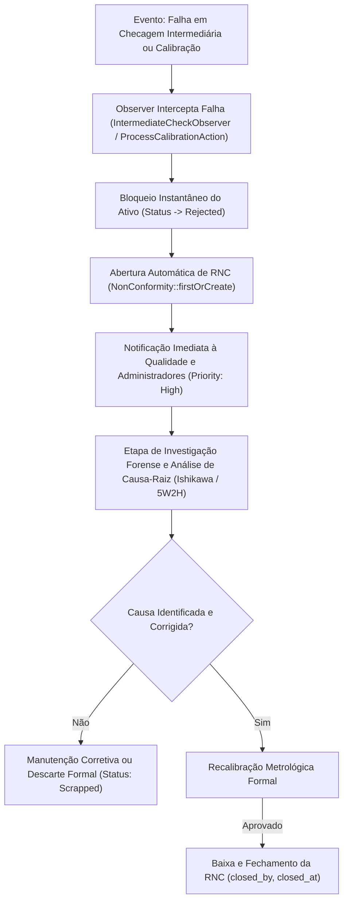
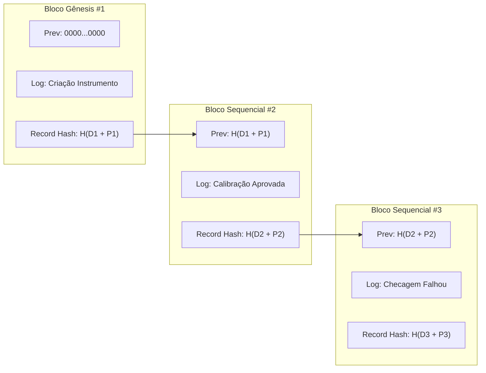

# Procedimento Operacional Padrão (POP-MET-003)
## Auditoria Forense, Governança e Gestão de Riscos Metrológicos

> **Código do Documento:** POP-MET-003  
> **Versão:** 1.0  
> **Aprovação:** Gestão da Qualidade & Engenharia de Metrologia  
> **Normas de Referência:** ABNT NBR ISO/IEC 17025:2017 (§7.10, §8.5, §8.7), FDA 21 CFR Part 11, Portaria MTE nº 3.214 (NR-12 e NR-13), ILAC-G24  
> **Módulos Afetados:** `Modules/Metrology`, `Modules/System`  

---

## 1. Objetivo e Campo de Aplicação

Este Procedimento Operacional Padrão (POP) estabelece os critérios técnicos, fluxos automatizados e diretrizes de integridade de dados para:
1. Bloqueio automático e imediato de ativos metrológicos com desvios fora da tolerância.
2. Abertura compulsória, tratamento e investigação de causa-raiz de Relatórios de Não Conformidade (RNC).
3. Verificação forense da integridade da trilha de auditoria (*audit trail*) encadeada criptograficamente.
4. Rastreamento de custódia física e segregação de risco operacional para instrumentos vinculados às Normas Regulamentadoras NR-12 (Segurança de Máquinas) e NR-13 (Vasos de Pressão e Caldeiras).

Aplica-se a todos os usuários, metrologistas, auditores da qualidade e postos de trabalho que operam o Lean Tech Metrologia.

---

## 2. Automação de Bloqueio e Não Conformidades

### 2.1. Bloqueio em Verificação Intermediária (`IntermediateCheckObserver`)
Quando uma checagem periódica resulta em `failed`, `fail` ou `rejected`:
1. **Transição de Estado Imediata:** O instrumento é atualizado para `ItemStatus::Rejected`. Isso bloqueia instantaneamente sua utilização no chão de fábrica e impede que ele seja selecionado para novas operações em postos de trabalho.
2. **Geração de RNC com Vínculo Metrológico:** Uma Não Conformidade formal é criada automaticamente contendo:
   * Vínculo polimórfico direto com o instrumento (`item_type` e `item_id`).
   * Prioridade configurada como `high` e status inicial `open`.
   * Descrição detalhando a data do ensaio, o padrão de referência utilizado e os desvios observados.
   * Responsável técnico que executou a checagem associado ao registro de abertura.

### 2.2. Bloqueio em Calibração Periódica (`ProcessCalibrationAction`)
Quando a calibração de um instrumento é concluída com resultado `Rejected`:
1. O instrumento transiciona automaticamente para `ItemStatus::Rejected`.
2. Uma RNC é criada vinculada ao ID da calibração (`calibration_id`).
3. O sistema dispara `CalibrationRejectedNotification` para todos os administradores e gestores da qualidade.

---

## 3. Integridade da Trilha de Auditoria (FDA 21 CFR Part 11)

### 3.1. Arquitetura da Cadeia Criptográfica (`AuditChainService`)
Para cumprir os requisitos de não-repúdio, integridade e impossibilidade de alteração retroativa da FDA 21 CFR Part 11 e ISO/IEC 17025 §8.4, o sistema implementa encadeamento estilo blockchain sobre a tabela `activity_log`:

Cada bloco armazena:
* `sequence_number`: Número sequencial monótono estrito ($1, 2, 3, \dots, n$).
* `previous_hash`: O `record_hash` do bloco predecessor imediato (ou `GENESIS_HASH` de 64 zeros para o primeiro registro).
* `record_hash`: $\text{SHA-256}(\text{payload canônico json})$.

### 3.2. Mecanismos de Detecção Forense
A auditoria periódica (`php artisan metrology:verify-audit-chain` ou endpoint `/api/v1/audit-logs/verify-chain`) valida:
1. **Adulteração de Conteúdo (`DATA_TAMPERING_DETECTED`):** Se qualquer valor da linha for modificado diretamente via SQL ou script de banco de dados, o recálculo do hash falha, acusando fraude pontual.
2. **Quebra de Elo da Cadeia (`BROKEN_CHAIN_LINK`):** Se o hash de um registro for recalculado isoladamente, o registro posterior acusará divergência de `previous_hash`.
3. **Exclusão de Registros (`SEQUENCE_GAP`):** Se um log incriminador for deletado para ocultar uma falha metrológica, a lacuna de sequência ($n \to n+2$) denuncia a exclusão não autorizada.

> **Nota de Auditoria de Segurança:** Contra ataques avançados de DBA com recomputação completa da cadeia, o sistema registra logs de acesso (`AccessLog`) e recomenda o arquivamento periódico externo do hash da ponta da cadeia (`chain_head_hash`).

---

## 4. Rastreabilidade de Custódia e Gestão de Ativos Críticos (NR-12 e NR-13)

### 4.1. Cadeia de Custódia Física (`LogisticsService` e `InstrumentMovement`)
A movimentação de instrumentos no chão de fábrica e trânsito entre laboratórios é rastreada via leitura de tags NFC/RFID:
1. **Leitura por Escaneamento:** O método `LogisticsService::processScan($tagId, $toStationId, $metadata)` valida a tag física do instrumento.
2. **Tipificação Automática de Movimentação:**
   * `checkin`: Entrada do instrumento em uma estação ou bancada de trabalho.
   * `checkout`: Retirada do instrumento para transporte ou uso externo.
   * `transfer`: Transferência física entre postos operacionais (ex: Laboratório RBC $\to$ Estação NR-12 Prensa Hidráulica).
3. **Imutabilidade do Histórico:** Cada evento gera um registro em `InstrumentMovement` contendo ID do usuário autenticado, carimbo de tempo, estação de origem, estação de destino e metadados contextuais, atualizando o campo `current_station_id` do instrumento.

### 4.2. Classificação de Criticidade de Segurança (`InstrumentCriticality`)
O campo `criticality` categoriza o risco do instrumento segundo requisitos legais e normativos:
* **`SafetyNr12` (`safety_nr12`):** Instrumentos associados à segurança de máquinas (sensores de cortina de luz, medição de tempo de frenagem de prensas, dinamômetros de proteção).
* **`SafetyNr13` (`safety_nr13`):** Dispositivos associados a vasos de pressão e caldeiras (manômetros de caldeira, válvulas de segurança PSV, transmissores de pressão crítica, termometria de fornos).
* **`ProductQualityCtq` (`product_quality_ctq`):** Características Críticas para a Qualidade (CTQ) sob requisitos automotivos IATF 16949 / ISO 9001.

### 4.3. Regras de Exceção para Ativos Críticos
1. **Priorização em Laudos de Impacto:** Na análise de impacto reversa de padrões reprovados ([`GenerateStandardImpactReportAction`](file:///C:/Users/andrl/OneDrive/Documentos/Projetos%20Pessoal/amemiya/Modules/Metrology/app/Actions/GenerateStandardImpactReportAction.php)), instrumentos com criticidade `SafetyNr12` ou `SafetyNr13` recebem classificação de risco **CRITICAL** obrigatória, gerando determinação compulsória de **Recall Imediato** e interdição do posto operacional.
2. **Auditoria de Conformidade em Tempo Real:** Instrumentos críticos vencidos são destacados visualmente nos dashboards operacionais e geram alertas imediatos para a equipe de Segurança do Trabalho e Gerência da Qualidade.

---

## 5. Responsabilidades e Governança

| Papel | Responsabilidade Primária |
| :--- | :--- |
| **Metrologista / Técnico** | Executar calibrações e checagens; realizar leitura NFC na movimentação de instrumentos; registrar causas de anomalias operacionais. |
| **Gestor da Qualidade** | Aprovar calibrações mediante re-autenticação; conduzir a investigação de causa-raiz em RNCs abertas; aprovar relatórios de impacto de padrões. |
| **Engenheiro de Segurança (SST)** | Monitorar a integridade e calibração de instrumentos de segurança NR-12 e NR-13; autorizar a liberação de máquinas após quarentena. |
| **Auditor Líder / Administrador** | Executar rotinas de verificação forense da cadeia criptográfica (`VerifyAuditChainCommand`); auditar logs de acesso e movimentação. |

---

## 6. Histórico de Revisões

| Versão | Data | Autor | Descrição da Alteração |
| :---: | :---: | :--- | :--- |
| **1.0** | 03/10/2026 | Auditoria Líder ISO 17025 / Engenharia de Software | Emissão inicial consolidando automações de Não Conformidade, integridade de auditoria e custódia NR-12/13. |
