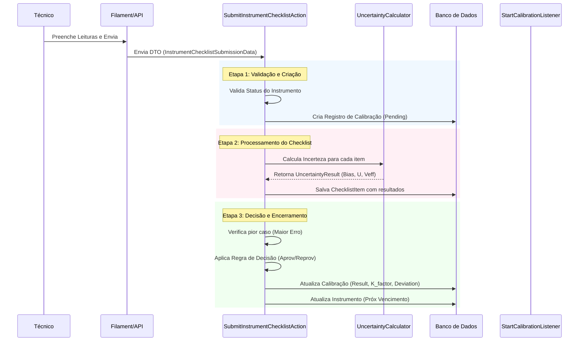

# Documentação do Módulo de Metrologia

Este documento detalha as regras de negócio, a arquitetura e os fluxos de trabalho (workflows) do Módulo de Metrologia.

## 1. Arquitetura Geral

O módulo segue uma arquitetura orientada a **Actions** e **Services**, utilizando **DTOs** (Data Transfer Objects) para transporte de dados estritamente tipados e **Enums** para controle de estados.

- **Actions**: Orquestradores de tarefas (ex: `SubmitInstrumentChecklistAction`). Não contém lógica matemática complexa, apenas delegam.
- **Services**: Contêm a lógica de domínio "pura" e cálculos (ex: `UncertaintyCalculator`).
- **DTOs**: Definem o contrato de dados entre UI/API e o Domínio.
- **Models**: Contêm regras específicas da entidade (ex: cálculo de MPE, relacionamentos).

---

## 2. Regras de Negócio e Localização

### 2.1. Cálculos de Incerteza (ISO GUM)
**Localização:** `Modules\Metrology\Services\UncertaintyCalculator.php`

O sistema implementa uma versão simplificada do método GUM (Guide to the Expression of Uncertainty in Measurement):

1.  **Erro (Tendência/Bias):** Diferença entre a média das leituras e o valor do padrão.
    - *Regra:* `Média(Leituras) - (V.Nominal + DesvioPadrão)`
2.  **Incerteza Tipo A:** Baseada na estatística das leituras (Desvio Padrão Experimental da Média).
    - *Regra:* `StDev / sqrt(n)`
3.  **Incerteza Tipo B:** Baseada em fontes externas (Resolução do instrumento, Incerteza do Padrão).
    - *Regra Resolução:* `Resolução / sqrt(3)` (Distribuição Retangular)
    - *Regra Padrão:* `IncertezaPadrão / k_padrão` (Distribuição Normal)
4.  **Incerteza Combinada (uc):** Soma quadrática das incertezas tipo A e B.
5.  **Incerteza Expandida (U):** `uc * k` (onde k=2 para 95.45% de confiança).
6.  **Graus de Liberdade (Veff):** Calculado via fórmula de Welch-Satterthwaite.

### 2.2. Validação de Calibração
**Localização:** `Modules\Metrology\Services\CalibrationValidator.php` e `ProcessCalibrationAction.php`

- **Regra de Bloqueio:** Não é permitido iniciar calibração de itens com status `Scrapped` (Sucata), `Lost` (Perdido) ou `Maintenance` (Manutenção) sem retorno prévio.
- **Regra de Decisão (Aprovação):**
    - Se `(Erro + Incerteza) <= MPE`: **Aprovado**.
    - Se `Erro <= MPE` mas `(Erro + Incerteza) > MPE`: **Aprovado com Restrição** (Zona de Dúvida).
    - Se `Erro > MPE`: **Reprovado**.

### 2.3. Regras de Entidades (Models)

#### Instrumento (`Instrument.php`)
- **MPE (Erro Máximo Permissível):** O sistema tenta extrair um float do campo texto. Se houver porcentagem (%), retorna 0.0 (regra de segurança).
- **Vencimento Automático:** Ao aprovar uma calibração, o sistema calcula a próxima data: `Data Calibração + Frequência (Meses)`.

#### Padrão de Referência (`ReferenceStandard.php`)
- **Cascata de Atualização (Kits):** Se um Padrão "Pai" (ex: Jogo de Blocos) é calibrado, todos os seus "Filhos" (peças individuais) são atualizados automaticamente com:
    - Nova data de vencimento.
    - Status Ativo.
- **Atualização de Valor Real:** Se houver `nominal_value` e `deviation` na calibração, o `actual_value` do padrão é atualizado para `Nominal + Desvio`.

---

## 3. Workflows (Fluxos de Trabalho)

### 3.1. Fluxo de Submissão de Checklist (Calibração Interna)

Este fluxo é acionado quando um técnico submete um checklist preenchido via Filament ou API de App Móvel.



### 3.2. Fluxo de Atualização de Kit (Padrões)

Acionado quando um checklist envolve a calibração de um kit (ex: Jogo de Blocos Padrão), onde cada passo do checklist corresponde a uma peça do kit.

```mermaid
graph TD
    A[Início: Calibração de Kit Pai] --> B{Possui Checkilst?}
    B -- Sim --> C[Iterar sobre Itens do Checklist]
    B -- Não --> Z[Fim]

    C --> D{Item é 'numeric'?}
    D -- Sim --> E[Encontrar Padrão Filho correspondente (Match Nominal)]
    D -- Não --> C

    E --> F[Calcular Novo Valor Verdadeiro]
    F --> G[Atualizar Padrão Filho (actual_value, uncertainty)]
    G --> H[Definir Próximo Vencimento do Filho]
    H --> C
```

---

## 4. Guia de Arquivos Chave

| Contexto | Classe / Arquivo | Responsabilidade |
| :--- | :--- | :--- |
| **Cálculo** | `UncertaintyCalculator.php` | Motor matemático GUM. |
| **Validação** | `CalibrationValidator.php` | Regras impeditivas de calibração. |
| **Workflow** | `SubmitInstrumentChecklistAction.php` | Orquestrador principal de submissão. |
| **Dados** | `MeasurementCalculationData.php` | DTO com inputs para o cálculo. |
| **UI** | `CalibrationForm.php` | Definição do Wizard e lógica de "Smart Filtering". |
| **Eventos** | `ProcessCalibrationListener.php` | Reações pós-salvamento (ex: Log, Notificação). |
