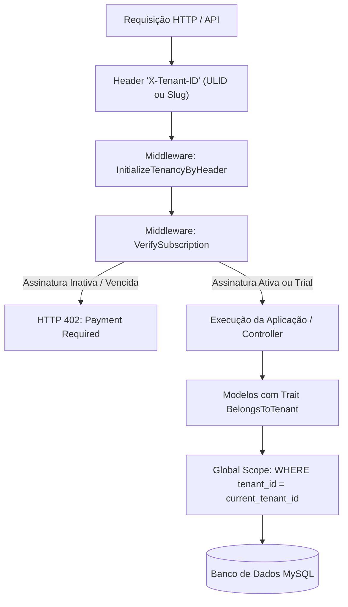

# Guia de Arquitetura: Segurança Multi-Tenant, Certificados Digitais e Matriz de Competências

> **Normas de Referência:** ABNT NBR ISO/IEC 17025:2017 (§6.2 e §7.8.2), FDA 21 CFR Part 11, OWASP Top 10 API Security  
> **Módulos:** Core (`app`), `Modules/System`, `Modules/Metrology`  
> **Status:** Documentação Canônica de Arquitetura de Segurança  

---

## 1. Arquitetura Multi-Tenant

O Lean Tech Metrologia adota o modelo de **Single-Database com Isolamento Lógico Estrito por Tenant** gerenciado pelo pacote `stancl/tenancy` e estendido pela arquitetura de modelos do sistema.



### 1.1. Resolução de Tenancy via Header (`InitializeTenancyByHeader`)
Nos endpoints de API (`/api/v1/...`), o tenant é identificado através do cabeçalho HTTP:
```http
X-Tenant-ID: 01HZY8ZABCDEF1234567890123
# ou via slug corporativo:
X-Tenant-ID: acme-metrologia
```
O middleware [`InitializeTenancyByHeader`](file:///C:/Users/andrl/OneDrive/Documentos/Projetos%20Pessoal/amemiya/app/Http/Middleware/InitializeTenancyByHeader.php) resolve o modelo [`Tenant`](file:///C:/Users/andrl/OneDrive/Documentos/Projetos%20Pessoal/amemiya/app/Models/Tenant.php) e invoca `tenancy()->initialize($tenant)`.

### 1.2. Gatekeeper de Assinatura (`VerifySubscription`)
O middleware [`VerifySubscription`](file:///C:/Users/andrl/OneDrive/Documentos/Projetos%20Pessoal/amemiya/app/Http/Middleware/VerifySubscription.php) valida se o tenant possui plano e assinatura com status `active` ou período de teste `trialing`. Se a assinatura estiver cancelada, inadimplente ou expirada, o acesso operacional aos endpoints de metrologia é sumariamente bloqueado com resposta `HTTP 402 Payment Required`.

### 1.3. O Trait `BelongsToTenant` e o Escopo Global Eloquent
Auditado em [`BelongsToTenant.php`](file:///C:/Users/andrl/OneDrive/Documentos/Projetos%20Pessoal/amemiya/app/Traits/BelongsToTenant.php):
* **Injeção Automática no `creating`:**  
  Quando um modelo é instanciado e salvo, o trait captura o tenant ativo (`tenancy()->tenant->id`) e popula automaticamente a coluna `tenant_id`.
* **Global Scope Automático:**  
  Todas as consultas `SELECT`, `UPDATE` e `DELETE` recebem automaticamente a cláusula:
  ```sql
  WHERE `tabela`.`tenant_id` = '01HZY8...'
  ```
* **Modelos Protegidos:** `Instrument`, `ReferenceStandard`, `Calibration`, `Checklist`, `NonConformity`, `IntermediateCheck`, `Setting`, `InstrumentMovement`, `AuditLog`.

### 1.4. Análise Crítica de Segurança de Isolamento
* **Ponto de Atenção Identificado:**  
  O Global Scope depende de `if (tenancy()->initialized)`. Caso uma rota interna não possua o middleware `InitializeTenancyByHeader` e seja acessada sem o header `X-Tenant-ID`, o escopo global não é ativado.
* **Mitigação Recomendada:** Para rotas autenticadas de negócio, aplicar um middleware mandatório `EnsureTenantIsInitialized` para abortar com `HTTP 400 Bad Request / Missing Tenant Context` quando nenhum tenant for fornecido, salvo para o papel `super-admin`.

---

## 2. Segurança do Certificado Digital A1 (X.509 / PKCS#12)

A emissão de laudos de calibração assinados digitalmente conforme a ISO/IEC 17025 e FDA 21 CFR Part 11 exige certificados digitais padrão ICP-Brasil / X.509 A1.

Auditado em [`CertificateApiController.php`](file:///C:/Users/andrl/OneDrive/Documentos/Projetos%20Pessoal/amemiya/Modules/System/app/Http/Controllers/Api/V1/CertificateApiController.php):

### 2.1. Fluxo de Upload e Extração Criptográfica
1. **Validação do Arquivo:** O controller aceita arquivos `.pfx`, `.p12` ou `.pem` de até 10 MB e exige a senha do certificado.
2. **Abertura Segura em Memória:** Utiliza `openssl_pkcs12_read($content, $certs, $password)` para validar a integridade e decodificar a chave privada e a cadeia de certificados em memória volátil.
3. **Verificação de Validade Temporal:** O método `openssl_x509_parse()` extrai `validTo_time_t`. Certificados expirados são rejeitados imediatamente (`HTTP 422`).
4. **Armazenamento Seguro no Disco Local:**  
   O certificado decodificado é gravado em diretório isolado por tenant no disco `local`:
   ```php
   $relativeDir = "tenants/{$tenantId}/certificates";
   $pemRelativePath = "{$relativeDir}/certificate.pem";
   Storage::disk('local')->put($pemRelativePath, $pemContent);
   ```
   * **Garantia de Confidencialidade:** O disco `local` mapeia para `storage/app/` (diretório restrito do sistema operacional, sem permissão de acesso web e sem symlink público).
5. **Criptografia da Senha do Certificado (*Encryption at Rest*):**  
   A senha do certificado **nunca é armazenada em texto plano**. Ela é criptografada com algoritmo AES-256-CBC autenticado por MAC via Laravel Encrypter:
   ```php
   Setting::setValue('lab_certificate_password', Crypt::encryptString($password));
   ```
6. **Descriptografia Just-in-Time:**  
   A senha é descriptografada exclusivamente na memória durante a execução de [`GenerateCertificatePdfAction`](file:///C:/Users/andrl/OneDrive/Documentos/Projetos%20Pessoal/amemiya/Modules/Metrology/app/Actions/GenerateCertificatePdfAction.php) para a assinatura PKCS#7 via TCPDF/FPDI e liberada em seguida pelo garbage collector.

---

## 3. Matriz de Competências Metrológicas (ISO/IEC 17025 §6.2)

A cláusula §6.2 da ISO/IEC 17025 exige que o laboratório garanta e comprove que o pessoal técnico possui a qualificação e competência necessárias para realizar calibrações específicas.

Auditado em [`UserCompetenceApiController.php`](file:///C:/Users/andrl/OneDrive/Documentos/Projetos%20Pessoal/amemiya/Modules/System/app/Http/Controllers/Api/V1/UserCompetenceApiController.php), [`User.php`](file:///C:/Users/andrl/OneDrive/Documentos/Projetos%20Pessoal/amemiya/Modules/System/app/Models/User.php) e [`StoreCalibrationRequest.php`](file:///C:/Users/andrl/OneDrive/Documentos/Projetos%20Pessoal/amemiya/Modules/Metrology/app/Http/Requests/StoreCalibrationRequest.php):

### 3.1. Estrutura da Matriz de Qualificação
* Tabela relacional pivô `competences`:
  * `user_id`: Identificador do técnico ou metrologista.
  * `instrument_type_id`: Tipo de instrumento autorizado (ex: Micrômetros, Paquímetros, Manômetros, Termômetros).
  * `valid_until`: Data de validade da habilitação/treinamento (permite autorizações por tempo determinado).

### 3.2. Validação Lógica (`User::hasValidCompetenceFor`)
```php
public function hasValidCompetenceFor($instrumentTypeId): bool
{
    $competence = $this->competences()->where('instrument_type_id', $instrumentTypeId)->first();

    if (! $competence) {
        return false;
    }

    if ($competence->pivot->valid_until) {
        return Carbon::parse($competence->pivot->valid_until)->isFuture();
    }

    return true;
}
```

### 3.3. O Mecanismo "Hard Stop"
O bloqueio opera em duas camadas de segurança:
1. **Camada Preventiva de UI (Early Warning):**  
   O endpoint `GET /api/v1/system/competences/check/{instrumentTypeId}` informa ao frontend se o usuário autenticado pode executar a calibração (`can_proceed`). Se o técnico não estiver habilitado e o modo estrito estiver ativo, a interface desabilita os campos de digitação.
2. **Camada de Aplicação / FormRequest (Hard Stop Inviolável):**  
   Em [`StoreCalibrationRequest::withValidator()`](file:///C:/Users/andrl/OneDrive/Documentos/Projetos%20Pessoal/amemiya/Modules/Metrology/app/Http/Requests/StoreCalibrationRequest.php#L54-L69), caso `Setting::getValue('strict_competence_enforcement') === 'true'`:
   * Se o técnico submetendo a calibração não possuir competência válida ou se ela estiver vencida, a requisição é rejeitada com erro `HTTP 422`:
     ```json
     {
       "errors": {
         "instrument_id": [
           "Unauthorized: You do not have valid competence/training to calibrate this type of instrument."
         ]
       }
     }
     ```

---

## 4. Guia Operacional de Provisionamento para Clientes SaaS

Para clientes que utilizam o sistema como Laboratório Próprio ou Provedor de Serviços de Calibração:

### Passo 1: Configuração da Identidade do Laboratório (White-Label)
* **Endpoint:** `PUT /api/v1/system/lab-identity`
* **Campos:** `lab_name`, `lab_address`, `lab_contact`, `accent_color` e `logo` (PNG/JPEG até 2 MB).
* **Efeito:** Personaliza o cabeçalho dos certificados de calibração em PDF e a interface do portal de auditoria pública.

### Passo 2: Upload do Certificado Digital A1
* **Endpoint:** `POST /api/v1/system/certificate`
* **Parâmetros:**
  * `certificate`: Arquivo `.pfx` ou `.p12` emitido por autoridade certificadora ICP-Brasil.
  * `password`: Senha de proteção da chave privada.
* **Resultado:** O sistema valida a integridade, extrai a cadeia e armazena a chave de forma criptografada. O status de dias restantes passa a ser monitorado nos dashboards de governança.

### Passo 3: Ativação da Aplicação Estrita da Matriz de Competências
* **Endpoint:** `PUT /api/v1/system/settings`
* **Payload:**
  ```json
  {
    "settings": {
      "strict_competence_enforcement": "true"
    }
  }
  ```
* **Efeito:** Habilita o "Hard Stop" automático, bloqueando a emissão de laudos por técnicos sem treinamento vigente na matriz de competências da empresa.
